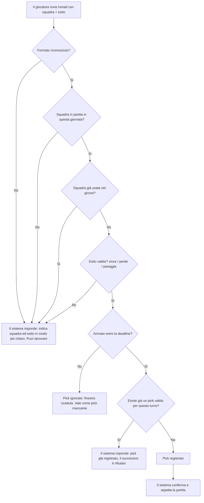
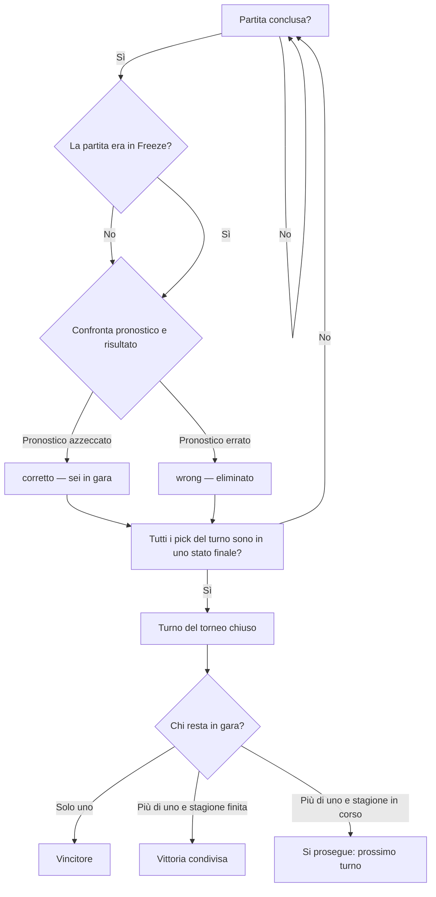
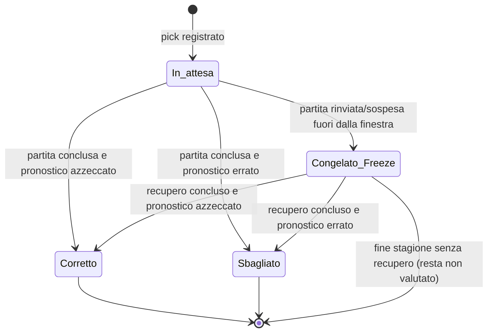
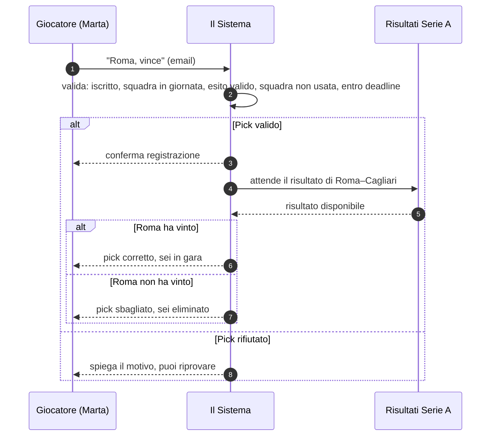
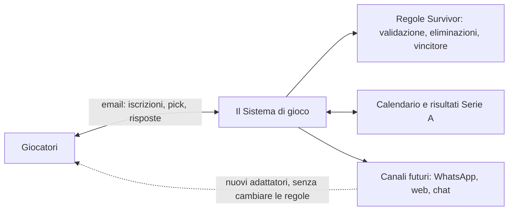

# Design Status — POC Survivor League

> ⚠ **POC ONLY** — Questo documento descrive lo **stato del design** della Proof of Concept
> in forma accessibile anche a stakeholder non tecnici. Non è il design del sistema di
> produzione. I documenti di riferimento fanno fede: `POC_PRD.md`, `POC_HLD.md`, `POC_LLD.md`.
>
> **Documento autonomo e cancellabile:** è un file nuovo, non modifica i documenti esistenti.
> Rollback = cancellare questo file.

**Stato complessivo del design:** completo e pronto per l'implementazione del nucleo
(no bloccanti residui). Architecture review indipendente del 2026-08-11/12: tutti i finding
prioritizzati risolti (HIGH-02, MED-02, CRITICAL-02). Readiness: **~86/100**.

**Destinatari:** organizzatori, giocatori e chiunque voglia capire il torneo senza leggere
i documenti tecnici. La Parte 1 è non tecnica; la Parte 2 ha i diagrammi; le Parti 3-5 sono
per chi vuole il dettaglio (con rimandi al PRD/HLD/LLD).

---

## Indice

- **PARTE 1 — Com'è e come funziona (per tutti)**
  - [1. Cos'è Survivor League](#1-cosè-survivor-league)
  - [2. Come si gioca in 5 passi](#2-come-si-gioca-in-5-passi)
  - [3. Chi è chi](#3-chi-è-chi)
  - [4. Regole in una pagina](#4-regole-in-una-pagina)
  - [5. User stories e scenari d'uso](#5-user-stories-e-scenari-duso)
    - [US1 — Iscrizione](#us1-iscrizione)
    - [US2 — Fare un pick (scenario felice)](#us2-fare-un-pick-scenario-felice)
    - [US3 — Il pick arrivato troppo tardi](#us3-il-pick-arrivato-troppo-tardi)
    - [US4 — La partita rinviata](#us4-la-partita-rinviata)
    - [US5 — Fine del torneo](#us5-fine-del-torneo)
- **PARTE 2 — Diagrammi**
  - [6. Diagrammi della logica di dominio](#6-diagrammi-della-logica-di-dominio)
    - [6.1 La linea del tempo: giornata di campionato (TC) e turno del torneo (TT)](#61-la-linea-del-tempo-giornata-di-campionato-tc-e-turno-del-torneo-tt)
    - [6.2a Dalla partita al pick: l'invio e la validazione](#62a-dalla-partita-al-pick-linvio-e-la-validazione)
    - [6.2b Dopo la partita: il verdetto](#62b-dopo-la-partita-il-verdetto)
    - [6.3 Il ciclo di vita di un pick (diagramma di stato)](#63-il-ciclo-di-vita-di-un-pick-diagramma-di-stato)
    - [6.4 Sequenza: chi parla con chi quando arriva un pick](#64-sequenza-chi-parla-con-chi-quando-arriva-un-pick)
    - [6.5 Architettura logica in parole semplici](#65-architettura-logica-in-parole-semplici)
- **PARTE 3 — Riferimento tecnico essenziale** · [sezione](#parte-3-riferimento-tecnico-essenziale)
- **PARTE 4 — Note e considerazioni varie** · [sezione](#parte-4-note-e-considerazioni-varie)
- **PARTE 5 — Domande aperte al Product Owner**
  - [Esistenti (da PRD §11, HLD §7, review §15)](#esistenti-da-prd-11-hld-7-review-15)
  - [Nuovi punti richiesti — verifica risolto / aperto](#nuovi-punti-richiesti-verifica-risolto-aperto)
    - [1. Il Channel Adapter è compatibile con una web app e con un agente che interagisce con i giocatori?](#1-il-channel-adapter-è-compatibile-con-una-web-app-e-con-un-agente-che-interagisce-con-i-giocatori)
    - [2. Serve capire chi interagisce con chi](#2-serve-capire-chi-interagisce-con-chi-es-quando-un-giocatore-inviariceve-una-email-quali-componenti-sono-coinvolti)
    - [3. Almeno un sequence diagram per capire le interazioni](#3-almeno-un-sequence-diagram-per-capire-le-interazioni)
    - [4. Tornei multipli](#4-tornei-multipli-come-installazioni-multiple-es-più-docker-o-un-singolo-sistema-che-gestisce-più-tornei)
    - [5. Sistema di pagamento (quota e payout) + regole PayPal gaming/gambling](#5-sistema-di-pagamento-quota-e-payout-regole-paypal-gaminggambling)
- [Documenti correlati](#documenti-correlati)

---

# PARTE 1 — COM'È E COME FUNZIONA (per tutti)

## 1. Cos'è Survivor League

Survivor League è un **torneo a eliminazione tra amici**, giocato via email, basato sui
risultati della **Serie A**. Ogni settimana (giornata di campionato) chi è ancora in gara
invia un pronostico: sceglie **una squadra** e dice se **vincerà, perderà o pareggerà**.
Chi indovina resta in gara; chi sbaglia (o non risponde in tempo) viene eliminato. Vince
chi resta solo in gara. Titolo provvisorio, gioco privato non commerciale (vedi disclaimer
in `BRIEF/BRIEF.MD`).

## 2. Come si gioca in 5 passi

1. **Ti iscrivi** inviando un'email all'indirizzo del torneo. Ricevi conferma e le istruzioni.
2. **Prima di ogni giornata** il sistema ti manda un'email: quali squadre puoi ancora usare
   e **entro quando** rispondere (la deadline).
3. **Invii il pick**: rispondi indicando squadra + esito ("Milan, vince").
4. **Dopo la partita** ricevi l'esito del tuo pronostico: sei in gara o sei eliminato.
5. **Si riparte** la giornata dopo, con una squadra diversa. Chi non risponde entro la
   deadline è eliminato. Alla fine emerge il vincitore (o più vincitori, nei casi previsti).

## 3. Chi è chi

| Chi | Ruolo | Come interagisce |
|---|---|---|
| **Giocatore** | La persona che partecipa. Nella POC un giocatore = un profilo, e l'email è l'identificativo | Scrive email al torneo: iscrizioni e pick |
| **Organizzatore (Commissioner)** | Amministra il torneo (test, override, correzioni) | Comandi da terminale (CLI) |
| **Il Sistema** | Applica le regole da solo, in modo deterministico e ripetibile: valida i pick, conta i risultati, elimina, decreta i vincitori | Automatico; si occupa di ricevere e inviare email |
| **Campionato (Serie A)** | Fonte di calendario e risultati — fornisce i dati, non decide nulla | Dati pronti (nella POC: dati storici 2025/26) |

Il "cervello" che legge le email in linguaggio naturale e scrive le risposte in italiano è
una componente interna (LLM): **confinata all'interpretazione del testo**. Non prende
decisioni di gioco — nessuna eliminazione o vittoria dipende dall'IA. Vedi §7.

## 4. Regole in una pagina

| Regola | In parole semplici |
|---|---|
| **Una squadra per girone** | In un girone (andata: giornate 1-19; ritorno: 20-38) puoi usare ogni squadra una volta sola. Al giro di boa il pool si azzera e tornano tutte disponibili |
| **Primo pick valido** | Conta il primo pronostico accettato per la giornata. I successivi vengono rifiutati (non è un errore: hai già giocato) |
| **Deadline unica** | Tutti hanno la stessa scadenza: inizio della prima partita della giornata − 30 minuti (valore configurabile). Fa fede l'arrivo sul server, non l'orario scritto nella tua email |
| **Pick sbagliato → eliminato** | Pronostico errato rispetto al risultato ufficiale = fuori |
| **Pick mancante → eliminato** | Niente pronostico entro la deadline = fuori. Nessuna seconda chance |
| **Partita rinviata/sospesa** | Non è colpa tua: il pick resta in attesa (stato "congelato") finché la partita non si gioca. Se il recupero è nella stessa finestra, si valuta normalmente; se è dopo, resta congelato. In nessun caso la squadra torna disponibile nel girone (resta "bruciata") |
| **Fine del torneo** | 1) resta un solo giocatore → vince lui; 2) tutti gli ultimi in gara eliminati nella stessa giornata → vittoria condivisa; 3) due o più superstiti a fine stagione → vittoria condivisa |

## 5. User stories e scenari d'uso

Formato: *«Come … voglio … così …»*, con una breve narrazione per capire l'esperienza reale.

### US1 — Iscrizione
> **Come** giocatore, **voglio** iscrivermi con la mia email, **così** posso iniziare a fare pick.

Anche a stagione in corso un nuovo giocatore può iscriversi, purché l'iscrizione sia
completata **prima della deadline** della giornata per cui vuole giocare (⇒ `CL2`).

*Anna vuole entrare nel torneo degli amici. Scrive una email all'indirizzo dedicato
("vorrei iscrivermi"). Il sistema le risponde confermando l'iscrizione e spiegando il
formato del pick e le regole. Anna è ora un profilo attivo: dalla prossima giornata
riceverà le email con le squadre disponibili.*

### US2 — Fare un pick (scenario felice)
> **Come** giocatore, **voglio** scegliere squadra ed esito via email, **così** resto in gara se indovino.

Il primo pick valido viene registrato; un pick rifiutato (formato poco chiaro, squadra non
in giornata, squadra già usata) non consuma il tentativo → si può riprovare (⇒ `CL4`, `CL5`).

*Marta riceve l'email della giornata 5: può usare Roma, Inter, … entro sabato alle 14:30.
Risponde "Roma, vince". Il sistema conferma: «Pick registrato per il turno 5».*

### US3 — Il pick arrivato troppo tardi
> **Come** giocatore, **voglio** conoscere sempre la deadline, **così** evito di essere eliminato per pick mancante.

Un pick che arriva dopo la deadline è ignorato: fa fede l'istante di **ricezione sul
server** (`receivedAt`), non l'header `Date` dell'email (⇒ `CL3`, decisone PO del 2026-08-12).

*Luca risponde la domenica sera "Inter, pareggia". Il sistema gli comunica che la finestra
del turno è scaduta: il pick conta come mancante e Luca è eliminato. Aveva ricevuto una
email con la deadline, ma non l'ha rispettata.*

### US4 — La partita rinviata
> **Come** giocatore, **voglio** non essere penalizzato se la partita che ho scelto viene rinviata, **così** posso ancora vincere.

Recupero entro la finestra → il pick si valuta normalmente (⇒ `CL7`). Recupero fuori
finestra → il pick va in **Freeze (congelato)**: non è né giusto né sbagliato, non elimina.
Se l'ultima partita prevista della giornata non si gioca, la giornata si chiude comunque e
il pick si congela (⇒ `CL8`, `CL1`).

*Paolo sceglie "Napoli, vince" ma Napoli-Atalanta viene rinviata. Non è una penalità: il
pick aspetta. La partita si recupera il mercoledì successivo (fuori finestra): il pick
resta congelato finché la partita non finisce. Paolo non viene eliminato e la sua
Napoli resta comunque usata nel girone.*

### US5 — Fine del torneo
> **Come** organizzatore, **voglio** che il vincitore sia determinato in modo trasparente, **così** tutti accettano il risultato.

Tre casi coperti e testati (⇒ `CS6`): vincitore unico; eliminazione collettiva;
superstiti a fine stagione (vittoria condivisa).

*Alla giornata 30 restano Giulia e Marco. Marco sbaglia: Giulia resta sola → vince lei.
In un altro torneo di prova, sia Giulia sia Marco sbagliano alla giornata 25: condividono
la vittoria. Se nessuno sbagliasse più fino alla 38, condividerebbero la vittoria.*

---

# PARTE 2 — DIAGRAMMI

## 6. Diagrammi della logica di dominio

### 6.1 La linea del tempo: giornata di campionato (TC) e turno del torneo (TT)

Il concetto più importante: **il torneo gira su due orologi paralleli**. La *giornata della
Serie A* (TC) è la cornice temporale; il *turno del torneo* (TT) è la finestra in cui si
gioca il pronostico (apertura → deadline → verdetto). La deadline cade prima del fischio
d'inizio della prima partita; la giornata si chiude qualche ora dopo la fine prevista
dell'ultima partita programmata.

> 📊 **Diagramma della timeline TC/TT (modificabile in Excalidraw):**
> https://excalidraw.com/#json=8JIxedSJglAnN3s08uOsn,IY_hoBLVb7oJPRtHSLPqAg
> *(Il file `docs/POC/POC_PRD_timeline.excalidraw` è la fonte; il link permette di aprirlo
> e modificarlo senza rigenerarlo. Questo documento NON ne contiene una copia.)*

Legenda per il lettore: sul diagramma vedi come si sovrappongono chiamata, deadline,
partite e chiusura — e dove cadono i rinvii dentro/fuori finestra.

### 6.2a Dalla partita al pick: l'invio e la validazione

### 6.2b Dopo la partita: il verdetto

### 6.3 Il ciclo di vita di un pick (diagramma di stato)

**Nota:** lo stato **Congelato (Freeze)** non è né giusto né sbagliato: è "in sospeso".
Non elimina il giocatore e non ritarda la chiusura del turno. Se la partita non viene mai
giocata in stagione, il pick non viene mai valutato (PRD §4.4).

### 6.4 Sequenza: chi parla con chi quando arriva un pick

### 6.5 Architettura logica in parole semplici

Messaggio chiave: il **sistema applica regole deterministiche**; i **dati del campionato**
contano solo come fonte; i **canali** (oggi email) sono intercambiabili.

---

# PARTE 3 — RIFERIMENTO TECNICO ESSENZIALE

> **Fonte di verità:** `POC_PRD.md` (regole, casi limite CL1-8, criteri CS1-7, parametri),
> `POC_HLD.md` (architettura, flussi), `POC_LLD.md` (dettaglio implementativo). Qui solo i
> puntelli per orientarsi. **Questa parte non duplica la specifica**: PRD/HLD/LLD restano
> l'unica fonte, per evitare errori di sincronizzazione.

| Argomento | Dettaglio essenziale | Riferimento |
|---|---|---|
| Ciclo TC/TT | TT si apre al termine del TC precedente; finestra di pick fino alla deadline; TT si conclude quando tutti i pick sono in stato terminale (corretto/sbagliato/congelato) | PRD §3, §4.3-4.4 |
| Deadine | Inizio prima partita TC − anticipo (default 30'). Fa fede `receivedAt` (ricezione sul server, `internaldate` IMAP per l'email), non l'header `Date` | PRD §4.3; decisione PO 2026-08-12 (HIGH-02) |
| Chiusura TC | Fine prevista UPP + scarto (default 5h); durata stimata partita (default 125'). Finestra di riferimento per rinvii, non trigger di contabilizzazione | PRD §4.4; CRITICAL-02 |
| Stati del pick | `pending` → `correct` / `wrong` / `frozen` | PRD §3.5, LLD §3 |
| Freeze | Rinvio/sospensione fuori finestra; squadra resta bruciata; contabilizzato a recupero concluso | PRD §4.4, CL1/CL7/CL8 |
| Casi limite | CL1-CL8 | PRD §8 |
| Criteri di successo | CS1-CS7 | PRD §9 |
| Parametri configurabili | Anticipo, scarto TC, durata partita, quota/payout (placeholder Fase 1) | PRD §4.4, RNF4, LLD §4.1 |
| Componenti | Game Engine (deterministico) · LLM Adapter (solo I/O) · ChannelAdapter (email POC) · SeasonDataProvider (static POC) · Scheduler (solo produzione) | HLD §1-3, LLD §1 |

---

# PARTE 4 — NOTE E CONSIDERAZIONI VARIE

Raccolta di note emerse durante la preparazione di questo "design status".

- **Il ruolo dell'LLM e dell'agente AI.** Il sistema usa un'LLM per capire le email dei
  giocatori e scrivere risposte in italiano; è **confinato al solo I/O**, non prende
  decisioni di gioco (regola architetturale vincolante in `AGENTS.md`). L'*agente AI*
  menzionato in futuro in HLD §1.3 è un **amministratore** (sostituto del commissioner via
  CLI: monitora e interviene in caso di anomalie) — **non** interagisce con i giocatori,
  a differenza di un chatbot (vedi punto 1 delle domande, FUTURE_EXPLORATIONS §1).
- **Cosa vede il giocatore.** Il giocatore vede solo email e risultati. Tutta la macchina
  interna (LLM, database, componenti) è invisibile: nel diagramma di sequenza 6.4 "Il
  Sistema" è un solo attore.
- **Perché non si duplica la specifica qui.** Questa è una copia di comodo, non la fonte:
  duplicare regole/CL/CS creerebbe due verità e rischio di errori. PRD/HLD/LLD restano
  autorevoli; qui i rimandi.
- **Rollback pulito.** Il file è nuovo e autonomo: la cancellazione lo rimuove senza toccare
  PRD/HLD/LLD né i diagrammi esistenti.
- **Timeline excalidraw non copiata.** Si cita il link e il file sorgente
  (`POC_PRD_timeline.excalidraw`) per non creare copie divergenti.
- **Pagamenti e paypal (in attesa del punto 5).** I pagamenti non sono nella POC. Quando si
  progetterà la Fase 1, oltre alla scelta dell'importo servono i vincoli del provider di
  pagamento: per PayPal le transazioni legate a gioco/competizioni devono rispettare la
  policy di gaming (closed loop 1-a-1, tra persone, riferite al **giocatore**, non al
  profilo). Da verificare anche il quadro normativo italiano (ADM) se si passa a operatività
  pubblica con denaro reale (disclaimer `BRIEF/BRIEF.MD`).
- **Prossimi passi (roadmap BRIEF §7):** POC → aggiornamento LLD da review §16 → implementazione
  nucleo deterministico → simulazione stagione 2025/26 → poi Fase 1 (WhatsApp, profili
  multipli, quota/montepremi, tornei multipli).

---

# PARTE 5 — DOMANDE APERTE AL PRODUCT OWNER

> Legenda stato: **Risolta** = decisa e documentata · **Aperta** = da decidere ·
> **Aperta (non bloccante POC)** = rinviata alla Fase 1 / oltre.

## Esistenti (da PRD §11, HLD §7, review §15)

| #            | Domanda                                                                                                                        | Stato                                                                                     | Dove                                                |
| ------------ | ------------------------------------------------------------------------------------------------------------------------------ | ----------------------------------------------------------------------------------------- | --------------------------------------------------- |
| ~~PO-1~~     | ~~Fonte e formato dei dati storici 2025/26 (`calendar.json`, `results.json`)?~~                                                | ~~**Aperta**~~                                                                            | ~~PRD §11.1, HLD §7.1, review §15.1~~               |
| ==PO-2==     | ==Quanto deve essere strutturato il formato del pick nell'email? ("Milan, vince" vs testo libero)==                      | ==**Aperta**==                                                                            | ==PRD §11.4, review §15.3 (B3)==                    |
| ~~PO-3~~     | ~~Provider dati per la produzione 2026/27? Budget per API a pagamento?~~                                                       | ~~**Aperta (non bloccante)**~~                                                            | ~~review §15.4 (HIGH-06)~~                          |
| ~~PO-4~~     | ~~Livello di monitoring atteso in produzione (health check vs alert proattivi)?~~                                              | ~~**Aperta (non bloccante)**~~                                                            | ~~review §15.5 (HIGH-05)~~                          |
| ==PO-5==     | ==Email di apertura turno: mostrare tutte le partite della giornata o solo le squadre disponibili per il profilo?==            | ==**Aperta**==                                                                            | ==review §15.6 (B4), HLD §7.7==                     |
| ==PO-6==     | ==Da quale istante si apre la finestra di pick del primo TC? (proposta: alla creazione del torneo/iscrizioni, configurabile)== | ==**Aperta**==                                                                            | ==PRD §11.5==                                       |
| PO-7         | Account Gmail dedicato? Quando configurarlo?                                                                                   | **Aperta**                                                                                | PRD §11.2, HLD §7.4                                 |
| PO-8         | Dettagli VPS: OS, accesso SSH, dominio?                                                                                        | **Aperta**                                                                                | PRD §11.3                                           |
| ==~~PO-9~~== | ==~~Quale LLM? (OpenAI, Claude, Ollama locale)~~==                                                                             | ==~~**Aperta**~~==                                                                        | ==~~HLD §7.5~~==                                    |
| PO-10        | Il passaggio di un pick in Freeze va notificato al giocatore?                                                                  | **Aperta**                                                                                | PRD §11.6                                           |
| ~~PO-11~~    | ~~Quale timestamp fa fede alla deadline?~~                                                                                     | ~~**Risolta** (2026-08-12: ricezione sul server)~~                                        | ~~PRD §==PO-9==4.3, HLD §5, review §0.1 (HIGH-02)~~ |
| ~~PO-12~~    | ~~Partite sospese come trattarle?~~                                                                                            | ~~**Risolta** (2026-08-12: come rinviate)~~                                               | ~~PRD §4.4, review §0.2 (MED-02)~~                  |
| ~~PO-13~~    | ~~Completezza dei risultati per la contabilizzazione~~                                                                         | ~~**Risolta** (2026-08-12: contabilizzazione incrementale, niente `areAllResultsFinal`)~~ | ~~review §0.3 (CRITICAL-02)~~                       |

## Nuovi punti richiesti — verifica risolto / aperto

### 1. Il Channel Adapter è compatibile con una web app e con un agente che interagisce con i giocatori?

**Stato: IN PARTE RISOLTO (compatibilità architetturale confermata) — design di dettaglio APERTO (Fase 1+).**

Il Game Engine non parla con i canali ma con l'interfaccia astratta `ChannelAdapter`
(HLD §1.4, LLD §6.4): oggi c'è solo `EmailAdapter`. L'architettura **non preclude** web,
WhatsApp, Telegram o un chatbot: aggiungere un canale = nuovo adapter, senza toccare la
logica di gioco (review §17, "Architettura per evoluzione futura 9/10"). Sia la **web app**
(FUTURE_EXPLORATIONS §2, BRIEF §7.3) sia l'**agente che interagisce con i giocatori**
(chatbot: FUTURE_EXPLORATIONS §1) sono però **fuori dalla POC** e non hanno design di
dettaglio. Nota di distinzione: l'*agente AI commissioner* (HLD §1.3) è amministrativo, non
di gioco.

### 2. Serve capire chi interagisce con chi (es. quando un giocatore invia/riceve una email, quali componenti sono coinvolti?)

**Stato: RISOLTO a livello POC — documentato; reso visibile con il diagramma di sequenza (§6.4).**

I componenti coinvolti e i flussi completi sono già documentati in HLD §3 e §4.0-4.4 e LLD §1:
`EmailAdapter (IMAP) → Message Router → handler iscrizione/pick → LLM Parser → Pick Processor
(Game Engine) → LLM Generator → EmailAdapter (SMTP)`. Il diagramma di sequenza 6.4 di questo
documento lo rende comprensibile a tutti (giocatore ↔ "Il Sistema" ↔ risultati).

### 3. Almeno un sequence diagram per capire le interazioni

**Stato: APERTO → CHIUSO in questo documento (§6.4).**

I documenti esistenti usavano solo flowchart (nessun `sequenceDiagram`). Il diagramma 6.4
(invio pick e verdetto) colma la lacuna. Eventuali sequence aggiuntivi (apertura/chiusura
turno, contabilizzazione incrementale) possono essere aggiunti nella prossima revisione.

### 4. Tornei multipli — come? Installazioni multiple (es. più Docker), o un singolo sistema che gestisce più tornei?

**Stato: APERTO — brainstorming e decisione architetturale prima del design Fase 1 (non bloccante per la POC).**

Capability di **Fase 1** (BRIEF §3.10, §7.2 punto 6; fuori scope POC: PRD §10/§1.1). La
decisione è già formalmente messa sul tavolo in **BRIEF §5 (topologia di deployment)** con
due opzioni: **(a)** un'istanza/container per torneo (isolamento totale, costi × tornei) o
**(b)** un'unica istanza multi-torneo (isolamento logico per `tournament_id`, canali/dati/
scheduler condivisi). Vanno valutati: separazione dati (DB per torneo vs `tournament_id`),
routing dei messaggi per torneo, montepremi/payout per torneo, osservabilità e costo della
scalata. Vincolo già dichiarato: **l'architettura della POC non deve precludere nessuna delle
due opzioni** (BRIEF §5) — oggi è neutra (review §17: "multi-torneo tracciato per la Fase 1").
Da fare: session di brainstorming dedicata + impatto su schema dati, canali e CLI.

### 5. Sistema di pagamento (quota e payout) + regole PayPal gaming/gambling

**Stato: APERTO — Fase 1 (non bloccante per la POC). Attenzione legale/finanziaria segnalata.**

Quota (default 5 EUR, BRIEF §3.6) e montepremi/payout (ipotesi 85%, BRIEF §3.9) sono fuori
scope POC (PRD §10) e inizializzati come placeholder nel LLD §4.1. Per la Fase 1 servono:
importo/configurazione, ripartizione, gestione arrotondamenti nei casi di vittoria condivisa
(BRIEF §5), e il **vincolo del provider**: per **PayPal** le transazioni legate a competizioni
devono rispettare la policy di **gaming/gambling** — in questo contesto privato, **closed loop
1-a-1**, ovvero trasferimenti diretti tra persone del gruppo, riferiti al **giocatore** (la
persona reale) e **non al profilo** (un giocatore può avere più profili — BRIEF §3.3). Va
verificato anche il quadro normativo italiano (ADM) per qualsiasi operatività pubblica con
denaro reale (disclaimer `BRIEF/BRIEF.MD`), prima del design di pagamenti/payout.

---

## Documenti correlati

| Documento | Ruolo |
|---|---|
| `BRIEF/BRIEF.MD` | Storico congelato (raccolta requisiti, 2026-08-11) — non aggiornare; fa fede il design |
| `BRIEF/FUTURE_EXPLORATIONS.MD` | Idee future fuori POC (chatbot, web, jolly, …) |
| `docs/POC/POC_PRD.md` | Requisiti di prodotto POC — fonte delle regole |
| `docs/POC/POC_HLD.md` | Architettura di alto livello |
| `docs/POC/POC_LLD.md` | Design di dettaglio (DB, CLI, env, test) |
| `docs/POC/POC_PRD_timeline.excalidraw` | Timeline TC/TT (link Excalidraw in §6.1) |
| `docs/reviews/2026-08-11/architecture-review-2026-08-11.md` | Review indipendente (fix in §16, domande PO §15) |
