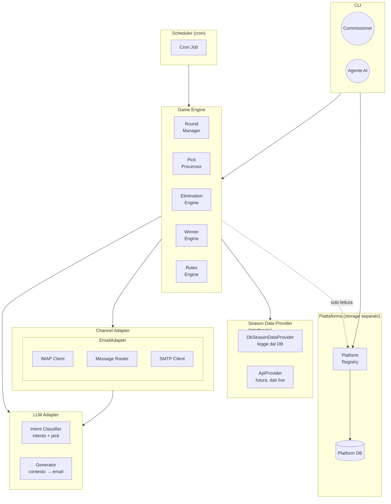
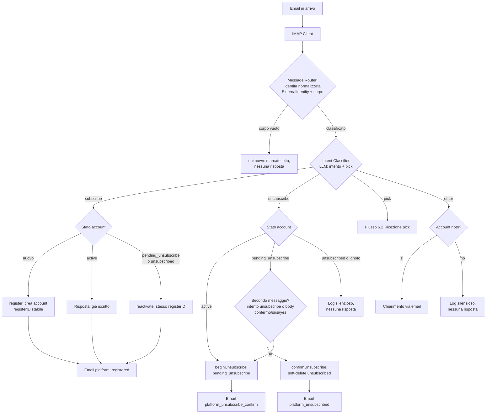
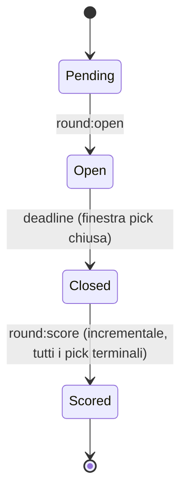
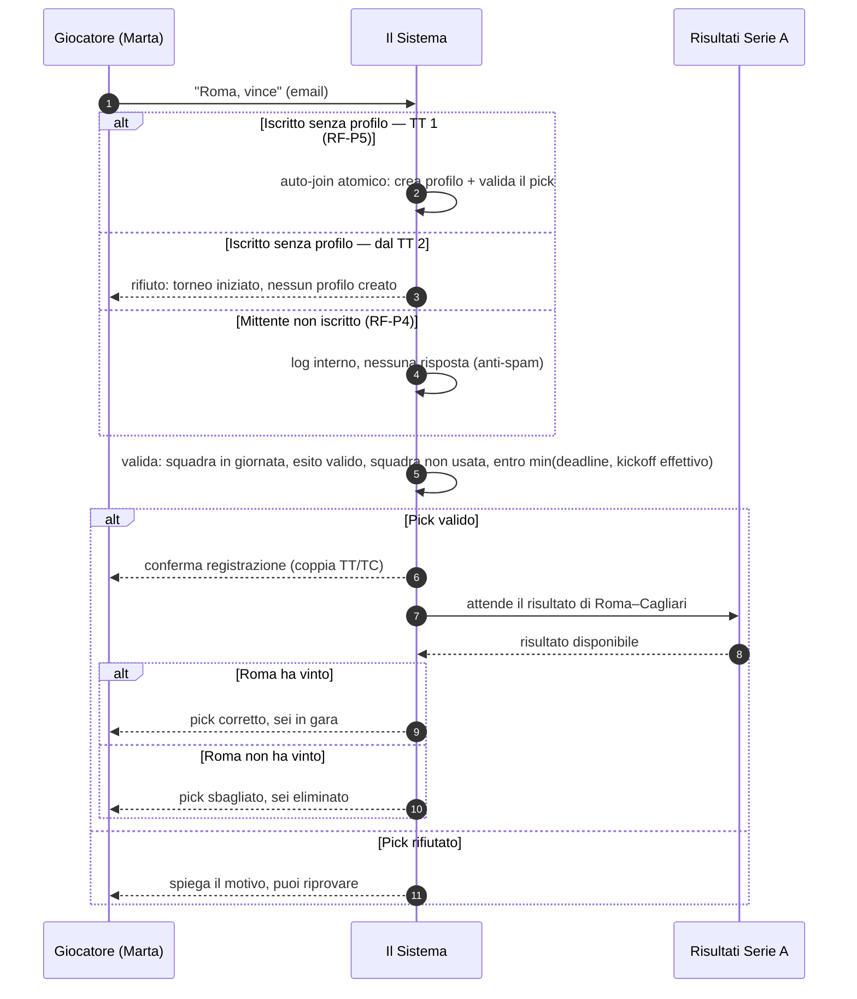
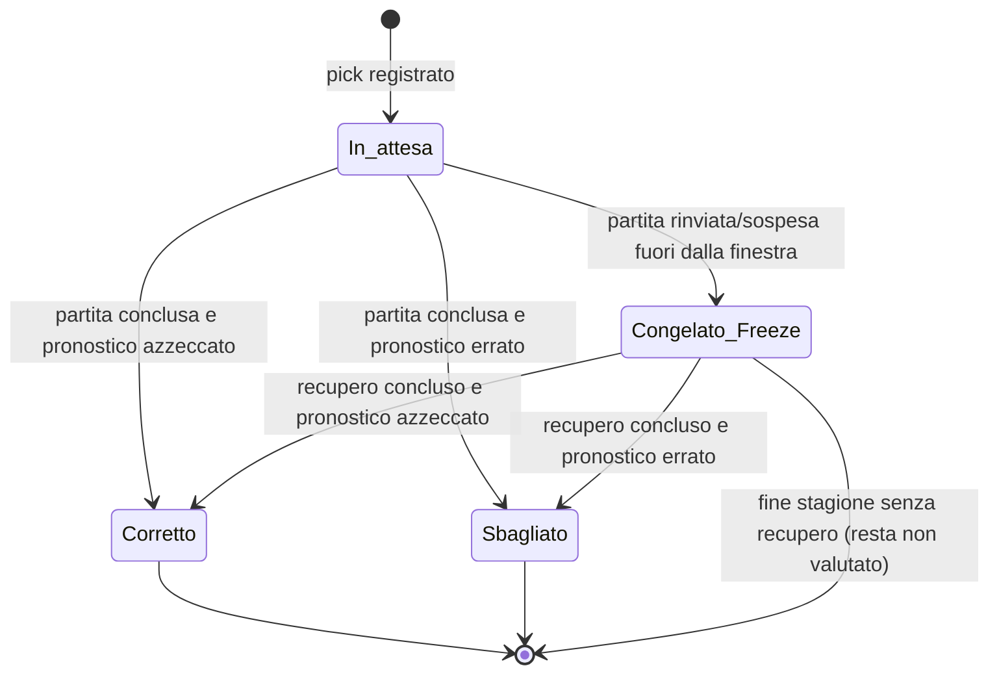
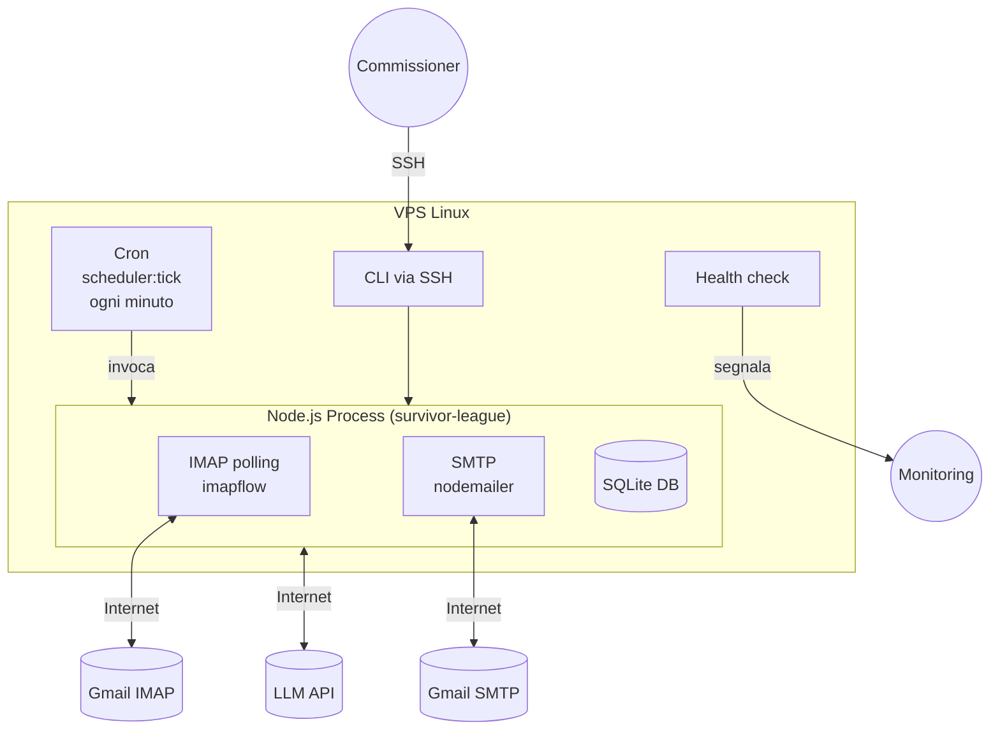

# HLD: Survivor League — Proof of Concept

> ⚠ **POC ONLY** — Questo documento descrive il sistema per la Proof of Concept. Non è il design del sistema di produzione.

**Stato:** Revisionato
**Data:** 2026-08-20
**Versione:** 0.5.0
**Revisione 0.5.0 (2026-08-20):** allineata al PRD v0.6.0 e ad ADR-009 (iscrizione a livello di piattaforma): nuovo componente **Platform Registry** (§2.2, §5.3); Message Router che smista sull'**intento LLM** (§5.3, §6.2); flussi riscritti — subscribe/unsubscribe a due passi, pick, silenzio anti-spam, auto-join al TT1 (§6.1, §6.2); notifiche con broadcast `tournament_open` e riepilogo `round_closed_survived` ai soli sopravvissuti (§6.3, §6.4); nessuna finestra di iscrizione (§5.4, §6.1); casi limite CL2/CL5 mappati sul nuovo modello (§5.5).

> Documento di architettura di alto livello ("come" il sistema è strutturato). I requisiti di prodotto ("cosa/perché") sono nel [PRD](POC_PRD.md) v0.6.0; il dettaglio implementativo (schema DB, interfacce, CLI, configurazione) è nel [LLD](POC_LLD.md). Le decisioni difficili da invertire sono registrate nelle [ADR](../decisions/architecture-decisions.md).

---

## Indice

- [1. Contesto e obiettivi](#1-contesto-e-obiettivi)
- [2. Attori e componenti](#2-attori-e-componenti)
  - [2.1 Attori del sistema](#21-attori-del-sistema)
  - [2.2 Responsabilità dei componenti](#22-responsabilità-dei-componenti)
- [3. Vincoli e assunzioni di scala](#3-vincoli-e-assunzioni-di-scala)
- [4. Decisioni architetturali chiave](#4-decisioni-architetturali-chiave)
- [5. Vista logica (componenti)](#5-vista-logica-componenti)
  - [5.1 Game Engine](#51-game-engine)
  - [5.2 Platform Registry](#52-platform-registry-adr-009)
  - [5.3 LLM Adapter](#53-llm-adapter)
  - [5.4 Channel Adapter](#54-channel-adapter)
  - [5.5 Scheduler](#55-scheduler)
  - [5.6 Responsabilità sui casi limite](#56-responsabilità-sui-casi-limite)
- [6. Vista logica dei flussi](#6-vista-logica-dei-flussi)
  - [6.1 Iscrizione](#61-iscrizione)
  - [6.2 Ricezione pick](#62-ricezione-pick)
  - [6.3 Apertura e chiusura round](#63-apertura-e-chiusura-round)
  - [6.4 Contabilizzazione](#64-contabilizzazione)
  - [6.5 Stati del round](#65-stati-del-round)
  - [6.6 Interazione pick (sequence)](#66-interazione-pick-sequence)
  - [6.7 Ciclo di vita del pick (state)](#67-ciclo-di-vita-del-pick-state)
- [7. Integrazioni esterne](#7-integrazioni-esterne)
- [8. Vista di deployment (VPS)](#8-vista-di-deployment-vps)
- [9. Vincoli non funzionali di architettura](#9-vincoli-non-funzionali-di-architettura)
- [10. Rischi noti e mitigazioni](#10-rischi-noti-e-mitigazioni)
- [11. Domande aperte](#11-domande-aperte)
- [12. Riferimenti](#12-riferimenti)

---

## 1. Contesto e obiettivi

Questo documento descrive l'architettura di alto livello della **Proof of Concept** di Survivor League: un torneo a eliminazione tra amici basato sui risultati della Serie A, giocato interamente via email. Definisce componenti, responsabilità, interazioni, dati e deployment necessari a soddisfare i requisiti del PRD, con particolare attenzione ai vincoli di qualità (sezione 9) e ai rischi noti (sezione 10).

L'HLD **non** ripete le regole di gioco (quelle vivono nel PRD, §4-5) né i dettagli implementativi (LLD). Per le regole fare riferimento al PRD; per la documentazione di canale/provider all'LLD. Le scelte architetturali rilevanti sono tracciate come ADR (sezione 4).

---

## 2. Attori e componenti

### 2.1 Attori del sistema

| Attore | Ruolo | Interfaccia |
|--------|-------|-------------|
| **Giocatore** | Invia pick, riceve notifiche | Email (unico canale) |
| **Commissioner** | Dev: amministra manualmente il torneo. Prod: supervisiona, interviene solo per override in caso di anomalie | CLI |
| **Scheduler (cron)** | In produzione: avvia la stagione, apre/chiude la fase di iscrizione, apre/chiude i round e contabilizza automaticamente in base al calendario | Interno (cron job) |
| **Agente AI** | In futuro: monitora il torneo e interviene via CLI al posto del commissioner | CLI (ADR-006) |
| **Sistema** | Riceve email, valida pick, contabilizza, invia risposte | Autonomo |

### 2.2 Responsabilità dei componenti

Principio architetturale vincolante (AGENTS.md): le responsabilità sono affidate a componenti distinti; nessun componente svolge il ruolo di un altro, non duplica logica altrui e non dipende da dettagli interni degli altri. Da qui discendono ADR-004 (Game Engine deterministico + LLM confinato) e ADR-006 (tutti i componenti gestibili da CLI).

| Componente | Ruolo (cosa fa) | Confine (cosa NON fa) |
|---|---|---|
| **Game Engine** (round, pick, eliminazioni, vincitore) | Definisce l'esito e lo stato di gioco: validazione, contabilizzazione, eliminazioni, determinazione del vincitore | Non interagisce direttamente coi giocatori, non interpreta linguaggio naturale, non fornisce dati stagione |
| **Platform Registry** (archivio account piattaforma) | Sorgente degli iscritti: account persistente (`registerID` stabile, email, status `active`/`pending_unsubscribe`/`unsubscribed`), iscrizione/disiscrizione a due passi (ADR-009, RF-P1/P2); `activeEmails()` per le notifiche | Non conosce il torneo: nessuna scrittura su profili/pick; è **solo letto** dai flussi di torneo (gate) |
| **Intent Classifier** (confine LLM) | Classifica l'intento di un messaggio (`subscribe`/`unsubscribe`/`pick`/`other`) ed estrae il pick in **una sola chiamata LLM** (ADR-004/009) | Non decide nulla di gioco: l'esito è poi filtrato dal check deterministico esatto sul pick |
| **Contabilizzazione** (Round Manager) | Riceve i risultati e aggiorna lo stato dei pick in modo incrementale; decide gli stati `correct` / `wrong` / `frozen` e la chiusura del TT | Non decide il calendario, non trasporta messaggi, non genera testi |
| **Canale di comunicazione** (EmailAdapter) | Consegna e riceve i messaggi (iscrizione, disiscrizione, pick, notifiche) | Non prende alcuna decisione di gioco: trasporta solo messaggi |
| **Dati stagione** (SeasonDataProvider) | Fornisce calendario e risultati come fonte unica | Non decide nulla: espone dati già pronti |
| **LLM** | Interpreta i messaggi in linguaggio naturale in input (intento + pick) e genera risposte in output | Confinato al solo I/O: non prende decisioni di gioco, non accede allo stato del torneo |
| **Scheduler** (automazione) | Innesca le operazioni secondo il calendario (apre/chiude round, invoca la contabilizzazione) | Non implementa la logica di gioco: decide *quando*, non *cosa* |

Questa separazione garantisce che ogni componente sia invocabile e verificabile in modo indipendente, con la stessa interfaccia usata dall'automazione e dall'operatore (ADR-006).

---

## 3. Vincoli e assunzioni di scala

La POC è un sistema **mono-torneo**, mono-istallazione, con un volume ridotto di dati; le stime di scala motivano le scelte tecnologiche (SQLite, processo singolo, niente code):

| Grandezza | Stima POC | Implicazione |
|-----------|-----------|--------------|
| Giocatori iscritti | Decine (ordine di 10-30) | SQLite e monolite più che sufficienti |
| Email per giornata | ~2 per profilo attivo (ingresso/uscita), quindi centinaia/giornata al massimo | Polling IMAP ogni minuto ok; nessuna coda asincrona necessaria |
| Partite per stagione | ~380 (38 TC × 10 partite) | Volume trascurabile; indici su `round` consigliati (LLD §3) |
| Concorrenza di scrittura | Praticamente nulla (un processo, un utente CLI alla volta; scheduler disabilitato in POC) | nessun lock distribuito; solo vincoli DB di unicità |

**Assunzioni operative:** un solo commissioner con accesso SSH; nessun web server/porta esposta; il sistema in POC è gestito manualmente da CLI (scheduler disattivato).

---

## 4. Decisioni architetturali chiave

Le decisioni significative e difficili da invertire sono registrate, in forma completa (contesto, decisione, alternative, conseguenze), nel file riepilogativo **`docs/decisions/architecture-decisions.md`** (append-only). Qui le sintesi e il loro impatto:

| ADR | Decisione | Impatto sull'architettura |
|-----|-----------|---------------------------|
| **ADR-001** | `receivedAt` come timestamp autorevole per la deadline | Il confronto pick↔deadline è deterministico; il canale registra la ricezione sul server |
| **ADR-002** | Partite sospese trattate come rinviate | Un solo flag di rinvio nel modello (`postponed`); nessuno stato `suspended` in POC |
| **ADR-003** | Contabilizzazione incrementale + scheduler sottile | Round `closed → scored` per stati terminali; separazione netta scheduler/Round Manager (sez. 5.4, 6.4) |
| **ADR-004** | Game Engine deterministico + LLM confinato all'I/O | Due domini separati (sez. 5.1, 5.2); l'LLM non prende decisioni di gioco |
| **ADR-005** | Provider dati designato: football-data.org | `SeasonDataProvider` isola la sorgente (sez. 7); riconciliazione produttiva fuori POC |
| **ADR-006** | Tutti i componenti gestibili da CLI | La CLI è il contratto operativo del sistema (sez. 5.4, sez. 8); orchestrabile da un agente in futuro |
| **ADR-008** | Aggancio asincrono del torneo a un TC arbitrario e chiusure garantite | `tournament_state.start_round` deriva la mappatura TT↔TC (rf-20/25); guard anti-frode al kickoff effettivo (RF-31); chiusura di sicurezza (RF-30); seam eligibilità (`checkEligibility`) (sez. 5.1, 6.2-6.4) |
| **ADR-009** | Iscrizione a livello di piattaforma con storage separato e auto-join al TT1 | Nuovo componente **Platform Registry** su DB separato (sez. 5); Message Router smista sull'intento LLM (sez. 5.3, 6.2); auto-join al TT1 (RF-P5); matrice notifiche con filtro account `active` (sez. 6.3-6.4); nessuna finestra di iscrizione (sez. 5.4) |

---

## 5. Vista logica (componenti)



### 5.1 Game Engine

Il nucleo deterministico (ADR-004). Contiene:

| Modulo | Responsabilità |
|--------|---------------|
| **Round Manager** | Apre e chiude round, gestisce deadline, coordina l'invio delle email di pick, e implementa la **contabilizzazione incrementale** dei pick (§6.4; `round:score`, idempotente) |
| **Pick Processor** | Valida un pick (squadra in giornata, già bruciata, esito valido, già inviato) e lo registra |
| **Rules Engine** | Regole di gioco: squadre bruciate per girone, esiti validi, condizioni di vittoria (PRD §5) |
| **Elimination Engine** | Determina quali profili sono eliminati (pick mancante, pick sbagliato) |
| **Winner Engine** | Determina se il torneo è finito e chi ha vinto (casi 1, 2, 3 del PRD §4.6) |

Il dettaglio delle query e delle regole di derivazione (es. squadre bruciate) è nell'LLD §1.1.

**Seam eligibilità (ADR-008/009).** Il Game Engine espone `checkEligibility(identity: ExternalIdentity) → { eligible: boolean; reason?: string }` come gate **pre-partecipazione**: l'identità (`ExternalIdentity { channel, identifier }`) è normalizzata dal ChannelAdapter (POC: `{channel: 'email', identifier: <email>}`); l'implementazione POC è "**account piattaforma `active`**" (lettura dal Platform Registry, nessuna scrittura); in Fase 1 ospiterà il controllo quota (`ENTRY_FEE_EUR`). Gli override del commissioner passano dalla stessa funzione con esito forzabile + motivo (PRD §4.1, US10).

### 5.2 Platform Registry (ADR-009)

**Archivio account della piattaforma** su storage separato (`PLATFORM_DB_PATH`, RF-P7): un account = `registerID` interno **stabile** + email univoca + status `active | pending_unsubscribe | unsubscribed` + date scritte dal clock iniettato (RF-P8). È la **sorgente degli iscritti** per tutte le notifiche (`activeEmails()`). Interfaccia in LLD §6.6; implementazione SQLite dedicata. Regole (RF-P1/P2/P3):
- **iscrizione**: crea/riattiva l'account con lo stesso `registerID`; conferma `platform_registered`; già `active` → "già iscritto";
- **disiscrizione a due passi**: primo unsubscribe → `pending_unsubscribe` + `platform_unsubscribe_confirm`; soft-delete solo sul secondo messaggio (intento `unsubscribe` o body `confermo`/`sì`/`si`/`yes`); da `unsubscribed`/sconosciuto → log silenzioso;
- **solo lettura dai flussi di torneo**: il registry è il gate delle notifiche e del pick, mai una tabella scritta dal Game Engine (nessuna transazione cross-DB).

### 5.3 LLM Adapter

Confinato al solo I/O (ADR-004, ADR-009): l'**Intent Classifier** classifica l'intento del messaggio (`subscribe`/`unsubscribe`/`pick`/`other`) ed estrae `{team, outcome}` in **una sola chiamata LLM** (PRD §4.1/§6, RF-P1/RF-07); il **Generator** produce email in italiano da contesto strutturato. Non prende decisioni di gioco, non accede allo stato del torneo; contenuto ambiguo → `other`/`pick: null` (mai eccezioni di contenuto); l'estrazione del pick è poi filtrata dal check deterministico esatto (ADR-004). Contratti in LLD §6.2-6.3.

### 5.4 Channel Adapter

Il Game Engine non dialoga direttamente con l'email ma con l'interfaccia astratta **`ChannelAdapter`** (`fetchMessages`, `sendMessage`). L'**`EmailAdapter`** è l'unica implementazione nella POC: contiene IMAP Client (che popola `receivedAt` con l'`internaldate`, ADR-001), **Message Router** (normalizza l'identità del mittente in `ExternalIdentity { channel, identifier }`, ADR-008, e produce `{ kind: 'classified', identity, body }` — la decisione di intento è dell'LLM, non del router) e SMTP Client. Aggiungere un canale in futuro = nuovo adapter senza toccare la logica di gioco (PRD §10, FUTURE_EXPLORATIONS). Contratti in LLD §6.4.

### 5.5 Scheduler

**Orchestratore sottile** (ADR-003, ADR-006): in produzione decide *quando* agire in base al calendario e allo stato dei round, invocando **gli stessi comandi CLI del Game Engine** usati manualmente nella POC (`round:open`, `round:close`, `round:score`). Non contiene logica di gioco: non confronta risultati, non valida pick, non tocca lo stato dei pick o degli account. In sviluppo/test non è attivo: il commissioner usa la CLI (vedi sez. 6, LLD §7.12).

**Finestra del torneo agganciato (ADR-008, ADR-009).** In Fase 1 lo scheduler opera sulla finestra `[start_round..N]` (ultimo TC della stagione): deriva la mappatura TT↔TC da `start_round` e apre il primo TT all'apertura del torneo; applica la chiusura dei round a deadline scaduta (o la chiusura di sicurezza allo scadere del TC se la deadline manca) e la contabilizzazione incrementale (LLD §1.4). **Non esiste più alcuna finestra di iscrizione da aprire/chiudere** (ADR-009): l'iscrizione piattaforma è sempre disponibile e la partecipazione è gated dalla deadline del TT1.

**Due modalità operative con la stessa CLI** (PRD §4.8):
- **Sviluppo/test (2025/26):** operazioni manuali del commissioner via CLI (avvio stagione, round, contabilizzazione, simulazione, gestione account piattaforma).
- **Produzione (2026/27):** automazione completa via cron (`scheduler:tick`). Il commissioner conserva sempre l'override (US10).

### 5.6 Responsabilità sui casi limite

Mapping dei casi limite del PRD (sez. 8) ai componenti responsabili:

| # | Caso | Componente responsabile | Meccanismo |
|---|------|------------------------|------------|
| CL1/CL7/CL8 | Partita rinviata (o sospesa) entro/fuori finestra TC | Round Manager + Season Data Provider | Regole di rinvio e Freeze (PRD §5.4, ADR-002); flusso §6.4 |
| CL2 | Mittente non iscritto invia un pick | Intent Classifier + Pick Processor + Platform Registry | Non iscritto → **log silenzioso, nessuna risposta** (RF-P4); iscritto senza profilo → auto-join nel TT1 (RF-P5) o rifiuto dal TT2 |
| CL3 | Pick post-deadline | Pick Processor | Confronta `receivedAt` con l'istante di accettazione `min(deadline, kickoff effettivo)` → respinto (ADR-001, RF-31) |
| CL4 | Squadra non in giornata | Pick Processor | Season Data Provider: squadra non in nessuna partita del round → respinto |
| CL5 | Formato illeggibile | Intent Classifier | Contenuto non interpretabile → `other`/`pick: null` → chiarimento o silenzio (ADR-004); nel TT1 nessun profilo viene creato (auto-join solo con pick valido, RF-P5) |
| CL6 | Due pick concorrenti stesso profilo | Pick Processor + DB | Vincolo `UNIQUE(profile_id, round)` → solo il primo viene registrato |
| CL11 | Aggancio a TC passato/in corso | Win Engine (avvio) | `tournament:start`: validazioni RF-21, rifiuto atomico senza stato parziale |
| CL17 | Deadline mancante/non registrata | Pick Processor + Round Manager + Scheduler | Guard anti-frode blocca i pick dopo il kickoff effettivo (RF-31); consolidamento via chiusura di sicurezza allo scadere del TC, log `safety_close` (RF-30); uscita = chiusura forzata (RF-29) |
| CL18 | Calendario anticipa partita dopo l'apertura | Pick Processor | La deadline nominale resta fissa (RF-14) ma il guard anti-frode rifiuta i pick dopo il kickoff effettivo (RF-31); rimedio = override US10 con `--reason` |
| CL9/CL10 | Override commissioner (correzione/gestione account) | Game Engine + Platform Registry (stessi comandi) | Stessa interfaccia per operatore e automazione (ADR-006) |

---

## 6. Vista logica dei flussi

I diagrammi mostrano il percorso ad alto livello dei principali flussi. Le **regole** di comportamento (criteri di validazione, freezato, eliminazioni) sono nel PRD §4-5; qui non viene ripetuto il dettaglio normativo.

### 6.1 Iscrizione e disiscrizione (piattaforma)

*L'iscrizione alla piattaforma è **sempre disponibile** via email (ADR-009, RF-P1): non esiste una finestra da aprire/chiudere. La **disiscrizione è a due passi** (RF-P2): primo unsubscribe → `pending_unsubscribe` + `platform_unsubscribe_confirm`; soft-delete (`unsubscribed`) solo sul secondo messaggio con intento `unsubscribe` o body di conferma (`confermo`/`sì`/`si`/`yes`). Da `unsubscribed`/sconosciuto → log silenzioso. `subscribe`/`pick` da `pending_unsubscribe` → ritorno ad `active` con lo stesso `registerID`. Regole in PRD §4.1.*



### 6.2 Ricezione pick

*Regole di validazione e "primo pick valido": PRD §4.3. Auto-join del mittente senza profilo: solo nel TT 1 (PRD §4.1, RF-P5); pick da mittente non iscritto: log silenzioso (RF-P4). Classificazione messaggi: LLD §1.3. Ogni email in uscita è inviata SOLO ad account `active` al momento dell'invio (RF-P6).*

```mermaid
flowchart TD
    A[Email in arrivo] --> B[IMAP Client]
    B --> C{Message Router:<br/>identità normalizzata + corpo}
    C -->|corpo vuoto| U[unknown: marcato letto]
    C -->|classificato| I{Intent Classifier<br/>LLM: intento + pick}
    I -->|subscribe/unsubscribe| D[Flusso 6.1<br/>Iscrizione/disiscrizione]
    I -->|other| O{Account noto?}
    O -->|sì| OC[Chiarimento via email]
    O -->|no| OS[Log silenzioso]
    I -->|pick| K{Account piattaforma}
    K -->|sconosciuto / unsubscribed| SIL[LOG INTERNO, nessuna risposta<br/>marcato letto (RF-P4)]
    K -->|pending_unsubscribe| RA[reactivate → active<br/>stesso registerID]
    K -->|active| AP{Profilo nel torneo?}
    AP -->|no| TT1{Round = TT 1<br/>aperto?}
    TT1 -->|sì| Z[Auto-join atomico:<br/>profilo + valida pick (RF-P5)]
    TT1 -->|no| X2[Email di rifiuto:<br/>torneo iniziato (dal TT 2)]
    AP -->|sì| F{Pick Processor}
    RA --> AP
    Z -->|pick valido| F
    Z -->|pick invalido| G2[Rollback: nessun profilo<br/>+ rifiuto con motivo]
    F -->|{team, outcome}| V{Cascata di validazione<br/>+ guard RF-31}
    V -->|rifiuto (motivo)| G[Email di rifiuto]
    V -->|valido| H[Pick registrato]
    H --> I2[Email pick_confirmed<br/>unica per auto-join (D5)]
```

### 6.3 Apertura e chiusura round

*In sviluppo: via CLI (`round:open`, `round:close [--force --reason]`). In produzione: automatico dallo Scheduler alla finestra del TC (deadline = inizio prima partita − anticipo, PRD §5.3). Il **primo TT si apre all'apertura del torneo** (RF-23) e all'avvio parte il broadcast `tournament_open` a **tutti gli iscritti attivi** della piattaforma (RF-P6, sostituisce l'invito a una lista di contatti). La registrazione del pick e la bruciatura della squadra avvengono **all'invio valido** (sez. 6.2, PRD §4.3): la chiusura **consolida** soltanto lo stato (elimina i profili senza pick, notifica `pick_missing_elimination` ai soli account `active`) e non registra nulla; la contabilizzazione è invocata separatamente (sez. 6.4). La chiusura può essere **forzata** dal commissioner (`round:close --force --reason <motivo>`, RF-29) o applicata in **sicurezza** allo scadere del TC se la deadline è NULL/non innescata (RF-30, log `safety_close`); l'istante di accettazione dei pick è `min(deadline registrata, kickoff effettivo)` (RF-31). Tutte le email portano la coppia **TT/TC** (RF-25) e sono filtrate sullo stato `active` dell'account al momento dell'invio (RF-P6).*

```mermaid
flowchart TD
    A["Trigger: round:open<br/>(TT1: apertura torneo)"] --> B[Round Manager]
    B --> C[Carica profili attivi<br/>eliminated = 0]
    B --> D[Determina deadline<br/>Season Data Provider]
    B --> E[Per ogni profilo:<br/>calcola squadre disponibili]
    E --> F[Filtro account piattaforma:<br/>solo active (RF-P6)]
    F --> G[LLM Generator<br/>coppia TT/TC nel contesto]
    G --> H[SMTP Client]
    H --> I[Email pick a ogni<br/>partecipante attivo]

    J["Trigger chiusura:<br/>deadline scaduta<br/>| round:close --force --reason<br/>| safety close (deadline NULL)"] --> K{Round Manager<br/>per ogni profilo attivo}
    K -->|Pick presente| L[Pick già registrato<br/>all'invio valido (6.2)]
    K -->|Pick mancante| M[Elimina profilo + notifica<br/>pick_missing_elimination<br/>solo account active]
```

**Broadcast di apertura torneo (`tournament:start`, RF-P6).** Dopo le scritture atomiche di avvio, il comando legge `activeEmails()` dal **Platform Registry** e invia `tournament_open` a tutti gli iscritti attivi (canale+generatore iniettati; no-op se assenti). Un account `unsubscribed`/`pending_unsubscribe` non riceve alcuna email.

### 6.4 Contabilizzazione

*In sviluppo: via CLI (`round:score`), idempotente, processa i pick `pending`. In produzione: automatico dallo Scheduler ad ogni tick; contabilizzazione incrementale pickle-by-pick (ADR-003). Regole: PRD §4.5, §5.4.*

I pick `frozen` vengono **rivalutati** da `round:score`: quando la partita rinviata ottiene un punteggio, il pick frozen passa a `correct`/`wrong`, con eventuale eliminazione a posteriori del profilo (PRD §5.4). Ad ogni tick lo Scheduler esegue `data:refresh` e invoca `round:score` sui round in stato `closed` e sui round `scored` che hanno ancora pick `frozen` (`SELECT DISTINCT round FROM pick WHERE status='frozen'`).

```mermaid
flowchart TD
    A["Trigger: round:score<br/>(per i pick pending)"] --> B[Round Manager]
    B --> C[Season Data Provider]
    C --> D{Per ogni pick pending}
    D --> E{Partita rinviata?}
    E -->|"Fuori finestra (CL1)"| F[Pick in Freeze<br/>status = frozen<br/>squadra bruciata nel girone]
    E -->|"No / in finestra (CL7)"| G{Risultato<br/>disponibile?}
    G -->|No| D
    G -->|"Sì"| H{Confronta pronostico<br/>con risultato reale}
    H -->|Corretto| I[Profilo sopravvive<br/>status = correct]
    H -->|Sbagliato| J[Profilo eliminato<br/>status = wrong]
    F --> K[Tutti i pick terminali?]
    I --> K
    J --> K
    K -->|No| L["Round resta closed<br/>(prossimo tick)"]
    K -->|"Sì"| M[Round -> scored]
    M --> N{summary_sent = 0?<br/>transizione closed→scored}
    N -->|sì| O[Email round_closed_survived<br/>SOLO ai sopravvissuti<br/>eliminated = 0, account active]
    N -->|no| O2[nessun riepilogo<br/>(idempotente)]
    M --> P[Winner Engine<br/>torneo finito?]
```

**Riepilogo di chiusura round (RF-P6).** Alla transizione `closed → scored` — e solo lì, con guardia `round_state.summary_sent` per l'invio **unica volta** (le riaperture di `round:score` non rinviano) — il sistema invia `round_closed_survived` **ai soli sopravvissuti** (`eliminated = 0`) con account piattaforma `active`. Gli eliminati ricevono **solo** le notifiche puntuali: `pick_missing_elimination` (alla chiusura) e `round_result_wrong` (alla contabilizzazione); l'eliminazione a posteriori da Freeze produce **solo** `round_result_wrong`, nessun riepilogo. Non esiste alcun `round_closed_eliminated` né alcun criterio `eliminated_at >= opened_at`.

**Nota sul rinvio:** la classificazione "dentro/fuori finestra" è deterministica e dipende solo dal calendario programmato e dalla data di recupero (PRD §5.4, RNF7). Il TC close non è il trigger della contabilizzazione: è la finestra di riferimento per le decisioni sui rinvii (ADR-003).

### 6.5 Stati del round

Il ciclo di vita del round riflette la separazione tra chiusura della finestra di pick (deadline) e chiusura del TT (tutti i pick terminali):



Semantica (PRD §4.4-4.5): `Closed` = chiusura della finestra di pick alla deadline; `Scored` = chiusura del TT, quando tutti i pick sono `correct`/`wrong`/`frozen`.

### 6.6 Interazione pick (sequence)

Il giocatore interagisce solo via email: invia il pick, riceve la conferma o il rifiuto e, più avanti, l'esito. Il "sistema" è un unico attore a fronte del giocatore (la catena interna è in questa sezione e nell'LLD §1).



### 6.7 Ciclo di vita del pick (state)

Gli stati possibili e le transizioni. Lo stato **Congelato (Freeze)** non è né corretto né sbagliato: è "in sospeso", non elimina il giocatore e non ritarda la chiusura del TT (regole in PRD §5.4).



---

## 7. Integrazioni esterne

### 7.1 Season Data Provider

Il sistema **non dipende da un fornitore dati specifico**: dialoga con l'interfaccia astratta **`SeasonDataProvider`** (contratto in LLD §6.1), che espone calendario e risultati (`Match`) indipendentemente dalla sorgente. Ogni fornitore concreto è una implementazione: cambiarne o aggiungerne uno non richiede modifiche alle interfacce, al Game Engine o alla CLI.

| Implementazione | Note |
|-----------------|------|
| **`DbSeasonDataProvider`** | Unica implementazione nella POC: il Game Engine legge solo dal DB (tabella `match`). I comandi `data:import` / `data:refresh` chiamano l'API **football-data.org** (header `X-Auth-Token`, token in env `FOOTBALL_DATA_TOKEN`, ADR-005) e fanno **upsert** nella tabella `match` |
| **`ApiProvider`** | Futura, per lettura diretta dei dati live (produzione 2026/27) |

I dettagli operativi di football-data.org (endpoint, rate limit, piani, mappatura degli stati `FINISHED`/`POSTPONED`/`SUSPENDED`, documentazione di riferimento) sono nell'LLD §6.1, in modo che la POC non duplichi specifiche del fornitore.

### 7.2 Canale email

Unico canale nella POC (PRD §6): ricezione via **IMAP** (`imapflow`), invio via **SMTP** (`nodemailer`). Il Message Router classifica i messaggi in ingresso. Il timestamp `receivedAt` usa l'`internaldate` del server (ADR-001). Dettagli: LLD §1.3, §6.4.

### 7.3 LLM API

API OpenAI-compatibile per il parser e il generatore. Confinata al solo I/O (ADR-004). Gestione di mancata disponibilità/fallback (parser regex, template pre-generati, retry) è rimandata alla produzione (rischio R1, sezione 10).

---

## 8. Vista di deployment (VPS)



**Requisiti VPS:**
- Node.js ≥20
- Cron disponibile
- Accesso SSH per il commissioner (override e manutenzione)
- Nessun web server, nessuna porta esposta

> Configurazione cron, env vars e dettagli operativi: LLD §4 e §7.12. Il **health check** (`health:check`) è un requisito di produzione (sezione 9, rischio R2).

---

## 9. Vincoli non funzionali di architettura

I requisiti non funzionali di prodotto sono nel PRD §7. Questa sezione definisce come l'architettura li soddisfa ad alto livello e i **trade-off accettati per la POC**:

| Attributo (ISO 25010) | Approccio POC | Riferimento |
|------------------------|---------------|-------------|
| **Functional correctness** | Nucleo deterministico testato (unit + integration + simulazione) | PRD RNF1, LLD §8 |
| **Reliability** | Contabilizzazione idempotente e incrementale; nessun punto unico di blocco nel gioco | ADR-003, PRD RNF9 |
| **Security** | Nessuna porta esposta; SSH per il commissioner; input validati con `zod`; credenziali in env (mai nel codice) | LLD §4.5; security/hardening HLD §10 |
| **Performance** | Volume trascurabile (sezione 3): SQLite, polling 1 min, niente code | — |
| **Maintainability / testability** | Componenti separati con interfacce testabili (sez. 5); ogni componente espone CLI (ADR-006) | LLD §7-8 |
| **Observability (POC)** | Log strutturati (pino) + comando di esportazione stato torneo (PRD RNF8); **alerting/monitoring completi sono produzione** (rischio R2) | PRD RNF8 |
| **Operability** | Tutto governabile da CLI: operatore, cron e futuro agente usano la stessa interfaccia (ADR-006) | LLD §7 |

**Trade-off accettati in POC:** nessuna strategia di fallback LLM, nessuna riconciliazione dati, nessun monitoring proattivo → tutti e tre sono tracciati come rischi per la produzione (sezione 10, e review §16 HIGH-04/05/06).

---

## 10. Rischi noti e mitigazioni

Rischi rilevati dalla revisione architetturale indipendente (2026-08-11/12) e riportati qui come documento vivo. Nessuno è bloccante per la POC; vanno affrontati **prima del go-live** di produzione:

| # | Rischio | Prob. | Impatto | Mitigazione |
|---|---------|-------|---------|-------------|
| R1 | LLM API non disponibile durante la finestra pick in produzione | Media | Alto | Fallback parser regex per formati semplici + template email pre-generati + retry con backoff (review HIGH-04) |
| R2 | Cron job non eseguito / fallisce in silenzio | Bassa | Critico | `health:check` con exit code per il monitoring, heartbeat, log strutturati (review HIGH-05) |
| R3 | Dati API errati / corretti a posteriori → eliminazioni errate | Bassa | Critico | Riconciliazione con la fonte ufficiale + `round:rescore` con audit (review HIGH-06, MED-03) |
| R4 | Rinvio partita non rilevato dalla fonte dati | Media | Alto | Distinzione "dato mancante" vs "rinviata": contabilizzazione incrementale (ADR-003) |
| R5 | Variazione orario partita dopo l'apertura del round | Media | Medio | La deadline resta fissa all'apertura per determinismo (PRD §5.3, RF-14); eventuali cambi si gestiscono con l'override (US10) |
| R6 | Modifica regolamento Serie A (es. formato) | Bassa | Basso | Sistema data-driven (LLD §3.2), parametri non hardcodati |
| R7 | Lock-in su Gmail per IMAP/SMTP | Media | Medio | `ChannelAdapter` astratto; la configurazione resta Gmail-specifica in POC |

---

## 11. Domande aperte

Allineate al PRD §13: le decisioni già acquisite non compaiono più come aperte.

**Aperte (non bloccanti POC):**
1. **Formato email di apertura round.** Mostrare tutte le partite della giornata o solo le squadre disponibili per il profilo specifico? (PRD §13.2)
2. **Account Gmail dedicato** / dettagli VPS (OS, SSH, dominio) — da definire con il commissioner (PRD §13.3-13.4).
3. **Notifica del passaggio a Freeze** al giocatore (PRD §13.5).

---

## 12. Riferimenti

| Documento | Ruolo |
|-----------|-------|
| [PRD](POC_PRD.md) v0.6.0 | Requisiti di prodotto: regole, RF, CL, CS, metriche |
| [LLD](POC_LLD.md) | Design di dettaglio: modello dati, interfacce TS, CLI, configurazione, test |
| [ADR](../decisions/architecture-decisions.md) | Decisioni architetturali registrate (ADR-001…009) |
| `docs/reviews/2026-08-11/architecture-review-2026-08-11.md` | Revisione architetturale indipendente (fix in §16, domande PO §15) |
