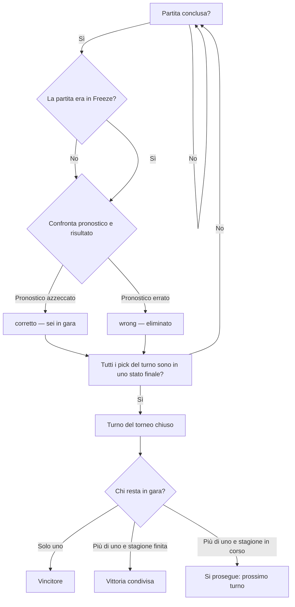

+++++++++++++++++++++++++++++++++ìì# PRD: Survivor League — Proof of Concept

> ⚠ **POC ONLY** — Questo documento descrive il sistema per la Proof of Concept. Non è il design del sistema di produzione.

**Stato:** Revisionato
**Data:** 2026-08-20
**Versione:** 0.6.1

---

## Indice

- [1. Obiettivo](#1-obiettivo)
  - [1.1 Scope della POC](#11-scope-della-poc)
  - [1.2 Obiettivi e non-obiettivi](#12-obiettivi-e-non-obiettivi)
- [2. Glossario](#2-glossario)
- [3. Il gioco in sintesi](#3-il-gioco-in-sintesi)
- [4. Flusso del torneo](#4-flusso-del-torneo)
  - [4.1 Iscrizione](#41-iscrizione)
  - [4.2 Apertura del TT](#42-apertura-del-tt)
  - [4.3 Invio e validazione del pick](#43-invio-e-validazione-del-pick)
  - [4.4 Deadline e pick mancante](#44-deadline-e-pick-mancante)
  - [4.5 Contabilizzazione e chiusura del TT](#45-contabilizzazione-e-chiusura-del-tt)
  - [4.6 Avanzamento e fine torneo](#46-avanzamento-e-fine-torneo)
  - [4.7 User stories e scenari d'uso](#47-user-stories-e-scenari-duso)
  - [4.8 Automazione in produzione e intervento del commissioner](#48-automazione-in-produzione-e-intervento-del-commissioner)
- [5. Regole di gioco](#5-regole-di-gioco)
  - [5.1 Una squadra per girone](#51-una-squadra-per-girone)
  - [5.2 Pick mancante](#52-pick-mancante)
  - [5.3 Deadline e finestra di pick](#53-deadline-e-finestra-di-pick)
  - [5.4 Chiusura del TC e partite rinviate](#54-chiusura-del-tc-e-partite-rinviate)
- [6. Canale di comunicazione](#6-canale-di-comunicazione)
- [7. Requisiti non funzionali](#7-requisiti-non-funzionali)
- [8. Casi limite](#8-casi-limite)
- [9. Criteri di successo e metriche](#9-criteri-di-successo-e-metriche)
- [10. Requisiti fuori scope](#10-requisiti-fuori-scope)
- [11. Prospetto di tracciabilità](#11-prospetto-di-tracciabilità)
- [12. Decisioni di prodotto](#12-decisioni-di-prodotto)
- [13. Domande aperte](#13-domande-aperte)
- [14. Changelog](#14-changelog)

---

## 1. Obiettivo

Un sistema che gestisce un torneo Survivor League basato sui risultati della Serie A, interagendo con i giocatori esclusivamente via email. La POC serve a validare le regole di gioco e il flusso di interazione (iscrizione → pick → conferma/rifiuto → esito) prima di aggiungere altri canali o meccaniche.

### 1.1 Scope della POC

La POC è un **sottoinsieme** delle funzionalità discusse nel BRIEF (documento storico congelato il 2026-08-11) e in `FUTURE_EXPLORATIONS.MD`: include le regole di gioco complete e il flusso di interazione con un canale solo, per validarli sui dati storici 2025/26. Tutto ciò che non è elencato qui è fuori dalla POC: rimandato alla Fase 1 di Produzione (roadmap BRIEF §7.2) o alle esplorazioni future (vedi §10).

| Funzionalità | Riferimento BRIEF | Forma nella POC |
|---|---|---|
| Iscrizione via email | §1, §3.1 | Account **piattaforma** persistente (email, `registerID` stabile); la partecipazione al torneo (profilo) nasce al **primo pick valido nel TT 1** (auto-join, RF-P5) |
| Regole di gioco complete | §3.1-3.2 | Una squadra per girone; tre casi di fine torneo (unico, collettiva, fine stagione) |
| Pick via email in linguaggio naturale | §3.3, §3.7 | Invio, validazione, primo pick valido, deadline |
| Eliminazione per pick mancante | §3.5 | Nessun meccanismo di grazia |
| Contabilizzazione deterministica e partite rinviate | §3.7 + §5.4 | Contabilizzazione incrementale (4.5); CL7 (recupero in finestra), CL1 (Freeze) |
| Canale unico email | §3.8 | Adapter email (Gmail IMAP/SMTP); altri canali in Fase 1 |
| Amministrazione e test via CLI | — | Ogni componente espone comandi CLI (ADR-006) |
| Dati storici 2025/26 e simulazione stagione | §7.1 | Dati via API football-data.org importati nel DB; simulazione intera stagione |
| Configurabilità totale | §5 | Parametri di gioco e infrastruttura in env validate |
| Avvio asincrono (aggancio) | — (2026-08-14, ADR-008) | Il torneo può partire da un TC arbitrario della stagione (`tournament:start --start-round <n>`); la partecipazione è gated dalla deadline del TT 1 |
| Iscrizione a livello di piattaforma | — (2026-08-20, ADR-009) | Storage separato `PLATFORM_DB_PATH`, soft-delete a due passi, iscrizione/disiscrizione via email sempre disponibili |

**Rimandate alla Fase 1 di Produzione** (BRIEF §7.2): profili multipli (§3.3), avviso di collisione (§3.4), quota di iscrizione e montepremi/payout (§3.6, §3.9), canale WhatsApp (§3.8), **tornei multipli (§3.10 — non inclusi nella POC)**.
**Rimandate alle esplorazioni future** (`FUTURE_EXPLORATIONS.MD`): jolly, auto-pick, ingresso tardivo, canali aggiuntivi, notifiche, chatbot, web (vedi anche §10).

### 1.2 Obiettivi e non-obiettivi

**Obiettivi della POC:**
- Validare le regole di gioco (gironi, deadline, Freeze, fine torneo) sui dati storici 2025/26.
- Validare il flusso di interazione via email in linguaggio naturale (interpretazione del pick tramite LLM, ADR-004).
- Dimostrare l'orchestrazione completa del torneo da riga di comando (ADR-006): stessa interfaccia per automazione, operatore e futuro agente.

**Non-obiettivi della POC (da non perseguire qui):**
- Perfezionare UX/contenuti oltre il necessario; il canale email è l'unico e il formato del pick è confermato come interpretazione libera via LLM (2026-08-13).
- Risolvere le lacune operative della produzione automatica (osservabilità completa, fallback LLM, riconciliazione dati): sono tracciate nei rischi dell'HLD §10 e nei requisiti mancanti della review (§16, HIGH-04/05/06).

La responsabilità dei **componenti** (come il sistema è strutturato) è architettura, non requisito di prodotto: è descritta nell'HLD §2 e negli ADR (in particolare ADR-004 e ADR-006).

---

## 2. Glossario

Dal brief originale, applicato alla POC:

| Termine | Significato |
|---|---|
| **Aggancio del torneo** | Scelta del TC di partenza del torneo (`start_round`): il TT 1 corrisponde al TC di aggancio e il torneo gioca la finestra `[start_round…fine stagione]` (RF-20) |
| **Ancora TC** | Sinonimo di TC di aggancio: il TC da cui parte il torneo |
| **Account piattaforma** | L'iscrizione alla **piattaforma** (ADR-009, RF-P1): email + `registerID` interno **stabile** + status `active`/`pending_unsubscribe`/`unsubscribed`. Persistita in uno storage separato (`PLATFORM_DB_PATH`, RF-P7); non è la partecipazione al torneo |
| **registerID** | Identificatore interno stabile dell'account piattaforma: **riusato** alla re-iscrizione (RF-P3); replicato su `player`/`profile` come riferimento (RF-P7) |
| **Iscritto (piattaforma)** | Un titolare di account piattaforma in stato `active`. Riceve la notifica di apertura torneo; può inviare pick (se partecipante) o disiscriversi |
| **Partecipante** | Un iscritto che ha un **profilo** nel torneo (nato per **auto-join al TT1**, RF-P5). Solo i partecipanti ricevono le email di round |
| **Auto-join** | Creazione **atomica** di profilo + primo pick valido al TT 1 (RF-P5): sostituisce RF-27; nessun profilo senza pick valido; la risposta è `pick_confirmed` |
| **Soft-delete a due passi** | Barriera di disiscrizione (RF-P2): primo messaggio di unsubscribe → `pending_unsubscribe` + email `platform_unsubscribe_confirm`; la soft-delete (`unsubscribed`) avviene solo su un secondo messaggio con intento `unsubscribe` o body di conferma (`confermo`/`sì`/`si`/`yes`). L'email resta memorizzata (re-iscrizione con lo stesso `registerID`) |
| **ExternalIdentity** | Identità di un giocatore fornita dal canale di comunicazione, normalizzata in `{ channel, identifier }`; nella POC `{ channel: 'email', identifier: <indirizzo email> }` (ADR-008) |
| **Token `TTnTCm`** | Coppia numerica compatta "TT n, TC m" (es. `TT2TC7`) usata in CLI e log; nelle email il corpo porta la coppia in forma estesa "Round N · Turno di campionato M" e il soggetto il solo TC "Turno {TC} di Campionato" (RF-25, ADR-013); nei log sono campi strutturati `{tt, tc}` (RF-25) |
| **Pick** | Pronostico per un TT: una squadra + un esito (vittoria / sconfitta / pareggio) |
| **Pick registrato** | Pick validato e salvato. In attesa del risultato della partita; può passare allo stato Freeze (5.4) |
| **Pick contabilizzato** | Pick valutato dopo la partita: corretto o sbagliato |
| **TT — Turno del torneo** (inglese: round) | Il round di gioco associato a un TC: la finestra di pick si apre al termine del TC precedente e si **chiude alla deadline** (4.4); il TT si **conclude** quando tutti i pick sono stati contabilizzati o freezati (4.5) |
| **TC — Turno di campionato** (inglese: matchday) | Finestra temporale della Serie A: dal fischio d'inizio della prima partita in calendario alla chiusura ai fini del gioco, cioè fine prevista della UPP più uno scarto configurabile (5.4). "Giornata" è la terminologia storica |
| **UPP — Ultima partita programmata** | La partita del TC con la fine prevista più tarda secondo il calendario |
| **PR — Partita rinviata** | Partita spostata rispetto al calendario originario, con una data di recupero |
| **Deadline** | Istante di chiusura della finestra di pick del TT: fischio d'inizio della prima partita del TC meno un anticipo configurabile (5.3) |
| **Finestra di pick** | Intervallo del TT in cui i pick possono essere inviati: dall'apertura del TT alla deadline |
| **Freeze** | Stato di un pick la cui partita è stata rinviata fuori dalla finestra del TC: resta in attesa e viene contabilizzato solo a partita conclusa; la squadra resta bruciata nel girone corrente (5.4) |
| **Girone** | Andata (TC 1-19) o ritorno (TC 20-38). Al cambio girone il pool di squadre disponibili si azzera |
| **Profilo** | La **partecipazione al torneo** di un iscritto: nasce per auto-join al primo pick valido nel TT 1 (RF-P5) e muore per eliminazione. Nella POC: un profilo per giocatore |
| **Giocatore** | La persona reale, la cui identità è fornita dal canale di comunicazione (nella POC: l'indirizzo email) |
| **Squadra bruciata** | Squadra già usata dal profilo nel girone corrente, non più disponibile |
| **Eliminazione** | Rimozione del profilo dal torneo dopo pick sbagliato o mancante |
| **Commissioner** | L'amministratore del torneo, unico utente con accesso alla CLI |

---

## 3. Il gioco in sintesi

Torneo a eliminazione tra amici basato sulla Serie A. Prima di ogni giornata di campionato (TC) i profili ancora in gara inviano un pronostico (pick): una squadra + un esito (vince / perde / pareggia). Pick corretto → si resta in gara; pick sbagliato **o mancante alla deadline** → eliminazione. Ogni squadra è utilizzabile una sola volta per girone; al cambio girone il pool si azzera. Il torneo può essere **agganciato** a un TC arbitrario della stagione: il TT 1 corrisponde al TC di aggancio e il torneo gioca la finestra `[start_round…fine stagione]` (RF-20, ADR-008). Il torneo termina quando resta un solo profilo in gara, quando tutti gli ultimi in gara vengono eliminati nello stesso turno, oppure a fine stagione con vittoria condivisa tra i superstiti. La descrizione divulgativa per i non tecnici è nel `POC_DESIGN_STATUS` (documento di supporto alla comunicazione con stakeholder). Le regole dettagliate sono al §4, §5.

---

## 4. Flusso del torneo

Ogni **turno di campionato (TC)** ha un **turno del torneo (TT)** corrispondente: i pick di un TT riguardano le partite del TC. Il TT si apre al termine del TC precedente — il **primo TT si apre all'apertura del torneo** (4.2, RF-23); la **finestra di pick** si chiude alla deadline (4.4); il TT si **conclude** quando tutti i pick sono stati contabilizzati o freezati (4.5).

**Aggancio del torneo (avvio asincrono).** Il torneo può essere **agganciato** a un TC arbitrario della stagione: alla creazione si fissa il TC di partenza `start_round` (default: TC 1) e da esso si **deriva** la mappatura con ogni TC: **TT = TC − start_round + 1** (RF-20, ADR-008). Il torneo gioca la finestra `[start_round…fine stagione]`, che è un **filtro logico**, non un dominio dati: import, derivazioni data-driven (numero TC, confine girone, squadre, deadline) e regole operative continuano a operare sull'intera stagione (LLD §3.2). Ogni comunicazione, log strutturato e output CLI riporta **sempre** la coppia **TT/TC** (RF-25); la coppia è iniettata deterministicamente nei template email, mai generata dall'LLM (ADR-004).

**Requisiti funzionali di aggancio:**
- **RF-20** — L'avvio del torneo accetta un parametro di aggancio `--start-round <n>` (default 1): il TT 1 corrisponde al TC `n` e la mappatura è `TT = TC − start_round + 1`.
- **RF-21** — La validazione dell'aggancio verifica che il TC di partenza esista, abbia partite in calendario e che la deadline del TT 1 sia futura; se una verifica fallisce, l'avvio rifiuta **atomicamente** senza lasciare stato parziale.
- **RF-25** — La mappatura TT↔TC è presente in ogni comunicazione, log strutturato e output CLI (coppia `{tt, tc}`), iniettata deterministicamente nei template, mai generata dall'LLM. **Emendamento email v3 (ADR-013):** nel SOGGETTO compare il solo turno di campionato (`⚽🏆SURVIVOR LEAGUE🏆⚽ - Turno {TC} di Campionato - {etichetta}`); la coppia "Round N · Turno di campionato M" resta nel CORPO.

Le sezioni 4.3 e 4.5 includono diagrammi illustrativi (mermaid) per rendere i flussi immediatamente comprensibili; le viste di progettazione (sequence diagram dell'invio del pick e state diagram del ciclo di vita del pick) sono nell'HLD §6. La sezione 4.7 raccoglie le **user story** e gli scenari d'uso che guidano la progettazione (ogni storia include criteri di accettazione e implicazioni di design). Le storie **US1–US5** descrivono il flusso dal punto di vista del **giocatore**, le storie **US6–US10** dal punto di vista del **Commissioner** (l'amministratore del torneo, §2). La sezione 4.8 chiarisce come queste operazioni saranno **automatizzate in produzione** (Fase 1, stagione 2026/27), lasciando sempre al commissioner la possibilità di intervenire.

```
TC n-1:   [fischio 1ª partita ─────────────── fine prevista UPP ─ +5h (config.) ─→ chiuso]
TT n:                      [finestra di pick: apertura ─────────→ deadline_n]
TC n:                                              [fischio 1ª partita ── ...]

TC s (= start_round):   [fischio 1ª partita ─────────────────────────────→ ...]
TT 1:                   [apertura torneo ───────────────────────────→ deadline TT1]
TT m = TC n − start_round + 1        (mappatura derivata, ADR-008)

deadline_n  = fischio di inizio della prima partita del TC n − anticipo (config., proposta 30')
accettazione pick = min(deadline registrata, fischio d'inizio effettivo prima partita del TC)   (RF-31)
chiusura TC = fine prevista della UPP + scarto (config., proposta 5 ore)
```

### 4.1 Iscrizione (piattaforma) e auto-join

L'iscrizione è a **due livelli** (ADR-009): la **piattaforma** (account persistente, sempre disponibile) e il **torneo** (profilo = partecipazione, solo entro la deadline del TT 1).

**Iscrizione alla piattaforma (RF-P1/P3/P4).** Un giocatore si iscrive (e si disiscrive) **via email in qualunque momento** — prima, durante e dopo un torneo: non esiste più alcuna "finestra di iscrizione" da aprire/chiudere. L'intento del messaggio (iscrizione / disiscrizione / pick) è classificato dall'LLM (RF-P1, ADR-004). Alla prima iscrizione il sistema crea l'account con un `registerID` interno **stabile** e risponde con la conferma (`platform_registered`) con formato del pick e regole essenziali. Una nuova iscrizione da un'email già registrata riattiva lo stesso account (`registerID` invariato, RF-P3) e risponde "già iscritto" con il tipo email dedicato `platform_already_registered`. Un pick da un mittente **non iscritto** (mai iscritto o disiscritto) produce **solo un log interno, nessuna risposta** (anti-spam, RF-P4). Il comando `platform:register` è l'**unico** comando di creazione account e **non crea profili** (la partecipazione avviene solo via auto-join).

**Disiscrizione a due passi (RF-P2).** Il primo messaggio con intento di disiscrizione **non** elimina: imposta `pending_unsubscribe` e invia `platform_unsubscribe_confirm`. La soft-delete (`unsubscribed`) avviene solo su un **secondo** messaggio con intento `unsubscribe` o con un body di conferma (`confermo`/`sì`/`si`/`yes`). Un messaggio di iscrizione o un pick mentre lo stato è `pending_unsubscribe` riporta l'account ad `active` (stesso `registerID`). Una disiscrizione da un account già `unsubscribed` (o da un mittente mai iscritto) produce un **log silenzioso** (nessuna risposta). L'email resta memorizzata: la re-iscrizione riusa lo stesso `registerID` e lo storico torneo non è toccato (RF-P3).

**Partecipazione al torneo: auto-join al TT 1 (RF-P5).** Un iscritto **senza profilo** che invia un pick **nel TT 1** (round = TC di aggancio, round aperto, pick che passa l'accettazione RF-31) crea **profilo + pick in un'unica operazione atomica**; se il pick non è valido il profilo non viene creato (rollback). La risposta è `pick_confirmed` (nessuna conferma di iscrizione separata). L'iscrizione alla piattaforma durante un torneo aperto **non crea subito il profilo**: chi si iscrive e non invia mai un pick **non è un partecipante** (non eliminato, nessuna email di round). **Dopo la deadline del TT 1** un pick da iscritto senza profilo è rifiutato con risposta (il torneo è iniziato); un pick da sconosciuto non auto-iscrive mai (RF-P4). La **disiscrizione a torneo in corso** non tocca il profilo (storico intatto): ferma solo comunicazioni e pick; il profilo muore naturalmente alla prossima chiusura round (`missing_pick`, senza email al disiscritto). Se il giocatore si **re-iscrive prima della prossima deadline**, riprende a giocare con lo stesso `registerID` e lo stesso profilo.

**Regole:**
- L'identità del giocatore è fornita dal canale di comunicazione; nella POC il canale è l'email, identificativa unica dell'account piattaforma (RF-P1, ADR-008)
- Un giocatore = un account piattaforma = al più un profilo per torneo (POC: un torneo alla volta, mai contemporanei)
- Il gate di eligibilità (`checkEligibility(ExternalIdentity)`, ADR-008) resta: l'implementazione POC è "account piattaforma **attivo**" (Fase 1: attivo + quota pagata). Il gate del pick = piattaforma attiva + profilo (o auto-join al TT 1)
- Ogni email in uscita è filtrata sullo stato dell'account al momento dell'invio: `unsubscribed` e `pending_unsubscribe` non ricevono alcuna email (RF-P6), **salvo le conferme del flusso di iscrizione/disiscrizione** (RF-P1/P2): `platform_unsubscribe_confirm` verso `pending_unsubscribe`, `platform_unsubscribed` verso `unsubscribed` e le risposte subscribe partono **sempre**, anche verso account non `active`, perché sono il flusso di conferma stesso (ADR-010)

**Requisiti funzionali:**
- **RF-P1** — Iscrizione piattaforma via email (intento LLM): crea/riattiva l'account con `registerID` stabile; conferma via email (`platform_registered`). Già iscritto → risposta "già iscritto" con il tipo email dedicato `platform_already_registered` (ADR-010). **Emendamento ADR-011:** il classificatore deduce dalla mail di registrazione anche il **nome** del giocatore (`{intent, pick, name?}`), salvato su `platform_account.name` alla prima creazione; nome assente → il sistema usa l'indirizzo email al posto del nome (correzione `registered_user_name`). Ovunque il sistema inviti all'iscrizione, l'istruzione fondamentale è la formula "dimmi il tuo nome e scrivi voglio iscrivermi" (es. mail di chiarimento).
- **RF-P2** — Disiscrizione via email (intento LLM, barriera a due passi): primo messaggio → `pending_unsubscribe` + `platform_unsubscribe_confirm`; soft-delete (`unsubscribed`) solo su secondo messaggio con intento `unsubscribe` o body di conferma (`confermo`/`sì`/`si`/`yes`). Da mittente `unsubscribed` o non iscritto → log silenzioso.
- **RF-P3** — Re-iscrizione: stesso `registerID`; lo storico torneo (profili/pick) non è toccato.
- **RF-P4** — Pick da mittente non iscritto (mai o disiscritto) → log interno, nessuna risposta (anti-spam/privacy).
- **RF-P5** — Un iscritto può partecipare solo entro la deadline del TT 1: primo pick nel TT 1 → auto-join (profilo+pick atomici); dopo il TT 1 → rifiuto con risposta; nessun profilo senza pick valido. Disiscritto a torneo in corso → profilo conservato, comunicazioni e pick fermati; re-iscrizione prima della prossima deadline → si riprende con lo stesso `registerID` e profilo.
- **RF-P6** — Notifiche: apertura torneo a tutti gli iscritti attivi; apertura round (pick) ai soli partecipanti attivi e, **all'apertura del TT 1**, anche agli **iscritti attivi senza profilo** (emendamento 2026-08-21); chiusura round (riepilogo `round_closed_survived`) ai soli sopravvissuti; gli eliminati ricevono solo le notifiche puntuali (`pick_missing_elimination`, `round_result_wrong`). **Carve-out (ADR-010):** le conferme del flusso di iscrizione/disiscrizione (RF-P1/P2 — `platform_unsubscribe_confirm`, `platform_unsubscribed`, risposte subscribe) partono **sempre**, anche verso account non `active`, perché sono il flusso di conferma stesso; il filtro `active` si applica a tutte le altre email. **Emendamento ADR-011/ADR-013:** cambiano SOLO i testi (stile unico "energetic", renderer deterministico di canale, soggetti con il solo turno di campionato e neutri per gli esiti, corpo plain-text senza riquadri ASCII, mai elenchi nominativi di partecipanti, chiusura fissa dell'eliminato); destinatari, filtri e matrice restano INVARIATI.
- **RF-P7** — Persistenza piattaforma separata da `DB_PATH` (`PLATFORM_DB_PATH`), non eliminata col DB torneo; `register_id` replicato su `player`/`profile`.
- **RF-P8** — Determinismo: `created_at`/`unsubscribed_at` piattaforma scritti dal clock iniettato (RNF1).

### 4.2 Apertura del TT

1. Il **primo TT si apre all'apertura del torneo** (RF-23); i TT successivi si aprono al termine del TC precedente (in test li apre il commissioner via CLI; a regime li apre lo scheduler, 5.4).
2. Il sistema determina la deadline: fischio d'inizio della prima partita del TC meno un anticipo configurabile (default: 30 minuti), basata sugli orari programmati del calendario (5.3).
3. Il sistema invia l'email di **apertura torneo** (`tournament_open`, una sola volta) a **tutti gli iscritti attivi della piattaforma** (RF-P6: sostituisce l'invito a una lista di contatti) e, a ogni apertura di TT, un'email a **ogni partecipante attivo** (profilo `eliminated = 0` con account piattaforma `active`) contenente:
   - Coppia TT/TC del round (es. "TT 2 / TC 7", forma estesa; RF-25)
   - Squadre disponibili per quel profilo (escludendo quelle già bruciate nel girone corrente)
   - Deadline entro cui inviare il pick
   - Istruzioni su come formattare la risposta

**Requisiti funzionali:**
- **RF-05** — All'apertura del TT il sistema calcola la deadline come orario d'inizio della prima partita del TC (da calendario) meno l'anticipo configurabile.
- **RF-06** — Il sistema invia l'email pick di apertura TT **ai soli partecipanti attivi** (`eliminated = 0` con account piattaforma `active`), con coppia TT/TC, squadre disponibili, deadline e istruzioni (RF-P6). **Eccezione TT 1 (emendamento 2026-08-21):** l'email va anche agli iscritti attivi **senza profilo** (che al TT 1 non esistono ancora: auto-join al primo pick, RF-P5).
- **RF-23** — Il primo TT si apre all'apertura del torneo; i TT successivi si aprono al termine del TC precedente.

### 4.3 Invio e validazione del pick

1. Il giocatore risponde all'email indicando squadra ed esito in linguaggio naturale.
2. Il sistema riceve l'email, la interpreta (tramite LLM, ADR-004) ed estrae `{squadra, esito}`.
3. Il sistema valida il pick:
   - L'account piattaforma del mittente è `active` e il mittente ha un profilo in gara? (Nel TT 1 un iscritto **senza profilo** fa **auto-join**: profilo + pick atomici, RF-P5. Un mittente **non iscritto** riceve solo un log interno, RF-P4.)
   - La squadra gioca in quel TC?
   - La squadra non è già stata usata nel girone corrente?
   - L'esito è valido (vittoria / sconfitta / pareggio)?
   - Il profilo non ha già inviato un pick valido per questo TT?
   - Il pick arriva entro l'istante di **accettazione** del TC, cioè `min(deadline registrata, fischio d'inizio effettivo della prima partita)` (RF-31)?
4. Se valido: registra il pick e risponde con conferma.
5. Se non valido: risponde spiegando il motivo del rifiuto; il giocatore può riprovare.

> **Figura 4.3a — Flusso di validazione del pick.** Il percorso dall'invio alla conferma (o al rifiuto). Un rifiuto non consuma il tentativo: il giocatore può riprovare. Il sequence diagram dell'interazione giocatore–sistema è nell'HLD §6.

```mermaid
flowchart TD
    A[Il giocatore invia l'email con squadra + esito] --> B{Formato riconosciuto?}
    B -- No --> C[Il sistema risponde: indica squadra ed esito in modo più chiaro. Puoi riprovare]
    B -- Sì --> D{Squadra in partita in questa giornata?}
    D -- No --> C
    D -- Sì --> E{Squadra già usata nel girone?}
    E -- Sì --> C
    E -- No --> F{Esito valido? vince / perde / pareggia}
    F -- No --> C
    F -- Sì --> G{Accettato?<br/>receivedAt ≤ min(deadline registrata,<br/>fischio d'inizio effettivo prima partita) — RF-31}
    G -- No --> H[Pick ignorato: finestra accettazione scaduta. Vale come pick mancante]
    G -- Sì --> I{Esiste già un pick valido per questo turno?}
    I -- Sì --> J[Il sistema risponde: pick già registrato, il successivo è rifiutato]
    I -- No --> K[Pick registrato]
    K --> L[Il sistema conferma e aspetta la partita]
```

**Regole:**
- Vale il **primo pick valido** inviato. Pick successivi nello stesso TT sono respinti (RF-08)
- Un pick da un iscritto **senza profilo**: nel **TT 1** innesca l'**auto-join** (profilo + pick atomici, RF-P5); se il pick non è valido nessun profilo viene creato. **Dal TT 2** è rifiutato con risposta (il torneo è iniziato)
- Un pick da un mittente **non iscritto** (mai iscritto o disiscritto) produce **solo un log interno, nessuna risposta** (anti-spam, RF-P4): non auto-iscrive mai
- Un pick rifiutato non consuma il tentativo: il giocatore può inviarne un altro (RF-09)
- Pick ricevuti dopo la deadline sono respinti: fa fede il timestamp di **ricezione sul server** (`receivedAt`, ADR-001), non l'header `Date` dell'email (RF-11)
- Un pick è accettato solo se `receivedAt` ≤ `min(deadline registrata, fischio d'inizio effettivo della prima partita del TC)` (**guard anti-frode**, RF-31): con la deadline nominale è ridondante (deadline = kickoff − anticipo), ma blocca i pick quando la deadline è NULL/errata o quando il calendario anticipa una partita dopo l'apertura (CL17, CL18)
- Pick identici tra profili diversi sono permessi (nella POC ogni giocatore ha un solo profilo, quindi la collisione della regola 3.4 del brief non si applica)

**Requisiti funzionali:**
- **RF-07** — Il sistema interpreta il testo dell'email in linguaggio naturale ed estrae `{squadra, esito}` (interpretazione LLM confermata, ADR-004).
- **RF-08** — Vale il primo pick valido: un secondo pick valido nello stesso TT è respinto.
- **RF-09** — Un pick rifiutato non consuma il tentativo: il giocatore può riprovare.
- **RF-10** — La validazione verifica: account piattaforma `active`, profilo esistente in gara (o auto-join al TT 1, RF-P5), squadra in partita nel TC, squadra non bruciata nel girone, esito valido, entro l'istante di accettazione.
- **RF-11** — Un pick ricevuto dopo la deadline è respinto (confronto su `receivedAt`, ADR-001).
- **RF-12** — Squadra del pick = bruciata nel girone corrente (vedi 5.1).
- **RF-31** — Guard anti-frode: nessun pick è accettato se `receivedAt` > fischio d'inizio **effettivo** della prima partita del TC; l'istante di accettazione è `min(deadline registrata, kickoff effettivo)`, prevale su RF-14 in caso di anticipo di calendario non gestito (CL18); rifiuto con motivo esplicito; rimedio = override US10 con `--reason`.

### 4.4 Deadline e pick mancante

Allo scadere della deadline la finestra di pick si chiude e non si accettano più pick per quel TT. I pick non possono più essere inviati o modificati.

1. Per ogni profilo attivo il sistema verifica se esiste un pick valido per il TT corrente.
2. **Pick presente:** nessuna nuova registrazione: il pick è già stato registrato e la squadra già bruciata nel girone corrente **all'invio valido** (4.3). La chiusura alla deadline **consolida** soltanto lo stato: il pick resta in attesa di contabilizzazione (4.5).
3. **Pick mancante:** il profilo viene eliminato. Il sistema invia un'email di notifica.

**Regole:**
- La chiusura della finestra di pick è un'operazione **deterministica** che consolida lo stato dei pick al momento della deadline (RF-13)
- Il commissioner può **forzare la chiusura** della finestra pick con `round:close --round <n> --force --reason <motivo>` (RF-29, US9): semantica **identica** alla chiusura a deadline (consolidamento: elimina i profili senza pick valido e invia le notifiche; non esiste "chiudi senza eliminare"). Vale anche con deadline NULL o non registrata
- Se la deadline di un round non è registrata o non ha mai innescato l'auto-chiusura, lo scheduler applica la **chiusura di sicurezza** alla chiusura del TC (fine prevista UPP + scarto, 5.4): stesso consolidamento, evento loggato come `safety_close` con causa `deadline_missing` (RF-30, US9). Se nemmeno la chiusura del TC è calcolabile → nessuna auto-chiusura, log `warn` + anomalia in `tournament:status`; uscita = chiusura forzata (RF-29)
- Cosa arriva dopo l'istante di accettazione è irrilevante: la finestra di pick è chiusa e il TT non accetta più pick
- La **chiusura del TT** (tutti i pick contabilizzati o freezati) è un evento successivo, gestito in 4.5

**Requisiti funzionali:**
- **RF-13** — Alla deadline, per ogni profilo attivo senza pick valido, il sistema elimina il profilo e invia l'email di notifica.
- **RF-14** — La deadline è calcolata all'apertura del round sulla base degli orari programmati del calendario e resta fissa per l'intero TT (decisione 2026-08-13, 5.3); un eventuale cambio d'orario della prima partita dopo l'apertura richiede una decisione esplicita del commissioner. In caso di anticipo non gestito, il guard anti-frode (RF-31) prevale (CL18).
- **RF-29** — Il commissioner può chiudere la finestra di pick in qualunque momento con `round:close --round <n> --force --reason <motivo>` (anticipata, o con deadline NULL/non registrata): consolidamento con semantica identica alla chiusura a deadline; ogni chiusura forzata è auditat.
- **RF-30** — Chiusura di sicurezza: senza deadline registrata, lo scheduler chiude il round alla chiusura del TC (fine prevista UPP + scarto, ricalcolata dai dati correnti); consolidamento identico alla chiusura a deadline; evento loggato `safety_close` con causa esplicita; se la chiusura TC non è calcolabile → nessuna auto-chiusura, warn + anomalia in `tournament:status` e uscita tramite chiusura forzata (RF-29).

### 4.5 Contabilizzazione e chiusura del TT

Il TT viene contabilizzato **incrementalmente** (ADR-003): ogni pick viene valutato **quando il risultato della sua partita diventa disponibile**, non tutti insieme alla chiusura del TC. Il Round Manager scorre i pick in attesa e contabilizza quelli la cui partita si è conclusa (5.4); i pick su partite rinviate fuori dalla finestra restano in Freeze e vengono contabilizzati separatamente, a partita conclusa (5.4).

Il TT si **conclude** quando tutti i suoi pick sono stati contabilizzati (corretto o sbagliato) o freezati: da quel momento gli stati dei pick sono definitivi e il torneo può avanzare (4.6). Un pick in Freeze non impedisce la chiusura del TT: è già in uno stato terminale e verrà contabilizzato più avanti, senza effetto sulla chiusura. La chiusura del TT può avvenire **prima della chiusura del TC** (5.4) se tutti i pick risultano contabilizzati al termine delle partite.

Quando la partita oggetto del pick è terminata e il risultato è disponibile, il sistema valuta il pick:

1. Confronta il pronostico con il risultato reale della partita:
   - Pronostico "vince" + squadra ha vinto = **corretto**
   - Pronostico "perde" + squadra ha perso = **corretto**
   - Pronostico "pareggia" + squadra ha pareggiato = **corretto**
   - Qualsiasi altra combinazione = **sbagliato**
2. Pick corretto → il profilo resta in gara.
3. Pick sbagliato → il profilo è eliminato.
4. Il sistema notifica l'esito **a ogni profilo valutato con account piattaforma `active`**:
   - Pick corretto: `round_result_correct` (resta in gara, squadre ancora disponibili)
   - Pick sbagliato: `round_result_wrong` (notifica di eliminazione)
5. Alla **transizione `closed → scored`** (e solo lì, una sola volta: guardia `round_state.summary_sent`, RF-P6) il sistema invia il **riepilogo di chiusura round** `round_closed_survived` **ai soli sopravvissuti** (`eliminated = 0` con account piattaforma `active`). Gli eliminati ricevono **solo** le notifiche puntuali (`pick_missing_elimination` alla chiusura, `round_result_wrong` alla contabilizzazione): **nessun** riepilogo di chiusura. L'eliminazione a posteriori da Freeze produce **solo** `round_result_wrong` (coerente con PRD §5.4), nessun riepilogo. Gli eliminati dei round precedenti non ricevono più email di round; chi è iscritto ma non partecipa riceve solo l'apertura torneo. **Ogni email in uscita è filtrata sullo stato dell'account piattaforma al momento dell'invio**: `unsubscribed`/`pending_unsubscribe` non ricevono alcuna email — **salvo le conferme del flusso di iscrizione/disiscrizione** (RF-P1/P2, ADR-010), che partono sempre perché sono il flusso di conferma stesso.

**Regole:**
- La contabilizzazione è **deterministica** e basata esclusivamente sui risultati ufficiali delle partite del TC (RF-15)
- La chiusura della finestra di pick (4.4) e la contabilizzazione sono due eventi separati nel tempo: prima si chiude la finestra di pick, poi, man mano che i risultati diventano noti, si valutano i pick
- La contabilizzazione è **idempotente**: processa solo pick in attesa e può essere ripetuta senza effetti collaterali (RF-17)

> **Figura 4.5a — Contabilizzazione e verdetto.** Il giudizio di un pick avviene a partita conclusa; da qui il flusso verso eliminazioni, chiusura del turno e fine torneo. Lo state diagram del ciclo di vita del pick è nell'HLD §6.



**Requisiti funzionali:**
- **RF-15** — La contabilizzazione è incrementale e deterministica: ogni pick è valutato quando il risultato della sua partita è disponibile.
- **RF-16** — Il TT si chiude (stato `scored`) quando tutti i pick sono in stato terminale (`correct` / `wrong` / `frozen`).
- **RF-17** — La contabilizzazione è idempotente: processa solo pick in attesa e può essere ripetuta senza effetti collaterali.

### 4.6 Avanzamento e fine torneo

Dopo la chiusura del TT (4.5), il torneo prosegue o termina. Termina in tre casi:

1. **Un solo profilo in gara** → quel profilo vince il torneo.
2. **Tutti i profili ancora in gara vengono eliminati nello stesso TT** → quei profili condividono la vittoria.
3. **Restano due o più profili dopo l'ultimo TC** → i profili superstiti condividono la vittoria.

(Il numero di TC della stagione è derivato dai dati, mai hardcodato: il sistema lo calcola dal calendario, LLD §3.2.) Un profilo con un pick in Freeze non ancora contabilizzato resta in gara e non blocca la determinazione del vincitore; se la partita non viene giocata entro la stagione, il pick non viene mai contabilizzato.

**Requisiti funzionali:**
- **RF-18** — Il torneo termina in tre casi: un solo profilo in gara; tutti gli ultimi in gara eliminati nello stesso TT; due o più superstiti dopo l'ultimo TC. **Emendamento ADR-011 (chiusura automatica e completa):** alla identificazione del/i vincitore/i il sistema chiude il torneo da solo — guardia atomica `winner_notified`/`finished_at`, notifica ai vincitori (`tournament_won`/`tournament_shared_win`), export automatico (dump JSON in `TOURNAMENT_EXPORT_DIR`), inibizione dello scheduler — e dallo stesso sistema è possibile riavviare un nuovo torneo (reset atomico del DB di gioco; piattaforma intatta, ADR-009).
- **RF-19** — Le soglie di fine torneo e di confine gironi sono derivate dai dati della stagione, mai hardcodate.
- **RF-26** — La fine del torneo si determina sulla finestra `[start_round…N]` (ultimo TC della stagione); i tre casi di fine torneo (RF-18) si applicano allo stesso modo su una finestra parziale o di un solo turno (CL12). **Emendamento ADR-011:** la verifica del vincitore è eseguita AUTOMATICAMENTE dal Round Manager alla chiusura di ogni round (dopo `closeRound` e dopo `scoreRound`), non solo dai comandi di sola lettura; `winner:check` resta invocabile in qualunque momento come vista di audit.

### 4.7 User stories e scenari d'uso

Le user story descrivono il comportamento atteso dal punto di vista dell'utente e aiutano a **guidare la progettazione**: per ogni storia sono indicati i criteri di accettazione (agganciati ai casi limite CL e ai criteri di successo CS) e le **implicazioni di design**, cioè cosa il sistema deve prevedere per soddisfarla.

#### US1 — Iscriversi alla piattaforma

> **Come** giocatore, **voglio** iscrivermi alla piattaforma con la mia email, **così** ricevo gli avvisi del torneo e posso partecipare inviando i miei pick.

**Contesto e scenario.** L'iscrizione alla **piattaforma** è **sempre disponibile** via email (RF-P1, nessuna finestra): il giocatore invia un'email di iscrizione; il sistema crea l'account (o riattiva l'esistente con lo **stesso `registerID`**) e risponde con `platform_registered` (formato del pick e regole essenziali). L'identità è fornita dal canale (nella POC l'email, unica, 4.1). La **partecipazione al torneo** nasce al **primo pick valido nel TT 1** (auto-join, RF-P5): chi si iscrive e non invia mai un pick non è un partecipante (nessuna email di round, nessuna eliminazione).

**Criteri di accettazione (⇐ RF-P1/P3/P4/P5, §4.1):**
- Data un'email di iscrizione da un mittente nuovo, il sistema crea l'account (con `registerID` stabile) e risponde con conferma + istruzioni (CS1).
- Data una seconda iscrizione dalla stessa email (già `active`), il sistema non duplica l'account: risponde "già iscritto" (univocità).
- Data un'iscrizione da un account `pending_unsubscribe` o `unsubscribed`, il sistema lo riattiva ad `active` con lo **stesso `registerID`** (RF-P3).
- Dato un pick valido nel TT 1 da un iscritto **senza profilo**, il sistema applica l'**auto-join**: crea profilo + pick in un'unica operazione atomica e risponde con `pick_confirmed` (RF-P5); se il pick non è valido **nessun profilo** viene creato (rollback).
- Dato un pick nel TT 1 da un mittente **non iscritto**, il sistema **non** auto-iscrive: log interno, nessuna risposta (RF-P4).
- Dato un pick da un iscritto senza profilo **dopo la deadline del TT 1**, il sistema lo rifiuta con risposta (il torneo è iniziato, RF-P5).

**Implicazioni di design:**
- Serve un'operazione **atomica** "crea profilo + registra pick" legata al primo pick valido (RF-P5), con rollback senza profilo orfano (vincolo di unicità, RNF2).
- Account piattaforma e partecipazione sono due stati **separati su due storage** (RF-P7): il processore email deve distinguere "iscritto senza profilo" da "sconosciuto" e da "partecipante", senza scritture cross-DB (la piattaforma è solo letta dai flussi di torneo).
- Serve la **barriera a due passi** per la disiscrizione (RF-P2): il primo messaggio di unsubscribe non deve mai eliminare l'account.

#### US2 — Fare un pick e ottenere conferma

> **Come** giocatore, **voglio** inviare squadra ed esito via email, **così** se il pronostico è corretto resto in gara.

**Contesto e scenario.** Prima della deadline il giocatore risponde all'email di apertura del turno indicando squadra + esito ("Roma, vince"). Vale il **primo pick valido**: un secondo invio con pick valido viene rifiutato. Un pick rifiutato non consuma il tentativo.

**Criteri di accettazione (⇐ CL4, CL5, §4.3):**
- Dato un pick valido entro deadline, il sistema lo registra e risponde con conferma (CS1).
- Dato un pick con squadra che non gioca in quel TC, il sistema lo respinge spiegando il motivo; la squadra **non** viene consumata (CL4).
- Dato un pick con formato illeggibile / esito non valido, il sistema lo respinge spiegando il motivo; si può riprovare (CL5).
- Dato un secondo pick valido nello stesso TT, viene respinto perché ne esiste già uno (primo pick valido, 4.3).
- Dato un pick ricevuto **dopo** la deadline, viene ignorato (CL3): il confronto usa la ricezione sul server, non l'header dell'email (5.3).

**Implicazioni di design:**
- La registrazione del pick deve essere **atomica e unica** per profilo+TT (RNF2): il vincolo va applicato a livello di scrittura, non solo di validazione, per gestire invii ravvicinati/concorrenti (CS2).
- La validazione è una cascata di controlli con **motivo di rifiuto dedicato** a ogni fallimento, così l'utente sa cosa correggere.
- Il timestamp di riferimento è `receivedAt` (ADR-001); il sistema deve poter distinguere un pick arrivato in anticipo ma processato in ritardo da uno davvero tardivo (CS4).
- I messaggi di errore non devono mai presupporre conoscenze tecniche (formato leggibile e azione successiva esplicita).

#### US3 — La deadline e il pick mancante

> **Come** giocatore, **voglio** conoscere sempre la deadline, **così** evito di essere eliminato per un pick non inviato in tempo.

**Contesto e scenario.** Tutti i giocatori condividono la stessa deadline (inizio prima partita − anticipo configurabile). Chi non ha un pick valido alla deadline viene eliminato senza meccanismo di grazia (5.2). La notifica di eliminazione arriva via email.

**Criteri di accettazione (⇐ §4.4, §5.2, CS4):**
- Alla deadline, per ogni profilo attivo senza pick valido, il sistema lo elimina e invia l'email di notifica.
- Un pick che arriva dopo la deadline non viene accettato, anche se la sua email risultava in spedizione prima (fa fede `receivedAt`).
- Gli stati dei pick al momento della deadline vengono consolidati in modo **deterministico** e identico a parità di input (RNF1).

**Implicazioni di design:**
- La chiusura della finestra è un evento **separato** dall'elaborazione: il sistema deve determinare la "mancanza" sulla base dello stato consolidato alla deadline, non di un'elaborazione best-effort.
- Eliminare un profilo = smettere di mandargli le email di pick e marcarlo non attivo (nessun flusso inverso nella POC).
- Il timestamp `receivedAt` deve essere registrato **alla ricezione** (per l'email: `internaldate` IMAP, vedi ADR-001 e LLD §1.3), indipendente dalla latenza del polling (5.3).

#### US4 — La partita rinviata o sospesa (Freeze)

> **Come** giocatore, **voglio** non essere penalizzato se la partita su cui ho scommesso viene rinviata o sospesa, **così** posso restare in gara anche se la partita si recupera tardi.

**Contesto e scenario.** La partita scelta viene spostata. Se il recupero cade dentro la finestra del TC, il pick si valuta normalmente con il risultato del recupero (CL7). Se cade fuori, il pick va in **Freeze**: resta in attesa, la squadra resta bruciata nel girone, il giocatore non viene eliminato e il TT può comunque chiudersi (CL1). Le partite sospese sono trattate come rinviate (5.4, ADR-002).

**Criteri di accettazione (⇐ CL1, CL7, CL8, §5.4):**
- Recupero entro la finestra del TC → il pick resta valido e viene contabilizzato con l'esito del recupero quando disponibile (CL7).
- Recupero fuori finestra → il pick passa a Freeze; a recupero concluso viene contabilizzato (corretto o sbagliato), eventualmente eliminando il profilo in quel momento (CL1).
- Se l'ultima partita prevista del TC (UPP) non si gioca, il TC si chiude comunque e il relativo pick va in Freeze (CL8).
- Un profilo eliminato per altri motivi con un pick in Freeze: il freeze è senza effetto (5.4).
- Se la partita non viene mai giocata in stagione, il pick non viene mai contabilizzato (4.6).

**Implicazioni di design:**
- Lo stato Freeze è **terminale per il TT** (non blocca la chiusura) ma **transitorio per il torneo** (può eliminare in seguito): il modello dati deve esprimere questa differenza.
- Serve una data di recupero per classificare entro/fuori finestra in modo **deterministico** (RNF7): la classificazione dipende solo da calendario programmato e data di recupero.
- La contabilizzazione **incrementale** deve riuscire a valutare un pick in Freeze anche molto dopo la chiusura del TT (ADR-003), senza toccare gli stati già definitivi del TT.
- La squadra di un pick in Freeze è bruciata nel girone in cui è stato registrato, a prescindere da quando si recupera (5.4).

#### US5 — Fine del torneo e vittoria

> **Come** organizzatore (e giocatore), **voglio** un esito chiaro e trasparente, **così** tutti accettano il risultato.

**Contesto e scenario.** Il torneo termina in tre casi (4.6): resta un solo profilo in gara; tutti gli ultimi in gara vengono eliminati nello stesso TT; restano due o più profili dopo l'ultimo TC. Il vincitore si determina dallo stato dei profili, senza richiedere ulteriori input.

**Criteri di accettazione (⇐ CS6, §4.6):**
- Un solo profilo in gara → vincitore unico.
- Tutti i profili in gara eliminati nello stesso TT → vittoria condivisa.
- Due o più profili superstiti dopo l'ultimo TC → vittoria condivisa.
- Un profilo con pick in Freeze non ancora contabilizzato **resta in gara** e non blocca la determinazione del vincitore (4.6).

**Implicazioni di design:**
- Il vincitore si calcola **dal solo stato dei profili/pick** (logica deterministica nel Game Engine), mai da considerazioni esterne.
- La determinazione deve essere ripetibile e testabile sui tre casi (CS6), anche in presenza di freeze non risolti a fine stagione.
- Il passaggio "prossimo turno" (nessun vincitore) deve avanzare automaticamente, derivando le soglie (numero TC) dai dati della stagione, non da costanti (5.1).

#### User story del Commissioner

Le storie **US6–US10** descrivono il **Commissioner** (l'amministratore del torneo, §2): l'unico utente che interagisce con il sistema via CLI. Nella POC (stagione 2025/26) queste operazioni sono **manuali** e servono a testare e a validare il flusso sui dati storici; in **produzione** (Fase 1, stagione 2026/27) sono **automatizzate** (4.8): il sistema legge il calendario e apre/chiude da solo i round (l'iscrizione piattaforma non ha più alcuna fase da gestire, 4.1). Il commissioner conserva **sempre** la possibilità di intervenire con i comandi per correggere lo stato del sistema.

#### US6 — Avviare la stagione

> **Come** commissioner, **voglio** avviare il torneo per la stagione 2025/26 con un comando CLI, **così** il sistema verifica il calendario delle partite ed esegue le operazioni preliminari prima che i giocatori possano partecipare.

**Contesto e scenario.** Dopo l'import dei dati della stagione (`data:import`, LLD), il commissioner avvia la stagione. Il sistema **verifica il calendario** (presente, completo, coerente) ed esegue le **operazioni preliminari**: deriva i parametri data-driven (numero di round, squadre, confine tra i gironi, deadline di ogni round — LLD §3.2) e inizializza lo stato della stagione (round in stato `pending`). Il comando accetta il parametro di **aggancio** `--start-round <n>` (default 1, RF-20): il TT 1 corrisponde al TC di aggancio. Se il calendario manca o è incoerente, o se l'aggancio non supera le verifiche (RF-21), l'avvio fallisce con un errore chiaro e non lascia uno stato parziale.

**Criteri di accettazione (⇐ §4.2, §8, CS3):**
- Dato un calendario valido, l'avvio completa la verifica, inizializza i round `pending` e invia l'email di **apertura torneo** (`tournament_open`) a **tutti gli iscritti attivi della piattaforma** (RF-P6, una sola volta).
- Dato un calendario mancante, incompleto o incoerente, l'avvio fallisce **senza modificare** lo stato (nessuno stato parziale).
- Dato un aggancio `--start-round <n>` a un TC che non esiste, senza partite in calendario o con deadline del TT 1 non futura, l'avvio rifiuta **atomicamente** senza stato parziale (RF-21).
- Dato un aggancio all'**ultimo TC** della stagione (torneo di un solo turno), l'avvio è **ammesso** con un warning informativo (CL12): i tre casi di fine torneo collassano naturalmente (RF-18).
- I parametri di gioco sono derivati dai dati della stagione, mai hardcodati (RF-19).

**Implicazioni di design:**
- Serve un comando CLI di avvio stagione che renda **atomicamente** coerente lo stato iniziale (es. `tournament:start --start-round <n>`, LLD §7.10), distinto dall'import dei dati (`data:*`).
- L'aggancio è persistito in `tournament_state.start_round` (NULL = TC 1 legacy, ADR-008) e da esso si deriva la mappatura TT↔TC usata in ogni comunicazione (RF-25).
- La verifica del calendario, la validazione dell'aggancio e le operazioni preliminari vivono nel **Game Engine** (deterministico): il commissioner (in POC) o lo scheduler (in produzione) le **innescano** ma non le implementano.
- Il broadcast `tournament_open` legge gli indirizzi dal **Platform Registry** (iscritti `active`), non da una lista di contatti passata al comando (ADR-009, RF-P6).
- Lo stesso comando, in produzione, è invocato automaticamente dallo scheduler al primo TC (4.8).

#### US7 — Consultare gli account della piattaforma

> **Come** commissioner, **voglio** consultare l'elenco degli account della piattaforma con stato e date, **così** so chi riceve le comunicazioni e posso verificare iscrizioni e disiscrizioni.

**Contesto e scenario.** Non esiste più alcuna "fase di iscrizione" da aprire (4.1, ADR-009): l'iscrizione piattaforma è sempre disponibile via email. Al commissioner serve una vista di sola lettura sugli account: `platform:list [--json]` elenca email, `registerID`, status (`active`/`pending_unsubscribe`/`unsubscribed`) e le date (`created_at`, `unsubscribed_at`) scritte dal clock iniettato (RF-P8).

**Criteri di accettazione (⇐ RF-P7, RF-P8):**
- `platform:list` mostra tutti gli account con `registerID`, email, status e date, in ordine deterministico (per `registerID`).
- Lo status riflette fedelmente la barriera a due passi: `pending_unsubscribe` dopo il primo unsubscribe, `unsubscribed` dopo la conferma (RF-P2).

**Implicazioni di design:**
- La vista legge **solo** dal DB piattaforma (`PLATFORM_DB_PATH`): nessuna scrittura cross-DB (ADR-009).
- L'account piattaforma è la sorgente degli iscritti per le notifiche (RF-P6): la vista CLI e il broadcast usano la stessa sorgente (`PlatformRegistry`).

#### US8 — Disiscrivere un account dalla piattaforma

> **Come** commissioner, **voglio** disiscrivere (soft-delete) un account con un comando CLI motivato, **così** l'account smette di ricevere comunicazioni e i suoi pick sono fermati.

**Contesto e scenario.** Il commissioner può disiscrivere direttamente un account con `platform:unregister --email <email> [--reason <motivo>]` (soft-delete diretto `unsubscribed`, distinto dalla barriera a due passi via email, RF-P2). La disiscrizione **non tocca** il profilo nel torneo (storico intatto, RF-P3): ferma solo comunicazioni e pick; il profilo muore naturalmente alla prossima chiusura round (`missing_pick`, senza email al disiscritto); se il giocatore si re-iscrive prima della prossima deadline riprende con lo stesso `registerID` e lo stesso profilo (RF-P5).

**Criteri di accettazione (⇐ RF-P2, RF-P3, RF-P5):**
- Dopo `platform:unregister`, l'account è `unsubscribed` con `unsubscribed_at` dal clock iniettato (RF-P8) e non riceve alcuna email (RF-P6).
- Un'email di iscrizione successiva dallo stesso indirizzo riattiva l'account `active` con lo **stesso `registerID`** (RF-P3).
- Lo storico torneo (profili/pick) resta intatto dopo la disiscrizione.

**Implicazioni di design:**
- La soft-delete del commissioner è un'operazione sul **solo DB piattaforma**; il filtro `active` sulle notifiche (RF-P6) applica da sé l'effetto sul torneo (ADR-009).
- `platform:unregister` è distinto dalla barriera a due passi: non invia `platform_unsubscribe_confirm` e richiede il motivo auditato.

#### US9 — Aprire e chiudere i round del torneo

> **Come** commissioner, **voglio** aprire e chiudere i round (TT) con comandi CLI, **così** il torneo avanza turno per turno.

**Contesto e scenario.** L'apertura di un round calcola la **deadline** (inizio prima partita − anticipo, 5.3) e invia le email di pick ai profili attivi con squadre disponibili e istruzioni (4.2). La **chiusura** consolida lo stato all'istante di accettazione: elimina i profili senza pick valido e lascia i pick (già registrati e con squadra bruciata all'invio valido, 4.3) in attesa di contabilizzazione (4.4). La contabilizzazione avviene separatamente e in modo incrementale (4.5). Il commissioner può **forzare la chiusura** della finestra pick con `round:close --round <n> --force --reason <motivo>` (RF-29): semantica identica alla chiusura a deadline, valida anche con deadline NULL/non registrata. Se la deadline non è registrata o non ha mai innescato l'auto-chiusura, lo scheduler applica la **chiusura di sicurezza** alla chiusura del TC (RF-30, 5.4).

**Criteri di accettazione (⇐ §4.2-4.5, CS3, CS4):**
- L'apertura calcola la deadline e invia le email ai profili attivi (§4.2, CS1).
- La chiusura all'istante di accettazione è **deterministica** e identica a parità di input (RNF1): elimina i pick mancanti (CS4) e consolida gli stati (§4.4).
- Data una chiusura forzata `round:close --round <n> --force --reason <motivo>`, il sistema consolida subito con semantica identica alla chiusura a deadline (elimina i mancanti, notifica) e registra la motivazione nell'audit (RF-29); senza `--reason` il comando fallisce.
- Data una deadline NULL/non registrata, la **chiusura di sicurezza** allo scadere del TC consolida il round e logga `safety_close` con causa `deadline_missing` (RF-30); nel frattempo il guard anti-frode (RF-31) impedisce pick spuri dopo il fischio d'inizio effettivo.
- Le operazioni sono invocabili anche **fuori dal calendario** (in test il commissioner può scavalcare la deadline, §9) e restano idempotenti dove previsto.

**Implicazioni di design:**
- Apertura e chiusura round sono comandi del Game Engine (`round:open`, `round:close [--force --reason]`, LLD §7.3), orchestrati in POC dal commissioner e in produzione dallo scheduler (4.8).
- La chiusura di sicurezza e l'auto-chiusura a deadline sono implementate nello stesso Round Manager (semantica unica di consolidamento); lo scheduler decide *quando*, il Round Manager *cosa* (ADR-003).
- Resta valida la distinzione tra **chiusura della finestra di pick** (istante di accettazione: `round:close`) e **contabilizzazione** (4.5: `round:score`): l'apertura/chiusura non contabilizza, consolida prima e invoca la contabilizzazione dopo.

#### US10 — Correggere lo stato del sistema (override)

> **Come** commissioner, **voglio** correggere lo stato del sistema con comandi CLI (contabilizzazione errata, pick inserito manualmente), **così** posso rimediare a errori o anomalie.

**Contesto e scenario.** Il commissioner può intervenire su **round presenti e passati**: correggere una **contabilizzazione errata** (es. rieseguire la contabilizzazione o ripristinare lo stato di un pick) e **inserire manualmente un pick** (`pick:register`, LLD §7.4). L'inserimento manuale risolve l'email del profilo e **verifica che l'account piattaforma sia `active`** (nessun bypass del gate, RF-P6/ADR-009). **Ogni override richiede una motivazione**: il pick fuori finestra/deadline accetta `--reason <motivo>` **obbligatorio**, registrata nel log audit strutturato (ADR-008). Il pick manuale è ammesso solo sul **round corrente non contabilizzato** (`round_state.status = 'open'`); su un round già `scored` si usa il flusso di correzione CL9. **Nessuna retroattività multi-round**: non si può inserire pick per turni precedenti al round corrente. Nei **round futuri** non esiste ancora uno stato da correggere: l'anticipo verso il futuro si ottiene aprendo in anticipo un round (US9). (L'iscrizione/ripristino manuale di giocatori è **rimossa**: `platform:register` è l'unico comando di creazione account e non crea profili, ADR-009.)

**Criteri di accettazione (⇐ §4.5, §4.6, CS2, CS5, CS6):**
- Data una correzione su un round presente/passato, il sistema riallinea lo stato **preservando gli invarianti** (univocità pick per profilo+round — RNF2, determinismo — RNF1, squadre bruciate coerenti) e ricalcola eliminazioni e vincitore in modo coerente (CS6).
- L'inserimento manuale di un pick segue le **stesse regole di validazione** dei pick automatici: account piattaforma `active`, squadra non bruciata nel girone, esito valido, primo pick valido (CS2, CS5); è ammesso solo su round corrente non contabilizzato e con `--reason` obbligatorio (cfr. anche il rimedio ai pick rifiutati dal guard anti-frode, RF-31).
- Su un round futuro **senza stato** una "correzione" non è ammessa: non c'è nulla da correggere (si usa l'apertura anticipata del round, US9).
- Ogni override senza `--reason` viene rifiutato dal sistema.

**Implicazioni di design:**
- Le correzioni passano dagli **stessi comandi del Game Engine** usati dall'automazione (stessa interfaccia per operatore e automazione, ADR-006), così gli invarianti sono garantiti e l'override non è un canale parallelo non validato.
- Le correzioni devono essere **tracciabili** (audit: cosa, quando e perché — `--reason`) per garantire trasparenza verso i giocatori (US5, CS6).
- Il riallineamento di una contabilizzazione (es. un pick segnato `wrong` per errore) deve ricalcolare gli effetti a valle (eliminazioni, squadre bruciate, vincitore) in modo **coerente e ripetibile**.
- Il gate di eligibilità (`checkEligibility`, ADR-008/009) è invocato anche dagli override con esito forzabile + motivo.

### 4.8 Automazione in produzione (Fase 1) e intervento del commissioner

Nella **POC** (stagione 2025/26) le operazioni del commissioner (US6–US10) sono **manuali**, per testare e validare le regole sui dati storici. In **Fase 1 — produzione, stagione 2026/27**, tutte queste operazioni saranno **automatizzate**:

- il sistema leggerà i **dati del calendario** delle partite (Season Data Provider) e, sulla base di essi, **aprirà e chiuderà i round** (US9) in autonomia, senza intervento umano (l'iscrizione piattaforma non ha fasi da gestire, 4.1);
- la contabilizzazione sarà invocata automaticamente e in modo incrementale (4.5).

L'automazione è affidata allo **Scheduler**, un orchestratore sottile che decide *quando* agire in base al calendario e allo stato dei round, invocando gli **stessi comandi CLI del Game Engine** usati manualmente nella POC: l'interfaccia è unica per automazione e operatore (ADR-006).

Sarà **sempre prevista la possibilità per il commissioner di intervenire** con i comandi CLI per *correggere lo stato* del sistema (US10): forzare/aprire/chiudere un round, ripristinare o inserire un pick. L'automazione **non rimuove mai il controllo umano**: il commissioner resta l'unico utente con accesso alla CLI e può agire in qualunque momento per correggere anomalie o errori.

---

## 5. Regole di gioco

### 5.1 Una squadra per girone

- Un profilo può scegliere una data squadra **una volta per girone**
- Girone di andata: TC 1-19. Girone di ritorno: TC 20-38 (il confine è derivato dai dati: `ceil(numeroRound / 2)`, LLD §3.2)
- All'inizio del girone di ritorno, il pool si azzera e ogni squadra torna disponibile
- In una stagione completa, un profilo può usare la stessa squadra al massimo due volte (una per girone)
- Con 20 squadre e 19 TC per girone, un profilo ha sempre almeno una squadra disponibile (RF-12, RF-19)

**In un torneo agganciato** la regola resta invariata e interamente data-driven (CL13): i numeri "TC 1-19" / "TC 20-38" valgono per la stagione completa — un aggancio al TC 20 (inizio girone di ritorno) azzera il pool come da regola; un aggancio oltre metà stagione implica il solo girone di ritorno, dove servono 19 squadre per 19 TT al massimo: la disponibilità è garantita (CL14). La derivazione dei gironi continua a operare sull'intera stagione (LLD §3.2); il torneo gioca la sua finestra `[start_round…N]` (RF-20, RF-26).

### 5.2 Pick mancante

- Profilo senza pick valido alla deadline → eliminato
- Nessun meccanismo di grazia nella POC (RF-13)

### 5.3 Deadline e finestra di pick

- Ogni TT ha una **deadline unica condivisa da tutti i profili**: l'istante in cui la finestra di pick si chiude
- Calcolata come: fischio d'inizio della prima partita del TC (da calendario) − anticipo configurabile (default: 30 minuti)
- **La deadline è calcolata all'apertura del round sulla base degli orari programmati del calendario e resta fissa per l'intero TT** (decisione 2026-08-13, RF-14): un eventuale cambio d'orario della prima partita dopo l'apertura non modifica la deadline fatta salva una decisione esplicita del commissioner (US10)
- Esempio: prima partita del TC sabato ore 15:00 → deadline sabato ore 14:30
- Il TT si apre al termine del TC precedente; il **primo TT si apre all'apertura del torneo** (4.1, RF-23 — domanda §13.1 risolta)
- La **chiusura della finestra di pick** coincide con l'istante di accettazione (vedi sotto); la **chiusura del TT** (tutti i pick contabilizzati o freezati) è l'evento successivo di 4.5
- Il timestamp che fa fede per stabilire se un pick è entro la deadline è l'istante di **ricezione sul server** (`receivedAt`), **non** l'header `Date` dell'email: quest'ultimo è prodotto dalla catena di invio (client/SMTP del mittente), un servizio esterno non controllabile del quale non conosciamo la latenza di consegna. Un pick è tempestivo se `receivedAt <= deadline`. La definizione operativa (per l'email: `internaldate` IMAP) e la motivazione sono in ADR-001; la latenza del polling (LLD §4.2) non ha effetto sulla validità del pick (RF-11, CS4)
- **Guard anti-frode (RF-31).** L'istante di **accettazione** effettivo di un pick è `min(deadline registrata, fischio d'inizio effettivo della prima partita del TC)`: nessun pick è accettato dopo il fischio d'inizio effettivo, **indipendentemente** dalla deadline registrata. Con la deadline nominale è ridondante (deadline = kickoff − anticipo); morde quando la deadline è NULL o errata, o quando il calendario anticipa una partita dopo l'apertura del round senza intervento del commissioner. In quest'ultimo caso il guard **prevale su RF-14** (la deadline nominale resta fissa, ma un pick a partita iniziata è comunque rifiutato, CL18); il rimedio è l'override US10 con `--reason` (4.4)

### 5.4 Chiusura del TC e partite rinviate

**Chiusura del TC.** Ai fini del gioco un TC si considera concluso allo scadere di uno **scarto configurabile** (proposta: 5 ore) dopo la **fine prevista della UPP**, cioè dell'ultima partita programmata per quel TC secondo il calendario. La fine prevista di una partita è l'orario d'inizio programmato più una **durata stimata** configurabile (proposta: 125 minuti). La chiusura vale **anche se l'UPP non viene giocata** entro la finestra prevista.

La chiusura del TC **non è il trigger della contabilizzazione** dei pick: i pick vengono contabilizzati man mano che il risultato della singola partita è disponibile (4.5, ADR-003). La chiusura del TC definisce invece la **finestra del TC** (intervallo tra il fischio d'inizio della prima partita e la chiusura di cui sopra), usata per le decisioni sui rinvii (CL7/CL8/CL1), e funge da riferimento per freezare i match non giocati (CL8). Un pick non ancora contabilizzato al momento della chiusura del TC viene valutato alla chiusura stessa (se il risultato è disponibile) o freezato secondo le regole di seguito; il TT si chiude quando tutti i pick sono contabilizzati o freezati (4.5).

**Partite rinviate.** Una partita rinviata (PR) può essere recuperata in una nuova data. La finestra del TC è l'intervallo tra il fischio d'inizio della prima partita e la chiusura di cui sopra; il comportamento del pick dipende dalla data del recupero:

1. **Recupero entro la finestra del TC** → il pick resta valido e viene contabilizzato con il risultato del recupero quando questo è disponibile (CL7)
2. **Recupero fuori dalla finestra del TC** → il pick passa allo stato **Freeze** (CL1): non viene contabilizzato e resta in attesa; verrà contabilizzato solo quando la partita sarà giocata e conclusa. Al contrario della precedente gestione, il pick **non viene annullato** e la squadra **resta bruciata** nel girone corrente; nel girone successivo la squadra torna disponibile per un nuovo pick
3. **La PR è l'UPP (o comunque l'ultima partita prevista non si gioca in finestra)** → il TC si chiude comunque e il relativo pick va in Freeze (CL8)

**Partite sospese.** Ai fini del gioco una partita sospesa (iniziata e interrotta per cause esterne, risultato non ancora chiaro) è **trattata come rinviata** (ADR-002): il pick non può essere contabilizzato (l'esito non è determinabile) e resta in attesa seguendo le regole dei rinvii di cui sopra (recupero entro la finestra → CL7; recupero fuori finestra → Freeze, CL1). La partita avrà una data di ripresa; quando sarà giocata e conclusa con un risultato finale chiaro, il pick potrà essere contabilizzato.

**Regole dello stato Freeze:**

- Un pick in Freeze non è corretto né sbagliato: è in attesa del risultato
- Il profilo non viene eliminato per il rinvio
- La contabilizzazione avviene quando la partita è conclusa, anche in un momento successivo della stagione; un esito sbagliato elimina il profilo in quel momento (eliminazione a posteriori). Se il profilo è già eliminato, il pick in Freeze non ha effetto
- Un pick in Freeze non ritarda la chiusura del TT (che avviene quando tutti i pick sono contabilizzati o freezati, 4.5) né l'avanzamento del torneo; il profilo resta in gara
- Se la partita non viene mai giocata entro la stagione, il pick in Freeze non viene mai contabilizzato e il torneo si conclude con le regole della 4.6
- La squadra di un pick in Freeze è bruciata per il girone in cui il pick è stato registrato (5.1), indipendentemente da quando la partita verrà giocata

**Parametri configurabili:** scarto di chiusura del TC (proposta 5 ore), durata stimata di una partita (proposta 125 minuti). Vedi RNF4.

---

## 6. Canale di comunicazione

Nella POC l'unico canale è l'**email**.

Il sistema deve:
- Ricevere email (iscrizione, pick)
- Inviare email (istruzioni, conferme, rifiuti, riepiloghi)
- Interpretare il contenuto delle email di pick in linguaggio naturale (RF-07)

**Formato del pick.** Il pick è inviato in **linguaggio naturale libero** ("Roma, vince") e interpretato tramite LLM (decisione confermata 2026-08-13). Il sistema non richiede un formato rigido: se l'interpretazione fallisce o è ambigua, risponde chiedendo di chiarire squadra ed esito (US2, CL5).

---

## 7. Requisiti non funzionali

| # | Requisito |
|---|-----------|
| RNF1 | La contabilizzazione di un TT deve essere **deterministica**: stesso input → stesso output |
| RNF2 | La registrazione del pick deve essere **atomica**: un profilo non può finire con due pick nello stesso TT |
| RNF3 | Il sistema deve funzionare su un VPS Linux |
| RNF4 | Tutti i parametri numerici (deadline anticipo) devono essere **configurabili**, non hardcodati |
| RNF5 | Il sistema deve supportare la riproduzione di scenari di test (automatici e manuali, con dati storici) attraverso l'interfaccia CLI (ADR-006); i dettagli operativi dei comandi sono nell'LLD §7 |
| RNF6 | Le email in uscita devono essere in **italiano** |
| RNF7 | La chiusura del TC e la classificazione dei rinvii (entro/fuori finestra) sono deterministiche e basate solo sul calendario programmato e sulla data di recupero (5.4) |
| RNF8 | Il sistema deve produrre **log strutturati** delle decisioni di gioco (accettazione/rifiuto del pick, eliminazioni, contabilizzazione) e consentire l'esportazione dello stato del torneo (audit; dettagli in HLD §9 / LLD) |
| RNF9 | Le operazioni di scrittura del sistema devono essere **idempotenti e riavviabili**: un comando ripetuto non produce effetti collaterali (LLD §7.13) |

---

## 8. Casi limite

| # | Caso | Comportamento atteso |
|---|------|---------------------|
| CL1 | Partita rinviata (o sospesa, 5.4) a una data fuori dalla finestra del TC | Il pick passa in Freeze: contabilizzato solo a partita conclusa, squadra bruciata nel girone corrente (5.4) |
| CL2 | Mittente non iscritto invia un pick | **Solo log interno, nessuna risposta** (anti-spam, RF-P4): il messaggio è marcato letto e nessun profilo viene creato. Un iscritto **senza profilo**: nel **TT 1** fa **auto-join** (profilo + pick atomici se il pick è valido, risposta `pick_confirmed`, RF-P5); **dal TT 2** è rifiutato con risposta (il torneo è iniziato) |
| CL3 | Pick ricevuto dopo l'istante di accettazione | Il TT è già chiuso (4.4). Il pick è ignorato; il sistema può notificare il mittente che la finestra è scaduta. Il confronto usa il timestamp di ricezione sul server (`receivedAt`, 5.3), non l'header `Date` dell'email |
| CL4 | Pick con squadra che non gioca in quel TC | Respinto, squadra non consumata |
| CL5 | Pick con formato illeggibile | Respinto (o richiesta di chiarimento) spiegando il motivo; nel TT 1, un iscritto senza profilo **non riceve un profilo** (auto-join solo con pick valido, RF-P5); un mittente non iscritto non riceve alcuna risposta (RF-P4). Il giocatore può riprovare |
| CL6 | Due email di pick dallo stesso profilo in rapida successione | Solo il primo pick valido processato viene registrato; il secondo trova il vincolo di unicità e viene respinto |
| CL7 | Partita rinviata ma recuperata entro la finestra del TC (es. sabato → domenica) | Il pick resta valido e viene contabilizzato con il risultato del recupero quando questo è disponibile (5.4) |
| CL8 | L'ultima partita programmata (UPP) non viene giocata entro la finestra | Il TC si chiude comunque (fine prevista UPP + scarto); il pick sulla UPP va in Freeze (5.4) |
| CL9 | Il commissioner corregge una contabilizzazione errata o inserisce manualmente un pick (round presente/passato) | Il sistema riallinea lo stato preservando gli invarianti (univocità pick per profilo+round, determinismo, squadre bruciate coerenti) e ricalcola eliminazioni e vincitore in modo coerente (US10, CS6). Un round già `scored` si corregge solo con questo flusso, non con il pick manuale (US10) |
| CL10 | Un giocatore chiede di iscriversi a torneo già avviato (o dopo la deadline del TT 1) | L'iscrizione alla **piattaforma** è accettata in qualunque momento (RF-P1): il giocatore resta un iscritto senza profilo e potrà partecipare a un torneo futuro. Per il torneo corrente, un iscritto senza profilo può entrare **solo entro la deadline del TT 1** (auto-join, RF-P5); dopo, il pick è rifiutato con risposta |
| CL11 | Aggancio del torneo a un TC già passato o in corso (`--start-round`) | L'avvio rifiuta **atomicamente** senza stato parziale: il TT 1 non può avere deadline già scaduta (RF-21, US6) |
| CL12 | Torneo di un solo turno (aggancio all'ultimo TC della stagione) | **Ammesso**: `tournament:start` emette un warning informativo, nessun blocco; i tre casi di fine torneo (4.6) collassano naturalmente (RF-18, RF-26) |
| CL13 | Aggancio esattamente al confine di girone (TC 20) | Il pool di squadre bruciate si azzera per il girone di ritorno come da regola (5.1); nessuna altra differenza |
| CL14 | Aggancio oltre metà stagione | Il torneo gioca solo il girone di ritorno: la disponibilità di squadre resta garantita (19 squadre per 19 TT al massimo) e le regole sono invariate (5.1) |
| CL15 | Freeze in un torneo agganciato | La gestione del Freeze (5.4) è invariata: un pick della finestra torneo su partita rinviata resta in attesa secondo le regole, a prescindere dal TC di aggancio |
| CL16 | Partecipante del TT 1 senza pick valido alla deadline del TT 1 | Nel modello auto-join il profilo nasce **con** il primo pick valido (RF-P5): al TT 1 non esiste un partecipante senza pick. Dal TT 2, chi è senza pick valido alla deadline è eliminato per pick mancante (`missing_pick`, 5.2, RF-13) |
| CL17 | Deadline di un round mancante o non registrata (`round_state.deadline` NULL) | Il guard anti-frode blocca i pick dopo il fischio d'inizio effettivo (RF-31); il consolidamento avviene via **chiusura di sicurezza** alla chiusura del TC (RF-30). Se anche la chiusura del TC non è calcolabile → niente auto-chiusura, log `warn` + anomalia in `tournament:status`; uscita = chiusura forzata del commissioner (RF-29) |
| CL18 | Il calendario anticipa una partita dopo l'apertura del round | La deadline nominale resta fissa (RF-14, 5.3) ma il guard anti-frode rifiuta i pick ricevuti dopo il kickoff effettivo (RF-31); il commissioner decide il rimedio (override US10 con `--reason`) |

---

## 9. Criteri di successo e metriche

### Modalità di test con dati storici

Per verificare il sistema senza attendere i TC reali:

- Il sistema opera su dati storici della Serie A 2025/2026 (calendario + risultati noti)
- Il commissioner può aprire e chiudere round via CLI scavalcando la deadline (ADR-006)
- I risultati sono noti, quindi ogni contabilizzazione è predicibile e verificabile

### Criteri di successo

| # | Criterio | Verifica |
|---|----------|----------|
| CS1 | Un giocatore completa il flusso: iscrizione → pick → conferma — interamente via email | Test end-to-end |
| CS2 | Il sistema gestisce pick concorrenti senza registrare duplicati | Test con invii simultanei |
| CS3 | Contabilizzazione corretta su tutti i TC della stagione 2025/26, inclusi recuperi e Freeze | Simulazione completa da CLI |
| CS4 | Pick post-deadline respinto | Test con orario forzato di `receivedAt` (> deadline): il pick è respinto; un pick con `receivedAt <= deadline` è accettato anche se processato dopo (5.3) |
| CS5 | Squadra già usata nel girone respinta | Test con pick duplicato |
| CS6 | Il torneo termina correttamente in tutti e tre i casi (vincitore unico, eliminazione collettiva, fine stagione) | Test per ogni caso |
| CS7 | Pick con formato ambiguo o errato gestito senza crash | Test con input malformati |

> **Nota RNF1 (Fase 7):** il determinismo "stesso input → stesso output" copre
> anche le colonne `created_at` di player/profile/pick: le scritture usano il
> clock iniettato (Decisione A, LLD §3), quindi due run di `simulate:full` con
> la stessa seed producono `tournament:export` identici (diff vuoto salvo
> `exportedAt`, che in UAT è il timestamp reale del processo).

### Metriche di prodotto della POC

Le metriche quantitative sono **fissate al momento del test**, in base al numero di giocatori effettivamente iscritti (decisione PO 2026-08-13). Osservare in fase di test:

- **Completamento del flusso:** percentuale di giocatori iscritti che completano il ciclo iscrizione → pick → conferma senza assistenza (riferimento: CS1).
- **Copertura della stagione:** la simulazione completa dei TC della stagione 2025/26 avviene senza errori e con contabilizzazione corretta (CS3).
- **Robustezza dell'interpretazione:** percentuale di pick interpretati correttamente al primo invio senza richiedere chiarimenti (CS7).
- **Reattività della conferma:** tempo tra la ricezione di un pick e la conferma/rifiuto al giocatore (osservazione, nessuna soglia in POC).

I valori soglia saranno riportati nel report di esito della POC insieme al numero di giocatori iscritti.

---

## 10. Requisiti fuori scope

- WhatsApp e altri canali
- Interfaccia web / frontend
- Profili multipli per giocatore
- Pagamento della quota di iscrizione e payout del montepremi
- **Tornei multipli nello stesso campionato (Fase 1 — BRIEF §3.10, §7.2)**
- Jolly, auto-pick, ingresso tardivo, annullamento pick
- Sistema di notifiche push (promemoria, ecc.)
- Operatività con denaro reale
- Chatbot conversazionale

---

## 11. Prospetto di tracciabilità

Mappa essenziale requisiti funzionali (RF) ↔ user story (US) ↔ casi limite (CL) ↔ criteri di successo (CS). La tracciabilità completa verso test è costruita nell'LLD (§8).

| RF | US | CL | CS |
|----|----|----|----|
| RF-P1 | US1 | — | CS1 |
| RF-P2 | US1, US8 | — | CS1 |
| RF-P3 | US1, US8 | — | CS1 |
| RF-P4 | US1 | CL2, CL5 | — |
| RF-P5 | US1 | CL2, CL5, CL10 | CS1 |
| RF-P6 | US6, US9 | — | CS1 |
| RF-P7 | US7 | — | — |
| RF-P8 | US7, US8 | — | — |
| RF-05 | US9 | — | CS3 |
| RF-06 | US9 | — | CS1 |
| RF-07 | US2 | CL5 | CS7 |
| RF-08 | US2 | CL6 | CS2 |
| RF-09 | US2 | CL4, CL5 | — |
| RF-10 | US2 | CL4 | CS5 |
| RF-11 | US2, US3 | CL3 | CS4 |
| RF-12 | US2 | — | CS5 |
| RF-13 | US3 | — | CS4 |
| RF-14 | US3 | — | CS4 |
| RF-15 | US4 | CL1, CL7, CL8 | CS3 |
| RF-16 | US4 | CL1 | CS3 |
| RF-17 | US9 | — | CS3 |
| RF-18 | US5 | — | CS6 |
| RF-19 | US6 | — | CS3, CS6 |
| RF-20 | US6 | CL11, CL12, CL13, CL14 | CS3 |
| RF-21 | US6 | CL11 | CS3 |
| RF-23 | US6, US9 | — | CS1 |
| RF-25 | US9 | — | CS1 |
| RF-26 | US5 | CL12 | CS6 |
| RF-29 | US9 | CL17 | CS4 |
| RF-30 | US9 | CL17 | CS4 |
| RF-31 | US2, US9 | CL17, CL18 | CS4 |

---

## 12. Decisioni di prodotto

Le decisioni rilevanti e difficili da invertire sono registrate come ADR in un unico file riepilogativo: [docs/decisions/architecture-decisions.md](../decisions/architecture-decisions.md) (append-only).

| ADR | Titolo | Impatto sul PRD |
|-----|--------|-----------------|
| ADR-001 | `receivedAt` come timestamp autorevole per la deadline | §5.3, RF-11, CS4 |
| ADR-002 | Partite sospese trattate come rinviate | §5.4, CL1 |
| ADR-003 | Contabilizzazione incrementale + scheduler sottile | §4.5, §4.8, RF-15/16/17 |
| ADR-004 | Game Engine deterministico e LLM confinato all'I/O | §1.2, §6, RF-07 |
| ADR-005 | Provider dati designato per la produzione: football-data.org | §13 (PO-1), fuori scope POC per i dati live |
| ADR-006 | Tutti i componenti gestibili da CLI per orchestrazione da agente | §4.8, RNF5, US6-US10 |
| ADR-008 | Aggancio asincrono del torneo a un TC arbitrario e chiusure garantite | §2, §4.2-§4.4, §5.3-§5.4, RF-20…31, CL11–18 |
| ADR-009 | Iscrizione a livello di piattaforma con storage separato e auto-join al TT1 | §2, §4.1-§4.5, §4.7, RF-P1…P8, CL2/CL5/CL10/CL16 |

---

## 13. Domande aperte

**Risolute** (le decisioni sono registrate nelle ADR e nel changelog):

1. ~~**Dati Serie A 2025/26. Fonte per calendario e risultati?**~~ **Risolta (2026-08-13):** provider designato football-data.org (ADR-005); nella POC i dati sono importati nel DB da football-data.org.
2. ~~**Formato pick in email. Quanto strutturato?**~~ **Risolta (2026-08-13):** linguaggio naturale libero, interpretazione via LLM (ADR-004, §6).
3. ~~**Timestamp della deadline.**~~ **Risolta (2026-08-12):** fa fede la ricezione sul server (`receivedAt`, ADR-001, §5.3).
4. ~~**Partite sospese.**~~ **Risolta (2026-08-12):** trattate come rinviate (ADR-002, §5.4).
5. ~~**Completezza dei risultati per la contabilizzazione.**~~ **Risolta (2026-08-12):** contabilizzazione incrementale, niente `areAllResultsFinal` (ADR-003, §4.5).
6. ~~**Calcolo della deadline.**~~ **Risolta (2026-08-13):** basata sugli orari programmati del calendario, fissata all'apertura del round (§5.3, RF-14).
7. ~~**Apertura del primo TT.**~~ **Risolta (2026-08-14):** il primo TT si apre **all'apertura del torneo**; la regola "fine del TC precedente" vale dal TT 2 (§4.2, RF-23). Con ADR-009 (2026-08-20) non esiste più una finestra di iscrizione: l'iscrizione piattaforma è sempre aperta e la partecipazione è gated dalla deadline del TT 1 (§4.1, RF-P5).

**Aperte:**

1. **Formato dell'email di apertura del round.** Mostrare tutte le partite della giornata o solo le squadre disponibili per il profilo? (riferimento: review §15.6 / B4)
2. **Account Gmail dedicato.** Indirizzo email del sistema: account Gmail dedicato? Quando configurarlo?
3. **Dettagli VPS.** OS, accesso SSH, dominio?
4. **Freeze e comunicazione.** Il passaggio di un pick in Freeze va notificato al giocatore (es. nell'email di riepilogo del turno)?

---

## 14. Changelog

| Versione | Data | Modifiche |
|----------|------|-----------|
| 0.6.1 | 2026-08-21 | **Chiarimenti ADR-009 post-revisione tecnica (ADR-010)**: RF-P6 con carve-out esplicito per le conferme RF-P1/P2 (`platform_unsubscribe_confirm` verso `pending_unsubscribe`, `platform_unsubscribed` verso `unsubscribed`, risposte subscribe) che partono sempre, anche verso account non `active`, perché sono il flusso di conferma stesso; RF-P1 con il nuovo tipo email `platform_already_registered` ("Già iscritto alla piattaforma") per la risposta a un account già `active` (niente riuso di `pick_rejected`); semantica della barriera a due passi allineata alla decisione 3 (completamento = account `pending_unsubscribe` + body di conferma, indipendente dall'intento LLM); regole §4.1/§4.5 allineate al carve-out. **Emendamento RF-P6 (2026-08-21):** all'apertura del TT 1 l'email pick va anche agli iscritti attivi senza profilo (RF-P6, RF-06) |
| 0.6.0 | 2026-08-20 | **Iscrizione a livello di piattaforma (ADR-009)**. Modello a due livelli: account piattaforma persistente su storage separato (`PLATFORM_DB_PATH`) con `registerID` stabile e soft-delete a due passi (`active`/`pending_unsubscribe`/`unsubscribed`, RF-P2); iscrizione/disiscrizione via email sempre disponibili con intento classificato dall'LLM (§4.1). Auto-join al TT1 (RF-P5): profilo+pick atomici al primo pick valido, risposta `pick_confirmed`; nessun profilo senza pick; pick da sconosciuto → log silenzioso (RF-P4). Matrice notifiche (RF-P6): `tournament_open` a tutti gli iscritti attivi, email di round ai soli partecipanti attivi, riepilogo `round_closed_survived` ai soli sopravvissuti alla transizione `closed→scored` (unica volta); ogni email filtrata su account `active`. RF-P7 (storage separato, `register_id` replicato), RF-P8 (clock iniettato). Rimossi RF-01/02/03/04/22/24/27/28 (sostituiti dai RF-P), US7/US8 riscritte (viste/gestione account piattaforma), US10 senza iscrizione/ripristino manuale; CL2/CL5/CL10/CL16 riscritti; glossario e tracciabilità §11 aggiornati |
| 0.5.2 | 2026-08-14 | **Aggancio asincrono del torneo (ADR-008)**. Fine finestra iscrizione auto-chiusa alla deadline TT1 (§4.1, RF-22) con chiusura forzata auditat (`tournament:register:close --reason`); auto-iscrizione al primo pick nel TT1 (RF-27); primo TT aperto all'apertura del torneo (§4.2, RF-23, Q1 §13 risolta); mappatura TT↔TC derivata da `start_round` e token compatti (§2, §4, RF-20/21/25/26); chiusura forzata finestra pick (`round:close --force --reason`, RF-29) e chiusura di sicurezza allo scadere del TC (RF-30, log `safety_close`); guard anti-frode all'accettazione = `min(deadline registrata, kickoff effettivo)` (RF-31, §5.3); eligibilità come seam su ExternalIdentity (ADR-008); override US10 con `--reason` obbligatorio e confini temporali; CL2 riscritto e aggiunti CL11–18; tracciabilità §11 aggiornata |
| 0.5.1 | 2026-08-13 | Corretta la semantica della chiusura del TT (§4.4, US9): il pick è registrato e la squadra bruciata all'invio valido (§4.3); `round:close` alla deadline consolida soltanto (elimina i profili senza pick, invia notifiche). Fonte dati POC aggiornata: football-data.org con import nel DB (§1.1, §13) |
| 0.5.0 | 2026-08-13 | Ristrutturazione allineata ai principi di product engineering (questa revisione): sommario con link di sezione funzionanti; requisiti funzionali numerati (RF-01…RF-19); §1.2 "Ruoli e responsabilità dei componenti" spostato nell'HLD; diagrammi di sequenza e di stato del pick spostati nell'HLD; rimossi dettagli tecnici di canale (internaldate / comandi CLI / valore 38 hardcodato → data-driven); aggiunti: "Il gioco in sintesi" (§3), obiettivi/non-obiettivi (§1.2), requisiti RNF8/RNF9, metriche di POC (§9), prospetto di tracciabilità (§11), decisioni di prodotto (§12), changelog (§14); registrate le ADR-001…006; decisioni PO acquisite (formato pick via LLM; deadline da calendario; metriche definite al test in base agli iscritti) |
| 0.4.0 | 2026-08-12 | Contabilizzazione incrementale (ADR-003); partite sospese come rinviate (ADR-002); `receivedAt` come timestamp autorevole (ADR-001); CL9/CL10 e US10 su fase iscrizione e override |
| 0.3.0 | 2026-08-11 | Terminologia TC/TT, Freeze, chiusura TC (fine prevista UPP + scarto), CL1/CL7/CL8 |
