# Survivor League — Component Diagram (UML)

> Ruolo del documento: vista grafica completa dei componenti della POC, delle relazioni che ciascuno intrattiene con gli altri e delle funzioni implementate da ciascun componente. Fa da mappa di navigazione del codice (`src/`) e delle scelte architetturali (ADR-001…009). I riferimenti di progetto aggiornati restano `docs/POC/POC_HLD.md` e `docs/POC/POC_LLD.md`; questo documento è una vista di sintesi, non normativa.
> La versione grafica editabile (hand-drawn) è `docs/system-components.excalidraw` — apribile su https://excalidraw.com (drag & drop) o con l'estensione VS Code "Excalidraw".

## 1. Diagramma dei componenti

```mermaid
flowchart TB
    classDef ext fill:#e9ecef,stroke:#868e96,color:#343a40
    classDef cli fill:#a5d8ff,stroke:#1971c2,color:#343a40
    classDef infra fill:#dee2e6,stroke:#495057,color:#343a40
    classDef data fill:#b2f2bb,stroke:#2f9e44,color:#343a40
    classDef game fill:#d0bfff,stroke:#7048e8,color:#343a40
    classDef llm fill:#ffd8a8,stroke:#e8590c,color:#343a40
    classDef ch fill:#c5f6fa,stroke:#0b7285,color:#343a40
    classDef plat fill:#fcc2d7,stroke:#c2255c,color:#343a40
    classDef iface fill:#ffffff,stroke:#868e96,color:#495057,stroke-dasharray:5 5

    subgraph EXT["SERVIZI ESTERNI"]
        fdApi["football-data.org API<br/>calendario e risultati Serie A"]
        gmailImap["Gmail IMAP<br/>receivedAt = internaldate (ADR-001)"]
        gmailSmtp["Gmail SMTP<br/>invio email"]
        llmApi["LLM API (OpenAI-compatible)"]
        cron["Cron — produzione"]
    end

    subgraph CLI["CLI (src/cli)"]
        cliMain["CLI (yargs)<br/>createCli() — ~45 comandi<br/>db · platform · data · rules · pick · elimination<br/>winner · round · tournament · llm (parse/classify/generate)<br/>channel:email · simulate · scheduler"]
        wiring["Email Wiring<br/>buildEmailComponents()<br/>attachEmailToContext()<br/>attachPlatformToContext() (ADR-009)"]
        ctxFactory["Context Factory<br/>getConfig() → migrate() + migratePlatform()<br/>→ GameContext (DI)"]
    end

    subgraph INFRA["INFRASTRUTTURA"]
        cfg["Config (zod)<br/>parseConfig() · getConfig()<br/>parametri gioco, infra, API, scheduler,<br/>DB_PATH + PLATFORM_DB_PATH (ADR-009)<br/>WIN_ONLY (ADR-016) · AUTOPICK_ON_MISSING (ADR-017)"]
        logger["Logger (pino)<br/>createLogger()"]
        sqlite["SQLite (DB torneo)<br/>createConnection() · migrate()<br/>tabelle: player · profile · pick · team<br/>match · round_state · tournament_state<br/>(tournament_state.win_only, ADR-016<br/>autopick_on_missing + pick.auto_pick, ADR-017)"]
    end

    subgraph PLATFORM["PIATTAFORMA (src/platform) — ADR-009, storage separato"]
        platIface["«PlatformRegistry» (interfaccia)<br/>register() · unregister()<br/>beginUnsubscribe() · confirmUnsubscribe()<br/>reactivate() · find() · activeEmails() · list()"]
        dbPlat["DbPlatformRegistry<br/>account: registerID stabile · status<br/>active / pending_unsubscribe / unsubscribed<br/>created_at dal clock iniettato (RF-P8)"]
        platSqlite["SQLite (DB piattaforma)<br/>PLATFORM_DB_PATH<br/>migratePlatform() · platform_account"]
    end

    subgraph DATA["SEASON DATA (src/data) — ADR-007"]
        sdpIface["«SeasonDataProvider» (interfaccia)<br/>getCalendar() · getMatchesForRound()<br/>getFirstMatchDateTime()<br/>getTeams() · getTotalRounds()<br/>getTeamsOrderedByShortName() (ADR-017)"]
        dbProv["DbSeasonDataProvider<br/>legge la tabella match + team (short_name)<br/>kickoff effettivo = MIN dei non rinviati (RF-31)"]
        fdClient["FootballDataClient<br/>getMatches() → Match[] (homeTeamShort/awayTeamShort)<br/>retry 429/5xx · throttle<br/>mappatura status → dominio"]
        importer["Importer<br/>importMatches() · upsertMatches() · upsertTeams()<br/>toMatchRow() · deriveTeams() (ADR-017)"]
    end

    subgraph GAME["GAME ENGINE (src/game) — nucleo deterministico"]
        ctx["GameContext (interfaccia DI)<br/>{db, dataProvider, config, now,<br/>channel?, generator?, parser?,<br/>classifier?, platform?}"]
        rules["Rules Engine<br/>getAvailableTeams() · getBurnedTeams()<br/>isBurned() · checkHalf()<br/>halfBoundary() · pickOutcomeFor()<br/>getFirstAvailableTeamByShortName() (ADR-017)"]
        rtime["Round Time<br/>computeDeadline()<br/>computeTcClose()"]
        turn["Turn (TT/TC, RF-25)<br/>ttFor() · turnFor() · getStartRound()<br/>turnCompact() · turnExtended()"]
        pickProc["Pick Processor<br/>validatePick() — cascata<br/>checkAcceptance() (guard RF-31)<br/>insertPendingPick() · registerPick()<br/>listPicks()"]
        reg["Registration<br/>autoJoinFromPick() (RF-P5)<br/>(rimossi: registerPlayer(), openRegistration(),<br/>closeRegistration(), autoRegisterFromPick() — ADR-009)"]
        elig["Eligibility<br/>checkEligibility() (ADR-008/009:<br/>account piattaforma active)"]
        elim["Elimination Engine<br/>eliminate() · checkElimination()<br/>listEliminated()"]
        winner["Winner Engine<br/>checkWinner() — casi 1/2/3 (RF-18/RF-26)"]
        roundMgr["Round Manager<br/>openRound() (RF-14) · closeRound()<br/>scoreRound() (ADR-003) · riepilogo<br/>round_closed_survived (RF-P6, summary_sent)<br/>auto-assign a chiusura (ADR-017: WIN_ONLY &&<br/>AUTOPICK_ON_MISSING e deadline !== null)<br/>roundStatus() · roundDeadline()"]
        tourn["Tournament<br/>startTournament() (RF-20/21 + broadcast<br/>tournament_open RF-P6)<br/>status · history · leaderboard · export"]
        sim["Simulation<br/>simulateSeason() · simulateRound()<br/>mulberry32(seed) (RNF1)<br/>account piattaforma + auto-join TT1"]
        sched["Scheduler<br/>computeActions() · schedulerTick()<br/>schedulerStatus() (R5–R7)<br/>senza azioni finestra iscrizione (ADR-009)"]
        mode["Mode Guard<br/>assertModeConsistent() (ADR-016/017)<br/>fatal su cambio WIN_ONLY o<br/>AUTOPICK_ON_MISSING a torneo aperto"]
    end

    subgraph LLM["LLM ADAPTER (src/llm) — confine I/O (ADR-004)"]
        llmParser["«LLMParser» (interfaccia)<br/>extractPick() → {team, outcome}<br/>oppure null (CS7)"]
        openaiParser["OpenAIParser<br/>delega al classificatore (ADR-009)"]
        llmClass["«LLMIntentClassifier» (interfaccia)<br/>classify() → {intent, pick}<br/>subscribe / unsubscribe / pick / other"]
        openaiClass["OpenAIIntentClassifier<br/>UNA chiamata LLM: intento + pick<br/>filtro deterministico esatto (D2/C)"]
        llmGen["«LLMGenerator» (interfaccia)<br/>generate(ctx) → testo email"]
        openaiGen["OpenAIGenerator<br/>subjectFor() (D1)<br/>placeholder TT/TC (D4, RF-25)"]
        llmClient["OpenAIClient<br/>chatCompletion() · LLMError"]
        templates["Templates<br/>EMAIL_TEMPLATES (18 tipi, ADR-009/017)<br/>pick_auto_assigned (ADR-017)<br/>serializeEmailContext()"]
        aliases["team-aliases.md<br/>risorsa alias squadre (E)"]
    end

    subgraph CH["CHANNEL ADAPTER — EMAIL (src/channel)"]
        chanIface["«ChannelAdapter» (interfaccia)<br/>fetchMessages()<br/>sendMessage()"]
        emailAdapter["EmailAdapter<br/>fetchMessages() · sendMessage()<br/>markSeen() (D7)"]
        router["Message Router<br/>classify() → {kind, identity, body} (ADR-009)<br/>normalizeEmail() (K)"]
        imapClient["IMAP Client<br/>fetchUnseen() · markSeen()"]
        smtpClient["SMTP Client<br/>sendMail()"]
        emailProc["Email Processor<br/>processEmailBatch()<br/>currentOpenRound() (D8)<br/>subscribe/unsubscribe a due passi (RF-P2)"]
    end

    cron -->|"scheduler:tick"| cliMain
    fdClient -->|"HTTP GET (retry 429/5xx)"| fdApi
    imapClient -->|"fetch non letti"| gmailImap
    smtpClient -->|"sendMail()"| gmailSmtp
    llmClient -->|"chatCompletion() HTTP"| llmApi

    cliMain -->|"getConfig()"| cfg
    cliMain -->|"createConnection() + migrate()"| sqlite
    cliMain -->|"platform:*"| platIface
    cliMain -->|"data:import / data:refresh"| fdClient
    cliMain -->|"data:import"| importer
    cliMain -->|"channel/LLM reali"| wiring
    ctxFactory -->|"inietta {db, dataProvider, config, now, platform?}"| ctx
    wiring -->|"istanzia"| emailAdapter
    wiring -->|"istanzia"| openaiGen
    wiring -->|"istanzia"| openaiClass
    wiring -->|"istanzia"| dbPlat

    dbPlat -.->|"realizza (ADR-009)"| platIface
    dbPlat -->|"SELECT/UPDATE platform_account"| platSqlite
    importer -->|"upsert tabella match"| sqlite
    dbProv -->|"SELECT tabella match"| sqlite
    dbProv -.->|"realizza (ADR-007)"| sdpIface
    openaiGen -.->|"realizza"| llmGen
    openaiParser -.->|"realizza"| llmParser
    openaiClass -.->|"realizza"| llmClass
    openaiParser -->|"riusa"| llmClass
    emailAdapter -.->|"realizza"| chanIface

    roundMgr -->|"kickoff, partite (RF-14/RF-31)"| sdpIface
    pickProc -->|"squadre, kickoff (RF-31)"| sdpIface
    tourn -->|"calendario (RF-21)"| sdpIface
    winner -->|"getTotalRounds() (RF-19)"| sdpIface
    sched -->|"chiusura TC (RF-30)"| sdpIface
    rules -->|"getTeams(), getTeamsOrderedByShortName() (ADR-017)"| sdpIface

    roundMgr -->|"eliminate()"| elim
    roundMgr -->|"getAvailableTeams(), pickOutcomeFor()"| rules
    roundMgr -->|"computeDeadline(), computeTcClose()"| rtime
    roundMgr -->|"turnFor() (RF-25)"| turn
    roundMgr -->|"notify() via sendMessage()"| chanIface
    roundMgr -->|"generate() + subjectFor() (D1)"| llmGen
    roundMgr -.->|"filtro account active (RF-P6)"| platIface
    pickProc -->|"isBurned() (RF-10)"| rules
    pickProc -->|"deadline/tcClose (RF-31)"| rtime
    reg -->|"checkEligibility() (account active)"| elig
    reg -->|"validatePick()/insertPendingPick() (RF-P5)"| pickProc
    reg -->|"getStartRound()"| turn
    elig -->|"find() — SOLA LETTURA"| platIface
    tourn -->|"checkWinner()"| winner
    tourn -->|"halfBoundary()"| rules
    tourn -->|"activeEmails() broadcast (RF-P6)"| platIface
    sched -->|"open/close/score"| roundMgr
    sched -->|"deps.refresh iniettato (R6)"| fdClient
    sched -->|"assertModeConsistent() (ADR-016)"| mode
    roundMgr -->|"assertModeConsistent() (ADR-016)"| mode
    pickProc -->|"assertModeConsistent() (ADR-016)"| mode
    emailProc -->|"assertModeConsistent() (ADR-016)"| mode
    mode -->|"getTournamentState()"| tourn
    sim -->|"startTournament() (seam RF-21)"| tourn
    sim -->|"register() account piattaforma"| platIface
    sim -->|"autoJoinFromPick() (RF-P5)"| reg
    sim -->|"registerPick()"| pickProc
    sim -->|"getAvailableTeams()"| rules
    sim -->|"open/close/score"| roundMgr
    sim -->|"checkWinner()"| winner

    emailProc -->|"classify() → identity+body"| router
    emailProc -->|"classify() → {intent, pick}"| llmClass
    emailProc -->|"register/unsubscribe a due passi (RF-P1/P2)"| platIface
    emailProc -->|"registerPick() (cascata + RF-31)"| pickProc
    emailProc -->|"autoJoinFromPick() (RF-P5)"| reg
    emailProc -->|"getStartRound(), turnFor() (D8)"| turn
    emailProc -->|"risposte email (subjectFor)"| llmGen
    emailProc -->|"fetch/send/markSeen (D7)"| chanIface
    emailAdapter -->|"fetchUnseen(), markSeen()"| imapClient
    emailAdapter -->|"sendMail()"| smtpClient
    openaiGen -->|"chatCompletion()"| llmClient
    openaiClass -->|"chatCompletion()"| llmClient
    openaiGen -->|"EMAIL_TEMPLATES, serializeEmailContext()"| templates
    openaiClass -->|"loadTeamAliases() (E)"| aliases

    class fdApi,gmailImap,gmailSmtp,llmApi,cron ext
    class cliMain,wiring,ctxFactory cli
    class cfg,logger,sqlite infra
    class platIface,dbPlat,platSqlite plat
    class sdpIface,dbProv,fdClient,importer data
    class ctx,rules,rtime,turn,pickProc,reg,elig,elim,winner,roundMgr,tourn,sim,sched,mode game
    class llmParser,openaiParser,llmClass,openaiClass,llmGen,openaiGen,llmClient,templates,aliases llm
    class chanIface,emailAdapter,router,imapClient,smtpClient,emailProc ch
    class sdpIface,ctx,llmParser,llmClass,llmGen,chanIface,platIface iface
```

## 2. Legenda

| Simbolo | Significato |
|---|---|
| `A -->|etichetta| B` | A usa/invoca B (l'etichetta indica cosa passa tra i due) |
| `A -.->|realizza| B` | A **realizza** l'interfaccia B (implementazione del contratto); i box a bordo tratteggiato sono interfacce |
| `package` | Layer architetturale (i componenti esterni sono servizi di terze parti) |

Note architetturali (AGENTS.md §1.3, ADR-004/007/008/009):

- **Tutti i moduli del Game Engine** ricevono `GameContext` per iniezione (`{db, dataProvider, config, now, channel?, generator?, parser?, classifier?, platform?}`): nessun modulo legge `process.env` o apre connessioni proprie.
- Il Game Engine dialoga **solo** con `SeasonDataProvider` (ADR-007): mai con l'API football-data.org, popolata esclusivamente da `data:import`/`data:refresh`.
- **Piattaforma separata (ADR-009):** `PlatformRegistry` vive su `PLATFORM_DB_PATH` (connessione distinta dal DB torneo) ed è **SOLA LETTA** dai flussi di torneo (gate eligibilità/notifiche/pick): nessuna scrittura cross-DB. I profili nascono per **auto-join al TT1** (`autoJoinFromPick`, RF-P5).
- LLM e Channel Adapter sono **confini I/O** (ADR-004): non contengono logica di gioco; l'**intento** dei messaggi (iscrizione/disiscrizione/pick) è classificato dall'LLM in UNA chiamata (`LLMIntentClassifier`, ADR-009) con barriera deterministica esatta sul pick.
- `scheduler:tick` non implementa alcuna regola di gioco: calcola le azioni da eseguire (`computeActions`, sola lettura) e invoca i comandi esistenti del Game Engine (R5–R7). Nessuna azione sulla finestra di iscrizione (ADR-009).
- La simulazione (`simulate:*`) è un orchestratore che invoca gli stessi moduli di gioco, con clock deterministico derivato dai dati (R2), seed `mulberry32` (RNF1), account piattaforma su DB dedicato e guardia anti-produzione.

## 3. Catalogo componenti: ruoli, funzioni e relazioni

| Componente | File | Ruolo / interfaccia | Funzioni chiave | Usa / è usato da |
|---|---|---|---|---|
| **CLI** | `src/cli/index.ts`, `src/cli/commands/*` | Contratto operativo del sistema (ADR-006); registra tutti i comandi yargs | `createCli()` — gruppi: `db`, `platform`, `data`, `rules` (incl. `rules:teams`, ADR-017), `pick`, `elimination`, `winner`, `round`, `tournament`, `llm` (parse/classify/generate), `channel:email`, `simulate`, `scheduler` | Costruisce il `GameContext`; usa Config, DB torneo+piattaforma, FootballDataClient, Importer, moduli di gioco |
| **Email Wiring** | `src/cli/email-wiring.ts` | Assemblea degli adapter/LLM reali e del registry piattaforma | `buildEmailComponents()`, `attachEmailToContext()`, `attachPlatformToContext()` (ADR-009) | Istanzia EmailAdapter, OpenAIGenerator, OpenAIIntentClassifier, DbPlatformRegistry |
| **Config** | `src/config.ts` | Parametri di sistema validati con zod (LLD §4), incl. `PLATFORM_DB_PATH`, `WIN_ONLY` (ADR-016) e `AUTOPICK_ON_MISSING` (ADR-017, default `false`, attiva solo con `WIN_ONLY=true`) | `parseConfig(env)`, `getConfig()`, `ConfigError` | Usata da CLI e logger; mai dai moduli di gioco (via contesto) |
| **Logger** | `src/logger.ts` | Log strutturati pino | `createLogger()` | Usata dalla CLI |
| **SQLite DB torneo** | `src/db/connection.ts`, `src/db/schema.ts` | Unico stato persistente del torneo (player, profile, pick, team, match, round_state, tournament_state; colonne additive `register_id`/`summary_sent` ADR-009, `win_only` ADR-016, `autopick_on_missing`/`auto_pick` ADR-017; tabella `team (name PK, short_name)` ADR-017) | `createConnection(path)`, `migrate()`, `applyAdditiveMigrations()`, `SCHEMA_DDL` | Usato da DbSeasonDataProvider e da tutti i moduli (via `ctx.db`) |
| **SQLite DB piattaforma** | `src/db/platform-schema.ts` | Storage SEPARATO degli account (ADR-009, RF-P7): `platform_account` (registerID, email, status, created_at, unsubscribed_at) | `migratePlatform(db)`, `PLATFORM_SCHEMA_DDL` | Usato da DbPlatformRegistry; mai dal DB torneo |
| **PlatformRegistry** | `src/platform/registry.ts` | Archivio account della piattaforma, SOLO LETTO dai flussi di torneo | `register()`, `beginUnsubscribe()`, `confirmUnsubscribe()`, `reactivate()`, `unregister()`, `find()`, `activeEmails()`, `list()`; impl `DbPlatformRegistry` (clock iniettato, RF-P8) | Usato da Eligibility, Email Processor, Tournament (broadcast), Round Manager (filtro), Simulation, CLI `platform:*` |
| **FootballDataClient** | `src/data/football-data-client.ts` | Unico accesso all'API dati stagione (ADR-007) | `getMatches() → Match[]`, `FootballDataError` | Chiama football-data.org; usato da `data:import`/`data:refresh` e dal refresh iniettato dello scheduler |
| **Importer** | `src/data/importer.ts` | Popola le tabelle `match` e `team` (upsert) | `importMatches(db, client)`, `upsertMatches()`, `upsertTeams()` (ADR-017: name→short_name), `deriveTeams()`, `toMatchRow()` | Usato da `data:import` e dal refresh dello scheduler |
| **SeasonDataProvider** | `src/data/provider.ts` | Contratto dati stagione (ADR-007) | `getCalendar()`, `getMatchesForRound(r)`, `getFirstMatchDateTime(r)`, `getTeams()`, `getTeamsOrderedByShortName()` (ADR-017: tabella `team`, ordinata per `short_name`), `getTotalRounds()` | Realizzato da DbSeasonDataProvider; usato dal Game Engine |
| **DbSeasonDataProvider** | `src/data/db-provider.ts` | Implementazione su tabelle `match` + `team`; kickoff effettivo = MIN dei non rinviati (RF-31) | Metodi dell'interfaccia (incl. `getTeamsOrderedByShortName()` → `Team[]`), `SeasonDataError` | Legge il DB; realizza SeasonDataProvider |
| **GameContext** | `src/game/context.ts` | Contratto unico di iniezione dipendenze | `{db, dataProvider, config, now, channel?, generator?, parser?, classifier?, platform?}` | Iniettato dalla CLI a ogni modulo di gioco |
| **Rules Engine** | `src/game/rules.ts` | Regole squadre, gironi (andata/ritorno), esiti | `getAvailableTeams()`, `getBurnedTeams()`, `isBurned()`, `checkHalf()`, `halfBoundary()`, `pickOutcomeFor()`, `getFirstAvailableTeamByShortName()` (ADR-017: prima squadra disponibile per short_name, `null` se nessuna) | Usa provider (`getTeams`, `getTeamsOrderedByShortName`); usato da Round Manager, Pick Processor, Tournament, Simulation |
| **Round Time** | `src/game/round-time.ts` | Istanti chiave del TC (deadline RF-14, chiusura TC) | `computeDeadline(kickoff, advanceMin)`, `computeTcClose(matches, durationMin, skewMin)` | Usato da Round Manager, Pick Processor, Scheduler, Simulation |
| **Turn** | `src/game/turn.ts` | Mappatura TC → TT e forme TT/TC (RF-25) | `getStartRound()`, `ttFor()`, `turnFor()`, `turnCompact()`, `turnExtended()` | Usato da tutti i moduli del Game Engine e dal wiring email |
| **Pick Processor** | `src/game/pick-processor.ts` | Validazione (cascata a 7 passi) e registrazione pick; guard anti-frode RF-31; `insertPendingPick(..., autoPick)` scrive `pick.auto_pick` (ADR-017) | `validatePick()`, `checkAcceptance()` (min(deadline, kickoff effettivo)), `insertPendingPick()`, `registerPick()`, `listPicks()` | Usa Rules, Round Time, provider; usato da CLI, Email Processor, Registration (auto-join), Simulation |
| **Registration** | `src/game/registration.ts` | Auto-join al TT1 (RF-P5) — l'unico ingresso nel torneo (ADR-009: `registerPlayer`/`openRegistration`/`closeRegistration`/`autoRegisterFromPick` rimossi) | `autoJoinFromPick()` (profilo+pick atomici, `register_id` replicato, rollback senza profilo) | Usa Eligibility, Pick Processor, Turn; usato da Email Processor, Simulation |
| **Eligibility** | `src/game/eligibility.ts` | Gate pre-partecipazione (ADR-008/009) | `checkEligibility(ctx, identity, opts)` → account piattaforma `active` (override US10 con motivo) | Usa PlatformRegistry (sola lettura); usato da Registration |
| **Elimination Engine** | `src/game/elimination.ts` | Eliminazioni (missing/wrong pick) | `eliminate()`, `checkElimination()`, `listEliminated()` | Usato da Round Manager e CLI |
| **Winner Engine** | `src/game/winner.ts` | Fine torneo e vincitore (casi 1/2/3, RF-18/RF-26, CS6) | `checkWinner()` | Usa provider (`getTotalRounds`); usato da Tournament, Simulation, CLI |
| **Round Manager** | `src/game/round-manager.ts` | Ciclo di vita dei round (unico scrittore di `round_state`); notifiche filtrate su account `active` (RF-P6); riepilogo `round_closed_survived` ai soli sopravvissuti alla transizione `closed→scored` (guardia `summary_sent`); **auto-assign** alla chiusura (ADR-017: con `WIN_ONLY && AUTOPICK_ON_MISSING` e `round_state.deadline !== null` assegna ai mancanti la prima squadra disponibile per short_name, email `pick_auto_assigned`, `auto_pick=1`; con deadline NULL elimina `missing_pick` come oggi) | `openRound()` (deadline fissa RF-14), `closeRound()` (esito `RoundCloseResult.autoAssigned`), `scoreRound()` (incrementale ADR-003, idempotente RF-17, Freeze CL1/CL8), `roundStatus()`, `roundDeadline()` | Usa Elimination, Rules, Round Time, Turn, ChannelAdapter, LLMGenerator, PlatformRegistry; usato da CLI, Scheduler, Simulation |
| **Tournament** | `src/game/tournament.ts` | Avvio stagione (RF-20/21) + broadcast `tournament_open` (RF-P6) e viste aggregate | `startTournament()` (seam `allowPastDeadline`), `tournamentStatus()` (`platformSubscribers`), `tournamentHistory()`, `tournamentLeaderboard()`, `tournamentExport()` | Usa Winner, Rules, Turn, provider, PlatformRegistry; usato da CLI e Simulation |
| **Simulation** | `src/game/simulation.ts` | Riproduzione full-season/round su dati storici (CS3, RNF1) con account piattaforma + auto-join | `simulateSeason()`, `simulateRound()`, `mulberry32(seed)`, guardie (R3, DB piattaforma pulito, registry obbligatorio) | Invoca Tournament, Registration (auto-join), Pick Processor, Rules, Round Manager, Round Time, Winner, PlatformRegistry; usato da `simulate:*` |
| **Scheduler** | `src/game/scheduler.ts` | Orchestratore di produzione (nessuna logica di gioco); senza azioni finestra iscrizione (ADR-009) | `computeActions()` (pura), `schedulerTick()` (check-then-act, RNF9), `schedulerStatus()` (`platformSubscribers`) | Usa Round Manager, Round Time, Turn, Mode Guard + refresh iniettato; usato da `scheduler:tick/status` e cron |
| **Mode Guard** | `src/game/mode.ts` | Guardia di consistenza della modalità di gioco (ADR-016 win_only, ADR-017 autopick): rileva un cambio di `WIN_ONLY` **o** di `AUTOPICK_ON_MISSING` a torneo APERTO e abbatte il processo PRIMA di ogni scrittura/invio (throw fatale) | `assertModeConsistent(ctx)` — nome GENERICO (estendibile per chiave a futuri parametri di modalità, es. Jolly) | Usa `getTournamentState()` (Tournament); invocata all'inizio da Scheduler, Round Manager, Pick Processor, Email Processor |
| **LLMParser** | `src/llm/parser.ts` | Estrazione `{team, outcome}` (confine I/O, ADR-004); delega al classificatore (ADR-009) | `extractPick(body, opts)` → `null` su ambiguo (CS7), `loadTeamAliases()`; impl `OpenAIParser` (riusa `OpenAIIntentClassifier`) | Usato da `llm:parse` |
| **LLMIntentClassifier** | `src/llm/intent-classifier.ts` | Intento + pick in UNA chiamata LLM (ADR-009, RF-P1/P2) | `classify(body, opts)` → `{intent, pick}`; `other`/`pick:null` su contenuto (CS7), `LLMError` su trasporto; filtro esatto (D2/C); impl `OpenAIIntentClassifier` | Usa OpenAIClient e aliases; usato da Email Processor e `llm:classify` |
| **LLMGenerator** | `src/llm/generator.ts` | Testi email in italiano per ogni `EmailType` (18 tipi, ADR-009/017) | `generate(ctx)`; `subjectFor()` (D1); `SUBJECT_LABELS.pick_auto_assigned = 'Pick Auto Assegnato'` (ADR-017); impl `OpenAIGenerator` (placeholder TT/TC, D4/RF-25) | Usa OpenAIClient e Templates; usato da Round Manager, Email Processor, Tournament |
| **OpenAIClient** | `src/llm/openai-client.ts` | Trasporto verso l'API LLM | `chatCompletion()`, `LLMError` | Chiama l'API LLM; usato da Generator, Parser, Classificatore |
| **Templates** | `src/llm/templates.ts` | Template di sistema per tipo email | `EMAIL_TEMPLATES` (18 tipi, incl. `platform_registered`, `platform_unsubscribe_confirm`, `platform_unsubscribed`, `tournament_open`, `round_closed_survived`, `pick_auto_assigned` — ADR-017), `DETERMINISTIC_NARRATIVES`, `serializeEmailContext()`, `formatItDate()` | Usato da Generator |
| **team-aliases.md** | `src/llm/team-aliases.md` | Alias squadre (risorsa del prompt, editabile a mano) | — | Usato da Parser/Classificatore (via CLI/Email Processor) |
| **ChannelAdapter** | `src/channel/adapter.ts` | Contratto astratto del canale (solo tipi) | `fetchMessages() → IncomingMessage[]` (receivedAt = ADR-001), `sendMessage(to, body, subject?)` | Realizzato da EmailAdapter; usato da Round Manager e Email Processor |
| **EmailAdapter** | `src/channel/email-adapter/index.ts` | Implementazione POC del canale email (IMAP+SMTP) | `fetchMessages()` (non marca nulla, D7), `sendMessage()`, `markSeen()` (solo a successo), `EmailAdapterError` | Usa IMAP/SMTP client; istanziato dal wiring |
| **Message Router** | `src/channel/email-adapter/message-router.ts` | Preparazione pura dei messaggi (ADR-009: la decisione di intento è dell'LLM, `REGISTRATION_KEYWORDS` rimossa) + normalizzazione identità (K) | `classify(message)` → `{kind: 'classified'\|'unknown', identity, body}`, `normalizeEmail()` | Usato da Email Processor |
| **IMAP / SMTP Client** | `src/channel/email-adapter/imap-client.ts`, `smtp-client.ts` | I/O con Gmail | `fetchUnseen()`, `markSeen()`, `sendMail()` | Chiamano Gmail; usati da EmailAdapter |
| **Email Processor** | `src/channel/email-processor.ts` | Wiring end-to-end delle email in ingresso (nessuna logica di gioco) | `processEmailBatch()` (router → classificatore → subscribe/unsubscribe a due passi/pick con auto-join/silenzio anti-spam → risposte → `\Seen`; errore LLM = stop batch; mittenti rivalutati per messaggio), `currentOpenRound()` (D8) | Usa Router, Intent Classifier, PlatformRegistry, Pick Processor, Registration, Turn, Generator, ChannelAdapter |
