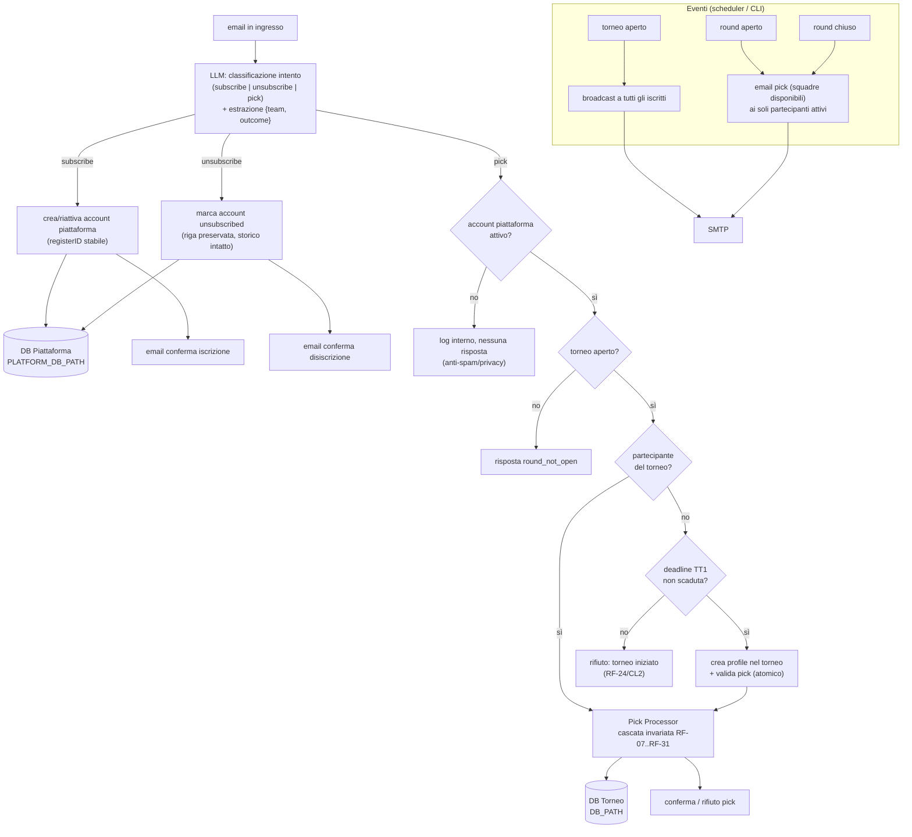

# Brainstorming — Iscrizione a livello di piattaforma

> **Stato:** bozza di analisi (brainstorming), aggiornata con le decisioni della review del 2026-08-20. Nessuna implementazione.
> **Branch:** `docs/adr-platform-registration` (creato da `main`).
> **Data:** 2026-08-20
> **Scopo:** analizzare gli impatti (dinamica di gioco + architettura) dello spostamento dell'iscrizione dei giocatori dal livello "torneo" al livello "piattaforma", prima di scrivere codice. Questo documento **non** modifica codice, non propone migrazioni eseguite e non apre branch di feature.

---

## 1. Sintesi esecutiva

Oggi l'iscrizione è un concetto **di torneo**: vive nel DB di torneo (`DB_PATH`), nelle tabelle `player` + `profile`, ed è gated dalla finestra `[apertura torneo, deadline TT1]` (`tournament_state.registration_open`, RF-22/RF-28, ADR-008). Eliminare il file DB di un torneo elimina anche i giocatori.

La modifica introduce un **modello a due livelli**:

1. **Iscrizione alla piattaforma** (subscription): un account persistente e indipendente dai tornei, con `registerID` interno **stabile e unico nel tempo** e l'email del giocatore. È sempre disponibile (iscrizione/disiscrizione via email), sopravvive all'apertura/chiusura ed eliminazione dei tornei, e vive in uno storage separato da `DB_PATH`.
2. **Partecipazione al torneo** (profile): resta invariata come concetto di torneo. `profile` continua a rappresentare la partecipazione a *quel* torneo; un giocatore può partecipare a un torneo **solo entro la deadline del TT1** di quel torneo.

Resta uno **scope mono-torneo**: il sistema gestisce **un torneo alla volta** (tornei successivi, mai contemporanei). Le regole di gioco del singolo torneo operano su `profile` e non cambiano; cambia solo il **gate di accesso** (appartenenza alla piattaforma) e il **contratto delle email in ingresso** (un mittente sconosciuto non riceve risposta: log silenzioso, anti-spam/privacy). Iscrizione e disiscrizione sono interpretate **dall'LLM** (come i pick), non più da keyword deterministiche.

---

## 2. Impatti sulla dinamica di gioco

### 2.1 Esperienza del giocatore

- **Prima:** il giocatore si iscrive *a un torneo* in una finestra limitata (apertura → deadline TT1); a finestra chiusa non entra (salvo override commissioner). Fuori finestra il suo pick è respinto con risposta (CL2) o innesca l'auto-iscrizione (RF-27, solo TT1).
- **Dopo:** il giocatore si iscrive **una volta** alla piattaforma (email, interpretata dall'LLM), riceve conferma, e da quel momento è "dentro" il sistema. Può iscriversi/disiscriversi in qualunque momento. Per partecipare a un torneo, deve essere iscritto alla piattaforma **e** il torneo deve essere aperto con la deadline del TT1 non ancora scaduta.
- **Cambio di comportamento rilevante:** un pick da una mail **non riconosciuta** (mai iscritta, o precedentemente disiscritta) non riceve risposta né auto-iscrizione: viene solo **loggato internamente** (anti-spam/privacy).

### 2.2 Regole di eliminazione, round, pick tardivi/duplicati

- **Invariate** a livello di torneo: eliminazione per pick mancante (`missing_pick`) o sbagliato (`wrong_pick`), Freeze (CL1/CL7/CL8), primo pick valido (RF-08), pick rifiutato non consuma il tentativo (RF-09), `receivedAt` autorevole (ADR-001), guard anti-frode RF-31. Queste regole operano su `profile` e non vengono toccate.
- **Cambia il gate di accesso al pick**, che diventa a due livelli:
  1. **Piattaforma:** l'email è un account attivo della piattaforma? No → log silenzioso (anti-spam).
  2. **Torneo:** il giocatore è partecipante (ha un `profile`) del torneo corrente? Se no, può auto-iscriversi al torneo solo se la deadline del TT1 non è scaduta; dopo, rifiuto (come oggi RF-24/CL2).
- La cascata di validazione del Pick Processor (RF-07…RF-31) resta invariata; il primo controllo "appartenenza alla piattaforma" passa dal seam `checkEligibility` (oggi vuoto, ADR-008), che diventa il lookup sull'elenco piattaforma.
- **Pick tardivi/duplicati:** invariati rispetto alla deadline del round (RF-11, RF-31) e all'unicità (`UNIQUE(profile_id, round)`, CS2/CL6).

### 2.3 Casi limite (decisioni recepite)

- **Iscrizione durante un torneo in corso.** Un giocatore può iscriversi (alla piattaforma) in qualunque momento, ma può **entrare nel torneo corrente** solo se **la deadline del TT1 non è scaduta**. Non è un'iscrizione tardiva: è un'iscrizione entro la deadline che consente di inviare il primo pick. Requisito fondamentale: **un giocatore può iscriversi a un torneo entro la chiusura della deadline del TT1 di quel torneo**. Dopo la deadline del TT1, nessun nuovo ingresso (coerente con RF-24/CL2); l'unico ingresso resta l'override manuale del commissioner (US10, `--reason`).
- **Partecipazione senza torneo attivo.** Confermato: se nessun torneo è aperto, il giocatore **non può inviare pick** (rifiuto, come oggi `round_not_open`/CL3).
- **Giocatore eliminato in un torneo passato.** L'eliminazione è una proprietà di `profile` (per-torneo). Un giocatore eliminato nel torneo N resta iscritto alla piattaforma e può partecipare al torneo successivo con un nuovo profilo e pool intatto.
- **Notifiche a non-partecipanti / eliminati.** Le email di **pick** (apertura round) vanno solo ai giocatori **ancora attivi** (`eliminated = 0`), non agli eliminati. All'apertura del torneo si notifica a tutti gli iscritti; poi solo a chi sopravvive. **Eccezione (decisione):** alla chiusura del round va una **email di riepilogo** sia ai **sopravvissuti** sia agli **eliminati di quel round**, e ciascuna email specifica se il destinatario è sopravvissuto o eliminato (vedi §3.3).
- **Iscrizione/disiscrizione ripetuta.** `registerID` è **stabile e unico nel tempo**: se un giocatore si disiscrive e poi si re-iscrive, riottiene lo **stesso** `registerID`. L'email viene ricordata per usi futuri.
- **Pick da un giocatore precedentemente disiscritto.** Il sistema ricorda l'email, ma se un utente disiscritto manda un pick → **log silenzioso, nessuna risposta** (trattato come sconosciuto).

### 2.4 Modello a due livelli (riepilogo)

| Livello | Concetto | Persistenza | Ciclo di vita | Gate |
|---|---|---|---|---|
| **Piattaforma** | account / subscription (`registerID`, email, status) | storage piattaforma separato | permanente; iscrizione/disiscrizione sempre disponibili | — |
| **Torneo** | `profile` (partecipazione) | DB torneo (`DB_PATH`) | per-torneo; eliminato con il DB del torneo | deadline del TT1 del torneo |

---

## 3. Impatti sull'architettura

### 3.1 Nuovo modello dati (entità piattaforma vs torneo)

- **Entità piattaforma** (nuovo storage): `platform_account` con `registerID` interno (PK, **stabile e riusato** alla re-iscrizione), `email` (normalizzata, UNIQUE), `status` (`active` / `unsubscribed`), `created_at`, `unsubscribed_at` (o `last_active_at`). La disiscrizione **non elimina fisicamente la riga** (soft-delete, **confermato**): la marca `unsubscribed`, preservando `registerID` ed email per la re-iscrizione e il riconoscimento futuro ("elimina l'account ma non lo storico").
- **Entità torneo** (DB attuale): `player` **resta** e rappresenta "un giocatore nel torneo"; `profile` **resta** e rappresenta la partecipazione al torneo. Entrambe continuano a esistere.
- **Relazione:** `platform_account` (1) ↔ (N) `profile` (uno per torneo). Il link avviene **replicando `registerID` anche in `player`/`profile`** (colonna denormalizzata), così il codice di torneo può riferire l'account di piattaforma senza un join cross-DB. `player` mantiene l'`email` come chiave naturale e guadagna `register_id`.

### 3.2 Persistenza: secondo DB/store separato da `DB_PATH`

- Serve un **nuovo path** (es. `PLATFORM_DB_PATH`, default `./data/platform.db`) con connessione separata da quella di `DB_PATH` (`src/db/connection.ts` oggi apre un solo DB). Il DB piattaforma **non** viene eliminato quando si elimina il file DB di un torneo.
- **Ciclo di vita:** servono **comandi dedicati** per la migrazione/inizializzazione del DB piattaforma (es. `platform:migrate` o estensione di `db:migrate` a due DB). Il DB torneo resta "usare e buttare"; il DB piattaforma è permanente.
- **TEST_MODE/UAT:** `PLATFORM_DB_PATH` va **replicato anche in `.env.uat`** (e `.env.uat-replay`, `.env.example`). Convenzione: **`.env.uat` è un'estensione dei parametri di `.env`** (stessi parametri base, più i test-only e `DB_PATH`/`PLATFORM_DB_PATH` di test), così il test mode non tocca mai la piattaforma reale.
- **Trade-off SQLite (RISOLTO — decisione):** si adotta **due connessioni separate** (`DB_PATH` + `PLATFORM_DB_PATH` come due file indipendenti). Non serve alcuna transazione cross-DB: la piattaforma è **solo letta** dai flussi di torneo. Ogni scrittura resta in un singolo DB:
  - *Iscrizione/disiscrizione* → scrivono solo la piattaforma.
  - *Join al torneo* (creazione `profile`) → legge la piattaforma (account attivo?) e scrive solo il DB torneo.
  - *Pick* → legge la piattaforma (account attivo? pagato?) e scrive solo il DB torneo (profilo+pick atomici, come oggi).
  - Anche la futura **quota/pagamento** (Fase 1) non richiede scrittura cross-DB: `platform_account.paid` è un **gate in lettura** applicato all'accettazione del pick (e del join), **non** una scrittura alla creazione del profilo. La verifica del pagamento avviene al momento del pick, solo se serve. Questo è esattamente il ruolo del seam `checkEligibility` (ADR-008), che in Fase 1 diventa "account attivo **e** pagato" come pura lettura.

### 3.3 Sistema di notifica email (decisioni recepite)

- **Coesistenza:** broadcast ed email personalizzate **coesistono**; le email di pick con le squadre disponibili vengono **assorbite dal broadcast** (un'unica email per partecipante attivo, che è al tempo stesso "round aperto" + istruzioni personalizzate con squadre disponibili). Non ci sono due email separate per lo stesso evento.
- **Destinatari:** le email di **pick** (apertura round) vanno **solo ai giocatori ancora attivi**, non agli eliminati. All'inizio del torneo a tutti (i partecipanti), poi solo ai sopravvissuti. ~~**Alla chiusura del round** va invece una **email di riepilogo** sia ai **sopravvissuti** sia agli **eliminati di quel round**~~ **→ SUPERATO dalla review finale (chiuso il punto 3 della review, implementato 2026-08-20, Task 9):** il riepilogo `round_closed_survived` va **ai SOLI sopravvissuti** (`eliminated = 0` con account `active`), inviato **una sola volta** alla transizione `closed → scored` (guardia `round_state.summary_sent`); gli eliminati ricevono **solo** le notifiche puntuali `pick_missing_elimination` (alla `round:close`) e `round_result_wrong` (allo `round:score`); l'eliminazione a posteriori da Freeze produce **solo** `round_result_wrong`. **Non esiste `round_closed_eliminated`** né alcun criterio `eliminated_at >= opened_at`. *Nota aperta minore (chiusa in pianificazione): il momento esatto di invio è la transizione `closed→scored` di `round:score`, con guardia di idempotenza `summary_sent`.*
- **Chi è iscritto ma non partecipa** riceve comunque le email di livello torneo (es. apertura torneo, come invito); se non vuole riceverle, può **disiscriversi**.
- **Nuovi trigger:** apertura torneo (broadcast a tutti gli iscritti = invito), chiusura torneo (vedi §4.2 punto 8, task separato), apertura round (broadcast assorbito nelle istruzioni pick), **chiusura round → riepilogo `round_closed_survived` ai soli sopravvissuti** (chiuso il punto 3 della review, 2026-08-20).
- **Nuovi template** (`src/llm/templates.ts`, `EmailType`): conferma iscrizione piattaforma, conferma disiscrizione, `tournament_open`, `round_closed_survived` (riepilogo chiusura round ai soli sopravvissuti — `round_closed_eliminated` RIMOSSO dalla review finale), oltre ai template pick esistenti. La coppia TT/TC resta iniettata deterministicamente (RF-25/ADR-004), mai via LLM.
- **Volume:** ~1 email per partecipante attivo per round (come oggi) + 1 email per iscritto alla piattaforma per l'apertura torneo. Impatto contenuto (HLD §3: decine di giocatori), ma il pattern di invio cambia.

### 3.4 Parsing/interpretazione email in ingresso (decisione recepita)

- **L'iscrizione e la disiscrizione passano dall'LLM**, come i pick (decisione della review: "anche i pick passano da LLM e sono azioni sensibili"). La classificazione deterministica a keyword del Message Router (`REGISTRATION_KEYWORDS`) viene quindi **superata/estesa**: l'LLM classifica l'intento dell'email (`subscribe` / `unsubscribe` / `pick`) ed estrae il pick `{team, outcome}`.
- Implicazione sul contratto dell'LLM Adapter (LLD §6.2): il Parser (o un classificatore di intento dedicato) deve produrre l'intento oltre al pick. Resta valida la barriera deterministica (ADR-004): l'LLM *propone*, il check deterministico *dispone* — il pick estratto è filtrato con exact-match sulla lista canonica, e l'azione di iscrizione/disiscrizione è confermata con una email di conferma (recupero semplice in caso di errore: la re-iscrizione riusa lo stesso `registerID`).
- **Cambio di contratto del flusso pick:** `email-processor.ts` oggi, per mittente sconosciuto, applica auto-iscrizione (RF-27) o risponde (CL2/CL5). Con la nuova spec il mittente sconosciuto (mai iscritto o disiscritto) **non riceve risposta e viene solo loggato**.

### 3.5 Componenti da modificare / deprecare / rimuovere

| Componente | Impatto |
|-----------|---------|
| `src/db/schema.ts` + `connection.ts` | nuovo schema piattaforma + seconda connessione (o `ATTACH`); `player`/`profile` guadagnano `register_id` |
| `src/config.ts` + `.env*` | nuova env `PLATFORM_DB_PATH` (+ zod); replica in `.env.example`, `.env.uat`, `.env.uat-replay` |
| `src/game/registration.ts` | il ciclo `register:open/close`/`registration_open` viene ripensato: l'iscrizione piattaforma è sempre attiva; la "finestra" resta solo come gate di partecipazione al torneo (deadline TT1) |
| `src/game/eligibility.ts` | `checkEligibility` diventa il lookup "account piattaforma attivo?" (oggi sempre `true`) |
| `src/llm/parser.ts` (+ generator/templates) | nuova classificazione di intento (subscribe/unsubscribe/pick) via LLM; nuovi `EmailType` |
| `src/channel/email-adapter/message-router.ts` | declassato a normalizzazione identità + smistamento del risultato LLM (niente più keyword di intento) |
| `src/channel/email-processor.ts` | nuovi rami subscribe/unsubscribe; cambio ramo sconosciuto (log silenzioso); gestione doppio storage |
| `src/game/tournament.ts` | `tournament:start` → broadcast apertura; `tournament:status` espone stato piattaforma |
| `src/game/round-manager.ts` | `round:open` → pick ai soli attivi; `round:close` → riepilogo a sopravvissuti + eliminati del round (esito specificato) |
| `src/game/scheduler.ts` + `src/cli/commands/scheduler.ts` | innesco broadcast sugli eventi (apertura/chiusura torneo/round) |
| `src/game/simulation.ts` + `simulate:*` | seed di account piattaforma + isolamento del DB piattaforma in-memory |
| Comandi CLI | nuovi `platform:*` (register/unregister/list/migrate), coerenza ADR-006 |
| **Da deprecare/riuso (proposta)** | RF-27 auto-iscrizione (sostituita da "account pre-esistente + auto-join al torneo entro deadline TT1"), RF-22/RF-28 reinterpretati come gate di partecipazione, `registration_open`/`registration_notified` riusati o rimossi |

### 3.6 Diagramma del nuovo flusso email/dati

---

## 4. Ambiguità e decisioni

### 4.1 Conflitti con i documenti esistenti — RISOLTI (da applicare ai documenti)

1. **Mono-torneo vs piattaforma.** L'iscrizione di piattaforma introduce di fatto **tornei successivi**, ma **non contemporanei**. Il cambio di scope è accettato, **restando nello scope mono-torneo**: il sistema gestisce **un torneo alla volta**. → Da aggiornare: PRD §1.1/§10 (chiarire "tornei successivi, mai contemporanei"), ADR dedicata.
2. **Auto-iscrizione RF-27 / RF-24 vs "pick da sconosciuto = solo log".** Risolto: RF-27 (auto-iscrizione al primo pick) è **sostituita** dal modello "account piattaforma pre-esistente + auto-join al torneo entro deadline TT1". Un pick da mittente sconosciuto (mai iscritto o disiscritto) → **log silenzioso**.
3. **Finestra di iscrizione (RF-22/RF-28) vs iscrizione sempre aperta.** Risolto: l'iscrizione **alla piattaforma** è sempre aperta; la "finestra" `[apertura, deadline TT1]` viene **reinterpretata come gate di partecipazione al torneo** (creazione del `profile`). RF-22/RF-28 restano concettualmente validi a livello torneo.
4. **Filosofia "rispondere sempre" vs log silenzioso.** Risolto: il log silenzioso per i mittenti sconosciuti è **voluto** (anti-spam/privacy).

### 4.2 Decisioni recepite dalla review (punti 5–12)

5. **`registerID` stabile e unico nel tempo.** Re-iscrizione → stesso `registerID`.
6. **Disiscrizione:** il sistema elimina l'account (dalla lista attivi) ma **non lo storico** (pick/profili dei tornei restano nel DB torneo). Righe piattaforma marcate `unsubscribed`, non rimosse fisicamente (necessario per 5 e 12).
7. **Notifiche broadcast:** agli utenti **attivi al torneo**; le email pick con squadre disponibili sono **assorbite dal broadcast**. **Riepilogo chiusura round:** una email a **sopravvissuti + eliminati di quel round**, con esito specificato per ciascuno.
8. **Chiusura torneo (modifica separata):** il torneo deve chiudersi **immediatamente e automaticamente** appena viene calcolato uno o più vincitori; va mandata una email di riepilogo con il nome del vincitore a **tutti coloro che hanno inviato almeno un pick al torneo** (cioè che sono stati attivi). → **Task separato**, da fare dopo il task principale di questa sessione.
9. *(assorbito in 2.3)* Ingresso a torneo in corso ammesso solo entro la deadline del TT1; dopo, solo override commissioner.
10. **Coerenza tra i due DB (RISOLTO).** Due connessioni separate; la piattaforma è solo letta dai flussi di torneo, quindi nessuna scrittura cross-DB. Anche la quota/pagamento è un gate in lettura (`paid`) al pick/join, non una scrittura alla creazione del profilo (vedi §3.2).
11. **Migrazione dati esistenti (RISOLTO): nessuna migrazione.** Il DB piattaforma parte vuoto; i `player`/`profile` esistenti (dati sintetici/test) non vengono migrati. Eventuale comando `platform:migrate` solo se in futuro compariranno email reali prima della produzione.
12. **Re-iscrizione:** il sistema ricorda l'email per usi futuri; se un utente precedentemente disiscritto manda un pick → **log silenzioso, nessuna risposta**.

### 4.3 Stato dei documenti

- Tutti i documenti rilevanti sono stati trovati e risultano **coerenti tra loro e con il codice attuale**: PRD v0.5.2, HLD v0.4.2, LLD v0.4.0, ADR-001…008, `AGENTS.md`, `agent-context/current-status.md`, `tasks/plan*.md`, `FUTURE_EXPLORATIONS.MD`. **Nessun documento obsoleto o mancante.**
- **Nessun ADR dedicato** a iscrizione/persistenza a livello piattaforma o al ciclo di vita/eliminazione dello storage: l'unico riferimento all'iscrizione è **ADR-008**, che questa modifica reinterpreta in più punti. Servirà una **ADR-009** dedicata.
- `BRIEF/BRIEF.MD` è storico e congelato (2026-08-11): non è fonte decisionale; il §3.10 (tornei multipli) è l'origine del conflitto di scope, ora chiarito come "tornei successivi, mai contemporanei".

---

## 5. Rischi e trade-off

| # | Rischio | Prob. | Impatto | Note / mitigazione |
|---|---------|-------|---------|--------------------|
| R-A | **Coerenza tra i due SQLite** (account piattaforma vs profilo/pick torneo) | Bassa | Alto | **RISOLTO** — due connessioni separate; la piattaforma è solo letta; ogni scrittura in un singolo DB (§3.2) |
| R-B | **Log silenzioso per sconosciuti** = niente feedback (l'utente non sa come iscriversi) | Media | Basso | voluto (anti-spam/privacy); accettato dalla review |
| R-C | **Volume notifiche broadcast** (apertura torneo a tutti gli iscritti) | Bassa | Basso | contenuto (decine di giocatori); disiscrizione come opt-out |
| R-D | **Ingresso a torneo in corso** riapre la fairness (pool più pieno) | Media | Medio | mitigato: ingresso limitato alla deadline TT1; dopo, solo override US10 |
| R-E | **Migrazione/dualità `player`/`profile`/account** (identità disallineata) | Media | Alto | `register_id` replicato su `player`/`profile`; email come chiave naturale |
| R-F | **Determinismo RNF1** su un secondo DB (clock iniettato sulle scritture piattaforma) | Bassa | Medio | estendere la regola "created_at esplicito dal clock iniettato" al DB piattaforma |
| R-G | **TEST_MODE/UAT** e cron: DB piattaforma da isolare nei test/replay | Media | Medio | `PLATFORM_DB_PATH` dedicato in `.env.uat`/`.env.uat-replay`; `.env.uat` come estensione di `.env` |
| R-H | **Disiscrizione/iscrizione via LLM** → misclassificazione di intento | Media | Medio | conferma via email + re-iscrizione banale (stesso `registerID`); barriera deterministica sul pick (ADR-004) |
| R-I | **"Chiusura torneo" automatica sul vincitore** (task separato) | Media | Medio | cambio del ciclo di vita torneo: serve definire l'istante esatto e la mail di riepilogo |

**Trade-off principali:**
- *Separare i DB* vs *file unico*: la spec chiede separazione fisica; il costo è la coerenza cross-DB (discussione sotto).
- *Broadcast a tutti gli iscritti* (apertura torneo) vs *solo ai partecipanti* (round): deciso — apertura a tutti, round ai soli attivi.
- *Log silenzioso* vs *risposta agli sconosciuti*: deciso — log silenzioso (anti-spam/privacy).

---

## 6. Proposta di piano di implementazione a fasi (SOLO proposta)

> Non eseguire. Ordine per dipendenze; ogni fase richiede prima la risoluzione dei punti aperti (§4.2 n. 10-11).

1. **Decisioni + ADR-009** — Registrare l'ADR "Iscrizione a livello di piattaforma" e applicare ai documenti le risoluzioni di §4.1-§4.2 (mono-torneo sequenziale, modello a due livelli, `registerID` stabile, disiscrizione soft, log silenzioso, notifiche ai soli attivi). Allineare PRD/HLD/LLD.
2. **Storage piattaforma** — `PLATFORM_DB_PATH`, **due connessioni separate** (decisione §3.2), schema `platform_account` + comandi `platform:*` (register/unregister/list), clock iniettato (RNF1).
3. **Gate eligibilità + auto-join** — `checkEligibility` = lookup account attivo; auto-join al torneo entro deadline TT1 (sostituisce RF-27); rifiuto dopo TT1.
4. **LLM intent classification** — estendere il Parser alla classificazione subscribe/unsubscribe/pick; aggiornare Message Router ed `email-processor.ts` (log silenzioso per sconosciuti).
5. **Notifiche broadcast** — nuovi template; trigger apertura torneo (tutti gli iscritti), round open (pick ai soli attivi) e round close (riepilogo a sopravvissuti + eliminati del round); coerenza TT/TC (RF-25).
6. **Scheduler + simulazione + TEST_MODE** — innesco broadcast; seed account piattaforma; `PLATFORM_DB_PATH` in `.env.uat`/`.env.uat-replay`.
7. **Deprecazione** — rimozione/riuso di RF-27, RF-22/RF-28, `registration_open`/`registration_notified`, `tournament:register:open/close` (dopo aver confermato la migrazione).
8. **Task separato: chiusura automatica sul vincitore** — chiusura immediata alla determinazione del vincitore + email di riepilogo ai partecipanti attivi (§4.2 n. 8).
9. **Test + documentazione** — regressione (regole di gioco invariate), coerenza cross-DB, aggiornamento `AGENTS.md`/`current-status.md`.

---

## Note di processo

- **Non** ho modificato codice di produzione, migrazioni o feature branch. Unica modifica: questo documento + il branch `docs/adr-platform-registration`.
- **Nota worktree:** alla creazione del branch era presente una modifica non committata su `main` (`docs/uat/timeline-example.excalidraw`), ancora nello stato di lavoro. Non è correlata a questa analisi; prima di un eventuale commit va deciso come gestirla.
